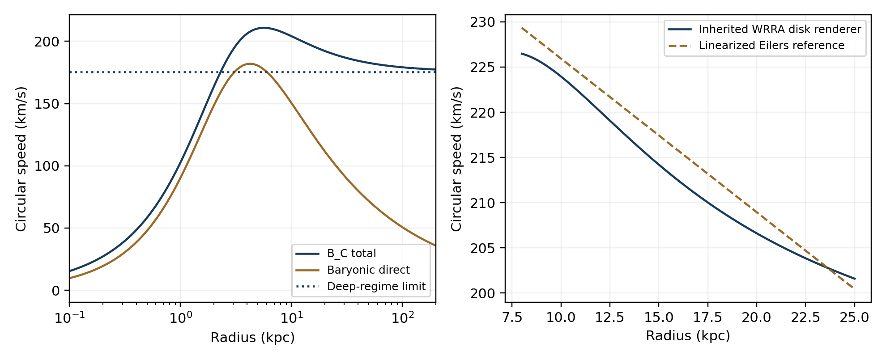

# WRRA M 0 5 Information Load and Twist Gravity in a Finite Model

Finite calculations of prephenotypic stress in a universe with expansion and twist

Wonsik Choi  
WRRA-M 0.5 | 1 October 2026  
Independent Researcher Seoul Republic of Korea  
ORCID 0009-0001-4263-9772 | janefather@gmail.com

## Verification input through falsification conditions

| Stage | Content of this calculation |
| --- | --- |
| Verification input | Mass modes in Minimal Computation Cosmology 2.3.2, the carrier conditions of WRRA-M 0.4, and constitutive responses and calibrations from the individual twist papers |
| WRRA specific transformation | Separate discrete mass output from continuous geometric output and use a fixed stress response to calculate additional gravity, effective mass, and light deflection |
| Output | Mass modes, 16-channel transport response, filter gaps, finite spherical rotation and lens deflection, and reproduction of the earlier Milky Way calculation |
| Falsification conditions | Failed carrier conditions, failed selection gaps, static instability of the stress constitutive law, or inconsistent motion and lensing in the same geometry |

## Research decision and results

This version selects the B_C branch: mass can be quantized because it is a phenotype, while gravity itself precedes the phenotype and has no fundamental quantum degrees of freedom. The calculation evaluates measurable gravitational outputs, including the metric and orbits, without introducing an independent Hilbert space for gravity or gravitons. This choice is a model premise of version 0.5. Discrete mass modes are calculated in the specified internal model. The work does not classify the universal impossibility of gravity quantization as an experimental result or a general theorem.

The overall cosmological architecture contains expansion and twist simultaneously. Version 0.5 completes the local twist-stress calculation first. The cause of expansion and global time evolution are not established by this static calculation. Connecting the global and local effects of one stress remains a subsequent task.

The calculation produces three results. First, the earlier calibrations reproduce the transition acceleration of 1.191812669 × 10⁻¹⁰ m/s². Second, the same constitutive response gives finite spherical rotation and conditional lens deflection, and reproduces the earlier Milky Way model with an RMS of 2.41784 km/s against the linearized reference over 8–25 kpc. Third, both filter gaps vanish for the simplest symmetric 16-channel carrier. This last result concerns the microscopic selection of the target filter: common transport alone does not determine that selection in this prototype.

## Structure inherited from the individual papers

The calculation layers of the individual originals were examined in addition to the integrated account. The twist-stress cosmology paper v1.0 supplies background-stress normalization, the local constitutive response, effective mass, and conditional lensing. The dual-component gravity model v0.4 supplies the decomposition into direct and stress gravity, the denominator behind the 15.7% and 84.3% shares, and the prohibition of double counting across the two interpretations. The galactic-disk-plane paper v1.0 actually adopts the calibrated response across the full acceleration range in its Milky Way calculation and distinguishes an unoriented plane from angular momentum. The finite boundaryless universe paper v1.0 states that expansion and twist coexist and that dynamics must connect global information to local stress. Section 5.3.3 of Causal Horizons v1.1 explicitly identifies B_C as fundamentally nonquantum gravity.

Section 7.4 of Minimal Computation Cosmology 2.3.2 itself states that fundamental gravity quantization is not included in its proof. Version 0.5 selects B_C as a research branch without retrospectively changing that statement. The conditional achievements of the original and the stronger model choice made here are therefore preserved separately.

## Distinct status of mass modes and gravity

Periodic boundary conditions in a closed internal model permit integer modes n. In natural units, the mass relation is

$$n\in\mathbb Z,\qquad m_n^2=m_0^2+\frac{n^2}{R^2}. \tag{1}$$

The reproduction example uses m₀ = 0 and the mass-energy unit μ_M = m_ec²/23. This gives μ_M = 22,217.345682 eV, while n = 23 reproduces the input electron mass-energy of 510,998.95069 eV. This is a reproduction of the internal discreteness and calibration. It does not assert that the physical pole masses of all particles are integer multiples of one common unit. Yukawa coupling, self-energy, and strong-interaction transformations of observed mass retain their downstream roles in version 2.3.2.

Gravity is a geometric response to the total source and boundary state. Every matter channel shares the same geometry. A gravitational output can jump when the source changes discretely without gravity itself acquiring fundamental quantum degrees of freedom. A simple example for the direct component is

$$\Delta g_M(r)=\frac{G\mu_M}{r^2},\qquad
\Delta g_M(2r)=\frac{\Delta g_M(r)}{4}. \tag{2}$$

In equation (2), μ_M is converted to a mass unit. Even for the same mass-mode change, the output spacing depends on radius and boundary conditions. A discrete source alone does not define a universal gravitational quantum. A finite numerical grid or finite computational precision also does not establish physical quantization of gravity. A complete update law for matter in quantum superposition coupled to classical geometry is outside this static model.

## Coexistence of expansion and twist and the component fractions

The coexistence architecture is recorded by separating the variables of the spatial metric:

$$\gamma_{ij}(t)=a(t)^2\widehat\gamma_{ij}[\Theta(t)],\qquad
H=\frac{\dot a}{a}. \tag{3}$$

Here a describes the isotropic change of scale, while Θ describes the twist state. Equation (3) separates variables; it does not derive their dynamics. The present static calculation inside a galaxy fixes the current a and global boundary state and evaluates the local response. Expansion and accelerated expansion are distinct observables and are not merged into a single causal claim.

The approximately 5% phenotype fraction and approximately 95% remaining before phenotype are editable energy-weighted calibrations. They are not measured fractions of information bits or channel counts. With the present inputs f_Φ = 0.0493 and clustering-stress fraction f_T = 0.265, the entire remaining fraction is 0.9507 and the residual background account is 0.6857. That background account is not identified as a microscopic derivation of a separate dark-energy cause. The executed calculation focuses on the local additional-attraction sector represented by f_T. The rotation and lensing outputs therefore evaluate the clustering-stress sector corresponding to about 26.5% of the total, within the whole hidden sector of about 95%; they do not calculate the gravity and expansion of that entire hidden sector.

Comparing direct matter with clustering stress alone gives f_T/f_Φ = 5.37525 and a direct-component share of f_Φ/(f_Φ + f_T) = 15.6857%. The approximately 5% and 15.7% figures can coexist because they use different denominators. This cosmic mean source ratio is not imposed as the gravitational ratio at every galactic radius.

## Information before phenotype and a closed universe

The upstream hypothesis is fixed as follows. The physical load of information that has not been rendered as a phenotype determines twist. Global gluing preserves that twist and constructs a finite universe without a boundary. This requires a transformation from information content to physical load. At the present stage, E_pre assigns energy weights to the information states:

$$E_{\mathrm{pre}}=\sum_a w_a I_a,\qquad u_{\mathrm{pre}}=\frac{E_{\mathrm{pre}}}{V},\qquad
\zeta\kappa_{\mathrm{tot}}^2=\frac{16\pi G}{c^4}\frac{E_{\mathrm{pre}}}{V}. \tag{4}$$

The model weights w_a convert information states into an energy load. Once this transformation is fixed, the remaining information content is an input to the twist-rate calculation. At fixed volume and stiffness, κ_tot² is therefore proportional to E_pre. No universal rest mass is assigned to an arbitrary information bit. Computing the load from the individual weighted information states and connecting the carrier test to local gravity remain to be implemented.

A three-torus T³, periodically glued in three directions, provides one constructibility model of the global identification. This model treats all local patches of one common Source equally. If Θ_i = κ_i L records twist along the three closed curves of representative static length L, then

$$V=L^3,\quad Q=\sum_{i=1}^3\Theta_i^2>0,\quad
E_{\mathrm{pre}}=\frac{\zeta c^4 Q}{16\pi G}L,\quad
L=\frac{16\pi G E_{\mathrm{pre}}}{\zeta c^4 Q}. \tag{5}$$

For finite E_pre, positive stiffness, and fixed nonzero gluing records, L and the volume are finite, and T³ has no boundary. Equation (5) is an exact algebraic relation in the chosen gluing model. It provides one possible implementation from information load through twist to closed geometry. It is not a theorem that every twist automatically selects T³, or a measurement of the actual cosmic topology. Changes in L over time can be linked to the expansion variable, but the evolution equation is not calculated here.

The model does not impose the unconditional rule that more information must always mean more twist. At fixed volume, the twist rate increases. If the gluing records are fixed while the volume also changes, the length changes according to equation (5). Because ζ, Θ_i, and the information weights remain unspecified, the actual cosmic length is not fixed to one number.

Separating the local clustering-stress fraction f_T from the entire remaining load f_pre preserves the local scale of the earlier individual papers while admitting the new upstream hypothesis. Under the additional assumption that the same quadratic load map extends to the whole hidden sector, the present calibration f_pre = 0.9507 gives the normalized index √(6f_pre) = 2.388347. This is an index of total load rather than a measured angle. The local additional-attraction scale is still calculated with f_T = 0.265.

## Twist normalization in the present universe

The quadratic stress energy and the closure relation across scales are taken from the earlier individual paper:

$$u_T=\frac{\zeta c^4\kappa^2}{16\pi G},\qquad
\rho_c=\frac{3H_0^2}{8\pi G},\qquad
f_T=\frac{u_T}{\rho_c c^2}. \tag{6}$$

$$a_T=cH_0\sqrt{\frac{f_T}{8}},\qquad
\zeta\kappa^2=6f_T\left(\frac{H_0}{c}\right)^2. \tag{7}$$

The inputs are c = 299,792,458 m/s, G = 6.67430 × 10⁻¹¹ in SI units, H₀ = 67.4 km/s/Mpc, and f_T = 0.265. The value of c is a defined input for unit conversion and is not a prediction target. The factor 1/8 and the matched-response connection in equation (7) are previously calibrated model elements. Once known values fix the model, the quantities calculated by this relation remain WRRA outputs.

The outputs are a_T = 1.191812669 × 10⁻¹⁰ m/s², ρ_c = 8.532855164 × 10⁻²⁷ kg/m³, and ζκ² = 8.440621409 × 10⁻⁵³ m⁻². The normalized index √(6f_T) = 1.260952 is not a directly measured twist angle. The stiffness ζ and twist rate κ are not separately determined.

## Calibrated constitutive response and static action

The constitutive response adopted in the disk-plane paper is used unchanged across the full acceleration range:

$$y=\frac{g_M}{a_T},\qquad
\nu(y)=\frac{1}{1-e^{-\sqrt y}},\qquad
g=\nu(y)g_M,\quad g_T=g-g_M. \tag{8}$$

The response function is an observationally calibrated input, not a uniquely derived function of the upstream common carrier. This version actually evaluates it within the internal calculation. Effective stress interpreted as a source and modified geometry are not added twice in one calculation.

The spherical static geometric response of B_C admits the following constructed action. Define x = g/a_T = yν(y) and μ(x) = y/x:

$$E[\Phi]=\int d^3x\left[\frac{a_T^2}{8\pi G}F(Y)+\rho_b\Phi\right],
\quad Y=\frac{|\nabla\Phi|^2}{a_T^2},\quad F_Y=\mu. \tag{9}$$

$$\nabla\!\cdot\!\left[\mu(|\nabla\Phi|/a_T)\nabla\Phi\right]=4\pi G\rho_b. \tag{10}$$

This static variational structure uses the established mathematics of AQUAL. The function μ is reconstructed to produce the same spherical response as the selected ν. Outside spherical symmetry, QUMOND and AQUAL are not treated as the same equation. Equation (9) does not complete a four-dimensional covariant action.

$$F[Y(y)]=\int_0^y2q\frac{dx}{dq}\,dq,\qquad
\frac{dx}{dy}=\frac{1-e^{-s}-(s/2)e^{-s}}{(1-e^{-s})^2}>0,
\quad s=\sqrt y>0. \tag{11}$$

Positivity follows from eˢ > 1 + s/2. The transverse eigenvalue μ and longitudinal eigenvalue d(μx)/dx = dy/dx of the static variation are positive for x > 0. Numerical differentiation in the code reproduces dF/dY = μ with a maximum relative error below 4.11 × 10⁻¹⁰. At g = 0 the equation degenerates, so the strict ellipticity check excludes the center. This result is not extended to a proof of stability or causality of the entire covariant model.

## Finite spherical calculation and the dark mass account

The spherical test source has a total baryonic mass of 6 × 10¹⁰ solar masses and Plummer scale b = 3 kpc. This reproducibility input is distinct from the actual Milky Way model. The declared calculation patch has radius 200 kpc.

$$M_b(<r)=M\frac{r^3}{(r^2+b^2)^{3/2}},\qquad
g_M=\frac{GM_b(<r)}{r^2},\qquad v_c^2=rg. \tag{12}$$

$$M_{T,\mathrm{eff}}(<r)=\frac{r^2g_T}{G},\qquad
\rho_{T,\mathrm{eff}}=\frac{1}{4\pi r^2}\frac{dM_{T,\mathrm{eff}}}{dr}. \tag{13}$$

Equation (13) is an account that expresses the additional effect of the same geometry as a Newtonian-equivalent mass. It does not count quantized dark particles or represent matter rest mass. The local microscopic twist rate κ(r) is not reported as though it had been directly measured through equation (13).

| Radius kpc | Direct speed km/s | Total speed km/s | Additional gravity / direct gravity | Effective stress mass solar masses |
| --- | --- | --- | --- | --- |
| 1 | 90.34 | 102.65 | 0.291 | 5.523e+08 |
| 3 | 174.39 | 193.78 | 0.235 | 4.979e+09 |
| 8.2 | 161.45 | 207.51 | 0.652 | 3.240e+10 |
| 20 | 111.71 | 192.26 | 1.962 | 1.139e+11 |
| 50 | 71.65 | 182.65 | 5.499 | 3.282e+11 |
| 100 | 50.77 | 179.14 | 11.453 | 6.862e+11 |

At low acceleration, g ≈ √(a_Tg_M) and v_f⁴ = GMa_T. The deep-regime speed scale of the test source is 175.5177 km/s. The slightly higher speed at 100 kpc follows from the fixed transition response. Effective stress density remains nonnegative throughout the 0.01–200 kpc patch, and the maximum relative error in spherical flux conservation is 3.42 × 10⁻¹⁶. Global stress outside the patch and the gluing conditions of the finite universe are not specified in this calculation.

## Conditional lensing in the same geometry

The condition Φ = Ψ from the individual stress paper is used to calculate light deflection from the same potential. This condition must be checked in a covariant completion.

$$\widehat\alpha_R(b)=\frac{2}{c^2}\int_{-\sqrt{R^2-b^2}}^{\sqrt{R^2-b^2}}
g(\sqrt{b^2+z^2})\frac{b}{\sqrt{b^2+z^2}}\,dz. \tag{14}$$

| Impact radius kpc | Total deflection arcsec | Direct component rad | Twist component rad |
| --- | --- | --- | --- |
| 5 | 0.5928 | 1.6883e-06 | 1.1855e-06 |
| 10 | 0.5356 | 1.0523e-06 | 1.5443e-06 |
| 20 | 0.4730 | 5.5875e-07 | 1.7342e-06 |
| 50 | 0.3955 | 2.2159e-07 | 1.6960e-06 |

The table gives the physical deflection accumulated inside the 200 kpc patch. It excludes the geometry outside the patch, observer-lens-source distance factors, and the observed image angle. No new stress dedicated to lensing or separate normalization is introduced. The conditional result is therefore that the same static response produces both motion and light output. Fitting observed lenses and covariantly deriving gravitational slip remain separate tasks.

## Reproduction of the individual Milky Way calculation

The adopted inputs are unchanged: stellar disks of 35.66 × 10⁹ and 11.25 × 10⁹ solar masses with scales of 2.53 and 3.38 kpc; HI and H₂ disks of 11.0 × 10⁹ and 1.2 × 10⁹ solar masses with scales of 7.0 and 1.5 kpc; and a bulge of 9.13 × 10⁹ solar masses with Hernquist scale 0.70 kpc. The modified-Bessel-function contributions of the exponential disks and the direct squared speed of the bulge are summed before equation (8) is applied.

| Radius kpc | Direct speed km/s | WRRA speed km/s | Additional gravity / direct gravity |
| --- | --- | --- | --- |
| 5 | 192.44 | 221.03 | 0.319 |
| 8.2 | 182.55 | 226.34 | 0.537 |
| 12 | 161.05 | 220.09 | 0.868 |
| 16.5 | 138.93 | 211.60 | 1.320 |
| 20 | 125.92 | 206.61 | 1.692 |
| 25 | 112.05 | 201.59 | 2.237 |

Over 8–25 kpc, the RMS against the linearized Eilers reference of 229 − 1.7(R − 8.2) km/s is 2.41784 km/s, reproducing the earlier paper's 2.42 km/s. This comparison is not a likelihood using individual observational data points and covariance. The disk calculation also retains the earlier algebraic Renderer approximation. It is not classified as a three-dimensional disk solution of the present spherical variational equation.

{width=6.4in}

The unoriented plane is inherited as P = I − nnᵀ. Replacing n with −n leaves P unchanged, and P² = P. The code gives a sign-invariance defect of zero and a projection defect below 5.56 × 10⁻¹⁷. This plane field does not define the sense of rotation or angular momentum. Because the directional stress q_T is not fixed, vertical thickness and restoring force are not outputs of this version.

## Executed carrier test and the selection boundary

The next calculation specified by 0.4 is executed for the simplest homogeneous carrier. Sixteen channels share the same principal transport structure and periodic internal model. The internal cycle-lattice Laplacian has eigenvalues 4sin²(πj/N). For N = 128, the positive Green-function intensities at five declared frequencies are averaged to extract each channel's scalar signature. Channel-specific lower-order operators are identical in this test.

With orthogonal channel injections into the same carrier, the transport Gram operator is a positive multiple of I₁₆. After normalization, its rank is 16, its smallest eigenvalue is 1, and the squared transport norm of the neutral channel is also 1. However, the eight gauge-invariant scalar responses are identical. The squared-mismatch score of 0.4 therefore gives

$$\Delta_L=0,\qquad\Delta_R=0,\qquad
S(F_{DX})=S(F_{XX})=S(F_{DD})=S(F_{XD})=0. \tag{15}$$

The homogeneous test passes the transport conditions but does not uniquely select the target filter. This is an exact negative result for the fixed prototype, not an impossibility theorem for all of WRRA-M. The next selection calculation requires differences in lower-order responses actually generated by channel origin and residue. Full transport rank and positive selection gaps are distinct results. The gauge-neutral sixteenth channel is also not automatically identified with the prephenotypic stress sector.

## Changing calibrations and falsification conditions

The component fractions are editable inputs in parameters.json. Example changes give the following outputs:

| Clustering stress fraction | Matter fraction | Entire remaining fraction | Transition acceleration m/s² | Spherical limiting speed km/s |
| --- | --- | --- | --- | --- |
| 0.200 | 0.0493 | 0.9507 | 1.0354e-10 | 169.45 |
| 0.300 | 0.0493 | 0.9507 | 1.2681e-10 | 178.26 |
| 0.265 | 0.0800 | 0.9200 | 1.1918e-10 | 175.52 |

Changing the clustering-stress fraction f_T changes both a_T and the speed scale. Changing only f_Φ changes the total hidden fraction and mean source ratio, while the local acceleration scale remains unchanged at fixed f_T. The approximately 5% and 95% fractions are therefore not made structurally immutable.

The calculation must be rejected or revised under the following conditions. If Gram positivity or full transport rank fails for the declared carrier, the transport branch fails. If positive selection is asserted but either actual gap is nonpositive, that selection claim fails. Negative static constitutive eigenvalues or failed spherical conservation invalidate the static implementation. If the same geometry cannot account for both motion and lensing, the present slip condition or stress law must be revised. If global dynamics cannot support simultaneous expansion and twist or total conservation, that subsequent completion fails.

Model revision using known observations is permitted. Revised inputs, constitutive laws, and versions must be recorded, and the outputs of the revised model evaluated again. An external theory that has not actually been calculated within WRRA is not called integrated. The executed items of this version are recorded in the code and result account. The covariant action, hybrid updating of matter and classical geometry, global boundary dynamics, and vertical stress remain subsequent tasks.

## Claim account and completion boundary

| Claim | Status | Basis in this version |
| --- | --- | --- |
| Discrete internal mass modes | Exact result in the specified model | Periodic boundary and integer modes |
| Fundamentally nonquantum gravity | B_C model premise | Selection of this branch |
| Coexistence of expansion and twist | Preserved structural assumption | Equation (3) |
| Information-load to twist transformation | Constitutive hypothesis | Equation (4) and unspecified state weights |
| Finite boundaryless universe construction | Conditional calculation | Equation (5) in the declared T³ gluing model |
| Twist acceleration scale | WRRA output after calibration | Equations (6) and (7) |
| Static constitutive action and positivity | Conditional construction and calculation | Equations (9) through (11) |
| Spherical stress mass and rotation speed | Finite model outputs | Equations (12) and (13) |
| Finite-patch lens deflection | Conditional output with no slip | Equation (14) |
| Earlier Milky Way speeds | Reproduction of a calibrated model | RMS 2.41784 km/s |
| Target selection by the homogeneous carrier | Not achieved in this test | Both gaps are zero |
| Microscopic derivation of the stress law from the carrier | Unresolved | Lower-order responses and a connecting law are needed |

The completion boundary of 0.5 is to fix the quantization status of B_C, actually calculate the additional gravity, effective mass, and conditional light effects of twist stress, and disclose the filter-selection result of the simple carrier. The finite calculation reaches that boundary. Structural originality is evaluated through the connection between discrete mass and continuous geometry, matter output and upstream stress, and common transport for motion and light. Microscopic filter selection and full covariant integration are recorded as subsequent calculations.

## References and reproduction material

1. Choi W. Minimal Computation Cosmology 2.3.2 Integrated Model. 2026. Sections 7.1 through 7.5 and Part VI of the current original. https://doi.org/10.5281/zenodo.22733000
2. Choi W. Twist Stress Cosmology and the Mass Phenotype of Dark Matter. v1.0. 11 September 2026. https://doi.org/10.5281/zenodo.22700557
3. Choi W. A Dual Component Model of Mass Gravity and Spatial Twist Stress Gravity. v0.4. 27 September 2026. Current individual original.
4. Choi W. WRRA Spatial Twist Galactic Disk Plane Selection and the Dark Mass Phenotype. v1.0. 27 September 2026. https://doi.org/10.5281/zenodo.23003875
5. Choi W. WRRA Causal Horizons and Finite Universe. v1.1. 24 September 2026. Section 5.3.3, B_C. https://doi.org/10.5281/zenodo.22931512
6. Choi W. WRRA Finite Boundaryless Universe. v1.0. 28 September 2026. Current individual original.
7. Choi W. WRRA-M 0.4 Common Carrier Metric Origin of Filter Compatibility. 1 October 2026. Current Korean original.
8. Bekenstein J and Milgrom M. Does the missing mass problem signal the breakdown of Newtonian gravity. Astrophysical Journal 286, 7–14. 1984. https://doi.org/10.1086/162570
9. Milgrom M. Quasi linear formulation of MOND. MNRAS 403, 886. 2010. https://doi.org/10.1111/j.1365-2966.2009.16184.x
10. McMillan PJ. The mass distribution and gravitational potential of the Milky Way. MNRAS 465, 76. 2017. https://doi.org/10.1093/mnras/stw2759
11. Eilers AC and colleagues. The Circular Velocity Curve of the Milky Way from 5 to 25 kpc. ApJ 871, 120. 2019. https://doi.org/10.3847/1538-4357/aaf648

In the reproduction package, compute.py reads parameters.json and calculates mass modes, carrier responses, spherical stress, finite-patch lensing, and Milky Way speeds. The results.json file records the inputs, outputs, and numerical checks together. The source_en.md file is the mathematical source of this English edition. The calculation dependencies are numpy, scipy, and matplotlib.

Copyright 2026 Wonsik Choi. The paper and calculation materials are distributed under CC BY 4.0.
