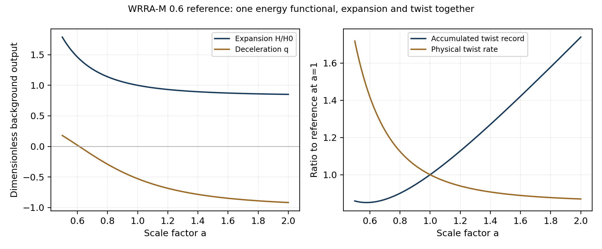
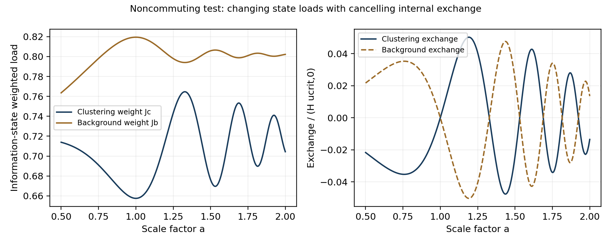

# WRRA M 0 6 정보부하와 뒤틀림 중력 및 팽창의 유한 연결

공통전달자 상태에서 에너지 부하와 압력을 계산하는 연속 기하 모형

최원식 Wonsik Choi  
WRRA-M 0.6 | 2026년 10월 1일  
Independent Researcher Seoul Republic of Korea  
ORCID 0009-0001-4263-9772 | janefather@gmail.com

## 연구 결과와 계산 범위

본 연구는 공통전달자의 정보 상태를 물리적 부하로 변환하고, 그 부하를 뒤틀림과 국소 중력 및 전역 팽창에 전달하는 유한 구성 모형을 완성한다. 하나의 에너지 함수가 정보 상태의 진화, 부피 변화에 대한 압력, 배경의 팽창을 함께 정한다. 따라서 전달자 시험과 국소 중력 계산 사이에 상태별 가중치 계산을 넣고, 기존에 따로 선언했던 배경 압력을 같은 함수의 미분으로 계산할 수 있다.

이 완성은 선언한 유한·동질 모형 안의 완성이다. 에너지의 부피 의존성, 부하 연산자와 정보 시계는 구성 선택으로 공개한다. 압력과 보존식은 그 선택에서 따라 나오는 결과다. 실제 우주의 유일한 미시 법칙이나 완전한 4차원 공변 중력 이론을 발견했다고 주장하지 않는다. 국소 회전과 렌즈는 기존에 보정한 응답에 같은 모이는 부하를 넣어 계산하는 조건부 산출값이다.

WRRA Core 1.0과 최소계산우주론 MCC 2.3.2를 기준으로 유지한다. 질량은 표현형이므로 양자화 가능하고 근본 중력은 표현형 이전이라는 B_C의 비양자 전제를 보존한다. 정보 상태의 행렬 표현은 사용하지만 중력 자체의 독립 힐베르트 공간이나 중력자를 도입하지 않는다. 이 선택을 중력 양자화 불가능성의 보편적인 정리로 분류하지 않는다.

## 개별 뒤틀림 논문에서 이어받은 구조

뒤틀림 응력 우주 논문의 이차 에너지 부하와 보정 응답, 이중 성분 중력 논문의 직접 성분·모이는 응력 회계, 유한 무경계 논문의 전역 접합과 국소 곡률의 구분을 이어받는다. 특히 MCC 2.3.2 제28–29장의 전역 배경과 국소 응력은 같은 표현형 이전 부하의 두 응답으로 취급한다. 여기에 별도의 암흑 성분을 더해 같은 효과를 두 번 세지 않는다.

현재의 후기 우주 보정은 표현형 4.93%, 전체 숨은 부하 95.07%, 모이는 부문 26.5%, 잔여 배경 68.57%다. 모두 우주 전체를 분모로 한 에너지 가중 비율이다. 26.5%는 숨은 95.07% 안의 부분이며, 정보 비트 수나 입자 채널 수의 측정비가 아니다. 이 비율들은 재현 입력으로 공개하고 갱신 가능하게 둔다.

## 공통전달자에서 상태별 부하까지

16개 시험 채널은 같은 내부 격자를 공유한다. 내부 정보 상태 ρ는 양의 준정부호 행렬이고 trace가 1이다. 부하 Js는 상태와 양의 연산자의 trace로 계산한다.

$$R=\frac{I_{16}}{16}\otimes\rho,\qquad \rho\succeq0,\quad\mathrm{Tr}\rho=1,\quad J_s=\mathrm{Tr}(\rho K_s). \tag{1}$$

N=128인 주기 격자의 순환 라플라시안을 모이는 부문의 연산자로 사용한다. 배경 연산자는 같은 연산자에서 출발하고, 비가환 시험에서만 양의 rank 1 항을 추가한다. 분모는 균등 상태의 배경 부하가 2가 되도록 고정한다.

$$K_c=2I-T-T^\dagger,\qquad K_b=\frac{K_c+\epsilon|0\rangle\langle0|}{1+\epsilon/(2N)}. \tag{2}$$

기준 계산은 ε=0이고, 비가환 시험은 ε=8이다. ε=8을 실제 우주의 선호값으로 제시하지 않는다. 이는 서로 다른 두 부하 가중치가 같은 정보 상태에서 교환하는지를 검사하는 고정 시험이다. 두 연산자는 모든 채널에 동일하게 적용하므로 이 변경이 채널별 필터 선택을 해결하지는 않는다.

기준 균등 상태에서는 Jc=Jb=2다. 물리 단위를 주는 에너지 밀도 계수 η는 기존 숨은 부하를 한 번 보정해 정한다.

$$u_{\mathrm{crit},0}=\frac{3H_0^2c^2}{8\pi G},\quad \eta=\frac{f_hu_{\mathrm{crit},0}}{2},\quad \chi=\frac{f_c}{f_h}. \tag{3}$$

같은 trace=1 상태라도 가중치가 다른 부하를 만든다. 여기서 정보의 무게는 정규화된 상태의 개수만이 아니라 그 상태가 에너지 연산자에 주는 기대 부하다. 임의의 비트 하나에 보편적인 정지질량이나 고정 에너지를 부여하지 않는다.

## 한 에너지 함수와 압력

대표 부피를 V₀a³으로 두고, 다음 에너지 연산자를 선언한다. 지수 nc와 nb는 정보부하가 부피 변화에 어떻게 반응하는지를 정하는 구성 입력이다.

$$h(a)=\chi a^{n_c}K_c+(1-\chi)a^{n_b}K_b,\quad \mathcal H(a)=\eta V_0h(a). \tag{4}$$

$$E_h=\mathrm{Tr}(\rho\mathcal H),\quad V=V_0a^3,\quad u_h=\frac{E_h}{V}=u_c+u_b. \tag{5}$$

$$u_c=\eta\chi a^{n_c-3}J_c,\qquad u_b=\eta(1-\chi)a^{n_b-3}J_b. \tag{6}$$

압력은 상태를 고정한 부피 미분으로 계산한다. 각 부문의 에너지는 a의 ns승에 비례하므로 미분 결과는 다음과 같다.

$$p_s=-\left(\frac{\partial E_s}{\partial V}\right)_\rho=-\frac{n_s}{3}u_s,\qquad n_c=0,\quad n_b=3. \tag{7}$$

nc=0은 모이는 부문의 고정된 공변 부피 에너지와 압력 0을 뜻한다. nb=3은 배경 에너지가 물리적 부피에 비례하고 압력이 배경 에너지 밀도의 음수인 구성이다. 이 판에서는 w를 별도 입력으로 다시 넣지 않는다. 그러나 지수 3의 미시적 기원까지 유도한 것은 아니다. 일정한 에너지 밀도와 음의 압력은 선택한 부피 의존성의 정확한 결과다.

## 정보 상태의 진화와 총 보존

같은 에너지 연산자가 손실 없는 상태의 진화를 생성하도록 구성한다. ℓ은 시간 lapse이고, 계산에서는 ℓ=1을 사용한다. 양의 작용 척도 A∗는 정보 시계를 정하며 플랑크 상수와 동일시하지 않는다. 현재의 ω∗/H₀=0.7도 공개한 시험 입력이다.

$$\dot\rho=-\frac{i\ell}{\mathcal A_*}[\mathcal H,\rho]=-i\ell\omega_*[h,\rho],\quad \mathcal A_*=\frac{\eta V_0}{\omega_*}. \tag{8}$$

ρ=Uρ₀U†인 unitary 궤도에서는 trace와 양의 준정부호성, 상태의 고윳값이 보존된다. trace의 순환 성질에 따라 상태 변화가 같은 순간의 에너지 연산자에 주는 부하는 0이다. 에너지 변화에는 부피에 대한 일만 남는다.

$$\mathrm{Tr}(\mathcal H\dot\rho)=0,\quad \dot E_h=-p_h\dot V,\quad \dot u_h+3H(u_h+p_h)=0. \tag{9}$$

이는 정보 상태가 변하지 않는다는 뜻이 아니다. 개별 Jc와 Jb는 변할 수 있다. 두 연산자가 교환하지 않으면 내부 부문 사이의 에너지 교환이 생기지만 그 합은 상쇄된다. 순수 상태의 위상과 혼합 상태의 고윳값 회계를 전역 팽창과 함께 사용할 수 있다.

## 고전 배경 작용과 팽창

유한 T³의 등방적인 평탄 평균을 선택해 고전적인 배경 작용을 쓴다. 공간 접합의 선택과 국소 추가 중력은 별개다. 고전 중력 작용은 다음과 같다.

$$S_g=-\frac{3c^2V_0}{8\pi G}\int dt\,\frac{a\dot a^2}{\ell}. \tag{10}$$

상태 궤도의 작용과 표현형 부하를 같은 lapse에 연결한다. Eφ,0는 압력 없는 표현형의 고정된 공변 부피 에너지다.

$$S_I=\int dt\left[i\mathcal A_*\mathrm{Tr}(\rho_0U^\dagger\dot U)-\ell(E_{\phi,0}+\mathrm{Tr}(\rho\mathcal H))\right]. \tag{11}$$

Sg와 SI를 합해 ℓ을 변분하면 Friedmann 제약을 얻고, a를 변분하면 가속도 방정식을 얻는다. U를 변분한 상태 방정식은 식 (8)이다. 이로써 동질 배경의 상태·에너지·압력·팽창은 하나의 유한 작용으로 닫힌다.

$$H^2=\frac{8\pi G}{3c^2}u_{\mathrm{tot}},\qquad \frac{\ddot a}{a}=-\frac{4\pi G}{3c^2}(u_{\mathrm{tot}}+3p_h). \tag{12}$$

이 작용은 동질 자유도로 제한한 minisuperspace 작용이다. 국소 광자 전달, 비등방 응력, 공간 섭동이나 은하의 배경 역반응을 유도한 완전한 4차원 작용으로 확대하지 않는다. Friedmann 및 연속 방정식은 표준적인 외부 수학이며 [5], 이번 모형의 구성 소유권은 정보부하 연산자와 진화·압력·뒤틀림 응답의 연결에 있다.

부문별 보존식에는 상태의 변화에 따른 교환항을 넣는다. χc=χ, χb=1−χ이다.

$$Q_s=\eta\chi_s a^{n_s-3}\dot J_s,\qquad \dot u_s+3H(u_s+p_s)=Q_s,\quad Q_c+Q_b=0. \tag{13}$$

$$q=\frac{u_{\mathrm{tot}}+3p_h}{2u_{\mathrm{tot}}},\qquad n_c=0,\ n_b=3:\quad q<0\ \Longleftrightarrow\ 2u_b>u_\phi+u_c. \tag{14}$$

따라서 팽창과 가속 팽창은 구분된다. 선택한 nc=0, nb=3 구성에서 가속 팽창은 배경 부하가 직접 성분과 모이는 부하의 합에 대해 위 부등식을 만족할 때 생긴다. 모든 뒤틀림이나 모든 정보 상태가 자동으로 가속 팽창을 만든다고 말하지 않는다.

## 같은 부하에서 뒤틀림과 국소 중력까지

전체 숨은 에너지 밀도는 전역 뒤틀림률을 정하고, 그중 모이는 밀도만 국소 추가 인력 척도에 넣는다.

$$\zeta\kappa_h^2=\frac{16\pi G}{c^4}u_h,\qquad a_T^2=\frac{\pi G}{3}u_c=\frac{\zeta c^4}{48}\kappa_c^2. \tag{15}$$

두 번째 관계는 0.5의 aT=cH√(fc/8)을 임계 밀도로 정리한 기존 보정 관계다. 상태 변화에 따라 uc가 달라지면 aT도 실제 계산으로 달라진다. 전역 H를 바꾸고도 현재의 원천 분율을 고정하는 불일치는 사용하지 않는다.

국소 응답은 기존 은하 원반 논문의 보정 함수를 유지한다.

$$y=\frac{g_M}{a_T},\quad \nu(y)=\frac{1}{1-e^{-\sqrt y}},\quad g=\nu(y)g_M,\quad v_c^2=rg. \tag{16}$$

시험 원천은 Plummer 질량 6×10¹⁰ 태양질량과 척도 3 kpc이고, 회전속도는 반경 8.2 kpc에서 비교한다. 실제 은하의 시간 진화나 새 관측 적합으로 분류하지 않는다. Φ=Ψ라는 조건 아래 같은 가속도에서 렌즈 편향도 계산한다.

$$\widehat\alpha_R(b)=\frac{2}{c^2}\int_{-\sqrt{R^2-b^2}}^{\sqrt{R^2-b^2}}g(\sqrt{b^2+z^2})\frac{b\,dz}{\sqrt{b^2+z^2}}. \tag{17}$$

렌즈 반경 R=200 kpc와 충격반경 b=10 kpc를 사용한다. 패치 밖 기하와 관측자·렌즈·광원의 거리인자는 포함하지 않는다. 국소 응답의 미시 유도와 중력 slip 검증은 이 판의 완료 주장 밖이다.

| 정보 상태 | J | aT m/s² | v km/s |
| --- | --- | --- | --- |
| 균등 기준 | 2.000000 | 1.191813e-10 | 207.510905 |
| 낮은 모드 | 0.152241 | 3.288204e-11 | 177.250177 |
| 일관된 중첩 | 0.657554 | 6.833742e-11 | 192.003913 |
| 높은 모드 | 4.000000 | 1.685478e-10 | 219.215978 |
| 영 모드 | 0.000000 | 0.000000e+00 | 161.450511 |

균등 기준은 aT=1.191812669e-10 m/s²와 207.510905 km/s를 재현한다. 같은 조건의 렌즈 편향은 0.535586511 각초다. 0.5의 가속도·회전·렌즈 산출값과 비교해 일치함을 확인했다. 영 모드에서는 추가 중력이 0이고 정의할 수 없는 비율이나 미계산 렌즈는 null로 기록한다.

## 유한 무경계 구성과 기하 의존 부하

유한 무경계 논문의 대표 접합을 T³로 유지한다. L₀는 미확정 대표 길이이고 L=L₀a다. 양의 강성을 고정하면 뒤틀림 기록의 이차 집계는 물리적 뒤틀림률과 다음처럼 연결된다.

$$L=L_0a,\quad Q=\sum_{i=1}^{3}\Theta_i^2,\quad W=\zeta Q=\frac{16\pi G}{c^4}u_hL^2. \tag{18}$$

$$E_h=\frac{c^4}{16\pi G}WL,\qquad L=\frac{16\pi GE_h}{c^4W}\quad(W>0). \tag{19}$$

양의 비영 부하와 유한한 a, 양의 L₀를 둔 각 계산 시점에서 부피는 유한하고 T³의 경계는 없다. 이 관계는 선택한 접합의 정확한 조건부 관계다. 정보부하가 실제 우주의 위상을 유일하게 선택했다거나 절대 우주 길이를 측정했다고 말하지 않는다. a가 무한히 커지는 미래까지 부피의 고정 상한을 증명한 것도 아니다.

균등 기준 상태의 nc=0, nb=3에서 팽창과 누적 기록은 다음과 같다.

$$\frac{H^2}{H_0^2}=(f_\phi+f_c)a^{-3}+f_b,\qquad \frac{W}{W_0}=\frac{f_c/a+f_ba^2}{f_h}. \tag{20}$$

| a | H/H₀ | q | W/W₀ | κh/κh₀ | aT/aT₀ |
| --- | --- | --- | --- | --- | --- |
| 0.5 | 1.788882 | 0.178588 | 0.737798 | 1.717904 | 2.828427 |
| 1.0 | 1.000000 | -0.528550 | 1.000000 | 1.000000 | 1.000000 |
| 2.0 | 0.851462 | -0.918714 | 3.024403 | 0.869541 | 0.353553 |

물리적 뒤틀림률과 누적 기록의 크기는 다르게 변한다. 현재 이후에는 팽창과 함께 누적 기록이 커질 수 있지만 밀도에 따른 물리적 뒤틀림률은 줄어든다. 둘을 한 숫자의 꼬임으로 합치지 않는다. a는 여기서 기하의 크기 변수다. 뒤틀림 광자 적색편이 커널을 계산하기 전에는 관측 적색편이로 자동 치환하지 않는다.

{width=6.4in}

착수 계산은 고정된 부하 연산자로 모든 배경 밀도를 표현하려 해 a=0.5에서 상태 허용 범위를 벗어났다. 이번 판은 에너지의 부피 의존성을 명시했으므로 물리적 부하 연산자도 기하에 따라 변한다.

$$K_{\mathrm{phys}}(a)=\frac{h(a)}{a^3},\qquad \lambda_{\min}(K_{\mathrm{phys}})\leq\mathrm{Tr}(\rho K_{\mathrm{phys}})\leq\lambda_{\max}(K_{\mathrm{phys}}). \tag{21}$$

ρ의 trace=1 조건이나 양의성을 완화하지 않았다. 연산자의 스펙트럼 자체가 a에 따라 변하고, 계산한 a=0.5에서 2까지의 기준 상태는 모두 해당 스펙트럼 범위 안에 있다. 이는 새 구성 선택으로 착수 모형의 제한을 해결한 것이다.

## 비가환 상태의 실행 결과

모드 8, 16, 24를 같은 가중치로 중첩해 상태 진화를 실행했다. 교환하는 연산자에서는 위상이 실제로 바뀌어도 평균 부하가 보존된다. 비가환 시험에서는 두 평균 부하가 실제로 달라진다.

Jc는 0.657554에서 0.764647까지, Jb는 0.763529에서 0.819446까지 변했다. 이는 ε=8과 지정한 정보 시계에서 계산한 시험 결과다. 숨은 정보의 개수가 달라져서가 아니라 같은 상태의 가중치와 기하 의존 에너지에서 나온 변화다.

{width=6.4in}

두 부문을 각각 외부에서 독립적으로 공급하지 않았다. 총 보존은 식 (9)와 (13)에서 성립한다. 수치적으로도 직접 계산한 교환항의 합이 0에 가깝고, 별도의 유한차분으로 총 연속 방정식을 확인했다.

## 검증과 반증 조건

상태 ODE는 DOP853으로 양방향 적분했다. 같은 초기 상태에서 별도의 중점 unitary 지수 전파를 실행하고 320단계와 640단계의 부하 오차를 비교했다. 비가환 시험의 오차 개선 배수는 두 끝점에서 약 4로, 두 번째 차수의 수렴을 확인했다. 또한 H 제약을 사용해 시간을 적분하는 계산과 별도로 가속도 방정식을 직접 풀어 같은 끝점의 상태 부하와 시간을 비교했다.

| 검사 | 최대 오차 |
| --- | --- |
| 에너지의 부피 미분과 압력 | 2.848e-11 |
| 비가환 상태의 노름 오차 | 4.667e-12 |
| 총 연속 방정식 잔차 | 4.105e-08 |
| H 미분과 가속도 일치 | 2.053e-08 |
| 응력 교환 상쇄 | 2.892e-15 |
| 유한 T³ 접합 관계 | 8.882e-16 |
| 별도 가속도 해의 제약 오차 | 4.805e-11 |

부피 미분으로 계산한 압력, 동시 기저 변환의 부하 불변성, 표현형 비율 0과 숨은 부하 0의 결합 경계, 잔여 배경 비율 0의 경계도 검사했다. 음의 연산자 계수, 0인 크기 변수와 비유한 정보 시계는 입력에서 거부한다. 이 검증은 동질 모형의 계산 정합성이다. 공간 섭동의 소리속도·안정성이나 실제 렌즈 관측 적합을 검증한 것으로 표시하지 않는다.

선언한 연산자가 양의성을 잃거나 상태의 trace와 양의성이 깨지면 부하 모형을 기각한다. 부피 미분과 압력이 맞지 않거나 교환항이 상쇄되지 않으면 단일 에너지 구성 주장이 실패한다. 별도의 가속도 계산이 Friedmann 제약과 어긋나면 배경 연결을 수정해야 한다. 운동과 렌즈가 같은 응답에서 맞지 않으면 조건부 국소 matching 또는 slip 조건을 수정해야 한다.

## 구성 선택과 완료 주장

에너지 지수의 선택이 팽창에 주는 영향도 실제 계산한다. 균등 기준 상태에서 다음 관계를 사용한다.

$$\rho=I_N/N:\quad J_c=J_b=2,\qquad q_0=\frac{1-n_bf_b}{2}\quad(n_c=0). \tag{22}$$

| nb | wb | q₀ |
| --- | --- | --- |
| 0.0 | -0.000000 | 0.500000 |
| 1.0 | -0.333333 | 0.157150 |
| 1.5 | -0.500000 | -0.014275 |
| 2.0 | -0.666667 | -0.185700 |
| 3.0 | -1.000000 | -0.528550 |

배경 지수 1은 고정된 뒤틀림 기록에 해당하는 w=−1/3 부문이며 이 보정에서 가속 팽창을 만들지 못한다. 지수 3은 일정 에너지 밀도와 w=−1을 만들고 기준 배경은 ΛCDM과 같은 팽창 형태다. 이 동일성을 새 독립 관측 예측이나 지수 3의 미시 증명으로 포장하지 않는다. 이미 선언한 정보 에너지의 부피 의존성에서 압력과 동역학을 일관되게 계산한 것이 0.6의 성과다.

| 주장 | 지위 | 이번 결과 |
| --- | --- | --- |
| 상태별 정보부하 | 선택한 연산자 안의 실행 결과 | 행렬 trace와 모드 계산 일치 |
| 상태 진화와 압력 및 총 보존 | 유한 동질 모형의 구성과 계산 | 같은 에너지 함수와 작용 |
| 팽창과 뒤틀림의 공존 | 조건부 배경 산출 | H와 기록 및 뒤틀림률 동시 계산 |
| 정보부하에서 국소 중력까지 | 기존 보정 응답의 조건부 연결 | 회전과 렌즈 계산 및 0.5 재현 |
| 유한 무경계 우주 | 선택한 T³ 구성의 조건부 관계 | 부하와 접합 기록의 길이 관계 |
| 미시 가중치와 에너지 지수의 유일한 기원 | 미해결 | 구성 선택으로 공개 |
| 4차원 공변 완성과 공간 섭동 | 후속 범위 | 동질 작용과 구분 |

0.6의 종료선은 정보 상태에서 부하를 실제로 계산하고, 하나의 에너지 함수와 동질 작용으로 상태 진화·압력·팽창·뒤틀림을 닫으며, 같은 모이는 부하를 기존 국소 응답에 전달하는 것이다. 이 판은 그 유한 종료선까지 계산했다. 대칭 전달자의 선택 격차는 여전히 0이고, 실제 우주의 위상과 길이, 하위차수 필터 기원, 공변 국소 응답과 관측 검증은 남은 물리 과제로 분명히 기록한다.

## 참고문헌과 재현 자료

1. Choi W. 최소계산우주론 MCC 2.3.2. 2026. 제28–29장 전역 배경과 국소 응력 회계. https://doi.org/10.5281/zenodo.22733000.
2. Choi W. 뒤틀림 응력 우주와 암흑물질의 질량 표현형. v1.0. 2026년 9월 11일. https://doi.org/10.5281/zenodo.22700557.
3. Choi W. 질량중력과 공간 뒤틀림 응력 중력의 이중 성분 모형. v0.4. 2026년 9월 27일. 개별 원문을 기준으로 사용.
4. Choi W. WRRA Finite Boundaryless Universe. v1.0. 2026년 9월 28일. 개별 원문을 기준으로 사용.
5. Trodden M and Carroll SM. TASI Lectures Introduction to Cosmology. 2004. §2.2. arXiv:astro-ph/0401547. https://vo.ned.ipac.caltech.edu/level5/Sept03/Trodden/Trodden2_2.html.
6. Choi W. WRRA-M 0.5 Information Load and Twist Gravity in a Finite Model. 2026년 10월 1일. 한글·영문 원고와 수정된 계산 코드.
7. Choi W. WRRA 공간 뒤틀림의 은하 원반면 선택과 암흑질량 표현형. v1.0. 2026년 9월 27일. https://doi.org/10.5281/zenodo.23003875.

compute.py와 두 입력 파일에 보정값·연산자·정보 시계를 명시했다. results.json은 전체 궤도, summary.json은 주요 결과, release_checks.json은 재현과 경계 검사를 기록한다. verify.py는 기존 0.5의 산출값과 비교한다. 한글·영문 원고는 같은 수식과 결과 장부에서 생성한다. 계산에는 numpy, scipy, matplotlib이 필요하고 Word 원고 생성에는 pandoc와 python-docx가 추가로 필요하다.

© 2026 Wonsik Choi. 원고와 계산 자료는 CC BY 4.0으로 배포한다.
