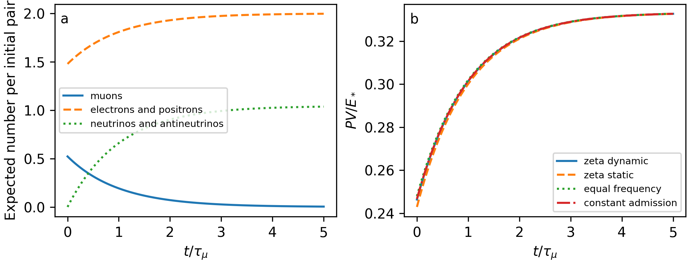
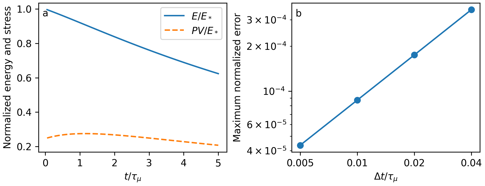

Corresponding author: Wonsik Choi, Independent Researcher, Seoul, Republic of Korea  
Email: janefather@gmail.com · ORCID: 0009-0001-4263-9772

# Abstract

When an unstable microscopic state refines a coarse energy sector, conservation of its reference energy does not guarantee preservation of its pressure. We construct a finite dynamical extension of an arithmetic particle readout within the Worldline–Residue–Resource–Action framework. Archived address distributions determine an initial electron-pair versus muon-pair allocation. Measured masses and a supplied muon lifetime calibrate the physical scale, while a positive finite quadrature of the tree-level three-body decay supplies daughter energies and momenta. A finite-step population map includes both charge-conjugate decay channels and retains daughter birth records during volume evolution. We establish eventwise conservation, a discrete energy–work identity, and a dynamic criterion for an aggregate to preserve both evolution and stress observables. At fixed volume, the construction conserves energy while converting cold muons into a positive-pressure daughter population. For the baseline address preparation, the dimensionless pressure rises from 0.246350 to 0.332735 over five muon lifetimes. A prescribed-expansion calculation verifies work closure and first-order convergence independently of the decay normalization. The extension removes frozen occupation as an execution restriction but does not restore the original dust equation of state. Its contribution is an explicit connection from retained arithmetic distinctions to evolving particle counts, energy transfer, and stress, with a precise account of which distinctions can be discarded. Two positive cohort mixtures share present number, energy, and stress but acquire different future moments under identical redshift. It is a calibrated finite kinetic model, not a derivation of the weak interaction or a fitted cosmological population history.

Keywords: finite state model; muon decay; nonequilibrium dynamics; coarse graining; energy conservation; kinetic pressure

# 1 Introduction

A coarse energy account can be correct at one instant and insufficient for its own subsequent evolution. An unstable population makes this distinction concrete: rest energy can become daughter kinetic energy without changing the total energy at a fixed volume. The pressure can nevertheless change. A model that retains only an initial energy fraction must therefore specify whether it also retains the variables needed to calculate that change.

The Worldline–Residue–Resource–Action (WRRA) program organizes this problem through minimal computation, a common carrier, and phenotype. Here phenotype means the explicit particle readout of a retained state. The earlier two-stage filter model, r11 [1], connected finite address selection to three calibrated sectors and a declared energy operator. Its aggregate energy account retained the sector probabilities but discarded address distinctions. A subsequent manuscript by Wonsik Choi and Jeongin Choi, *From Number Structure to Particle Selection: A Possible Readout and Its Energy–Pressure Constraints in a Finite WRRA Toy Model*, version 0.2, 8 October 2026, introduced a two-pair readout. We refer to that supplied companion manuscript as the interface paper. Its complete numerical input is preserved in Online Resource 1; no unverified publication identifier is assigned to it here.

The interface paper's Proposition 5 characterized diagonal refinements that preserve identifiable energy and pressure. Its example assigned a hot electron pair and a cold muon pair the same reference energy. Equal energy concealed a difference in the volume derivative. Because the muon pair was unstable, that calculation deliberately held occupations fixed. The present paper addresses the stated next step: propagate the population through decay while retaining the daughter energy, momentum, charge, and stress.

The physical inputs are conventional. Masses are taken from CODATA [2], the lifetime and channel identification from the Particle Data Group [3], and the normalized decay shape from the unpolarized tree-level Fermi interaction [4]. Those inputs are actually evaluated within the new ledger. The lifetime is not inferred from an integer address. Likewise, the finite arithmetic routing is not replaced by an assertion that known particle theory already supplies an address-to-particle mechanism.

Our central question is which state distinctions must survive coarse graining for a dynamically closed energy-and-pressure readout. Standard Markov aggregation addresses closure of reduced dynamics [5], and kinetic theory computes stress from momentum distributions [6]. We connect these established tools to the particular WRRA preparation and its pressure obstruction. The contribution is this executed construction and its compatibility conditions, rather than a new exponential-decay law or a new general aggregation theorem.

The question originally arose from the idea that gravity might express the weight of information. The artistic motivation described in the interface paper supplies historical context for that question; it is not a physical input to the present calculation. Here the operational content of “weight” is the energy and stress assigned to a retained state. We do not infer a universal mass per bit, a physical size of the universe from the address cutoff, or a fundamental time quantum from the numerical step.

# 2 Inputs and the finite preparation

## 2.1 Assessment sequence

**Verified inputs.** We retain the archived r11 cutoff, exponent, admission controls, and the interface paper's mass anchors. We add the measured lifetime as an explicit calibration. The 5%, 26.8%, and 68.2% reference fractions belong to the earlier aggregate model; they are not new observations of a lepton ensemble.

**WRRA transformation.** The calculation reconstructs the retained address distribution, applies the declared prime-multiplicity routing, propagates the unstable branch into daughter packets, and reads all occupied modes through a single energy-and-stress ledger.

**Outputs.** Conditional particle counts, daughter energy partitions, pressure histories, and work under a prescribed volume history are computed. The same three initial sector totals can support different transient pressure histories because their retained address distributions differ.

**Falsification conditions.** The specified construction fails if it produces negative populations, violates event conservation, loses energy without recorded work or transfer, or disagrees with the pressure derivative of its own kinetic energy. A physical test of arithmetic routing additionally requires a specified preparation-to-address map. We return to these conditions before drawing the conclusion.

## 2.2 Arithmetic information inherited from the interface

Let $\mathcal O$ be the odd composites in $\{2,\ldots,N\}$, with $N=10^6$. For $n=\prod_p p^{\nu_p(n)}$, define

$$\Omega(n)=\sum_p\nu_p(n),\qquad \chi(n)=\frac{\sum_p\nu_p(n)^2}{\Omega(n)^2}.\qquad\text{(1)}$$

The statistic is the probability that two independently sampled prime-factor occurrences have the same prime label. The inherited convention assigns probability $\chi(n)$ to an electron–positron pair and $1-\chi(n)$ to a muon–antimuon pair. It is a declared readout rule. The names of the prime factors do not enter it, but their multiplicities do.

Write $\alpha=1.8996876950554356$ and $w_n=n^{-\alpha}/\sum_{m=2}^N m^{-\alpha}$. For each archived drive $d$, the retained distribution and its readout are

$$\pi_{n,d}=\frac{w_nT_{n,d}}{\sum_{m\in\mathcal O}w_mT_{m,d}},\qquad X_d=\sum_{n\in\mathcal O}\pi_{n,d}\chi(n).\qquad\text{(2)}$$

The admission rule uses eight frames, $T_{n,d}=1-\prod_{k=0}^{7}[1-\sigma(g_{nkd}-h_d)]$, with $\sigma(z)=(1+e^{-z})^{-1}$. For frequency controls, $g_{nkd}=\tfrac12\sum_{j=1}^4\cos[f_{jd}(\log n+\xi_d k)]$; the constant control sets $g=0$. Zeta controls use frequencies $(14.134725141734695,21.022039638771556,25.01085758014569,30.424876125859512)$. The equal-frequency control uses $(14,21,28,35)$. All thresholds in Table 1 are inherited without refitting.

Table 1 Archived controls and recomputed conditional electron-pair probabilities

| Drive | Phase increment | Threshold | $X_d$ |
|:--|--:|--:|--:|
| Zeta dynamic | 0.1 | 1.44767317035244 | 0.739066404 |
| Zeta static | 0 | 1.3272231882678218 | 0.728712730 |
| Equal frequency | 0.1 | 1.5258414200781683 | 0.743799725 |
| Constant admission | — | 1.25537782309341 | 0.739920138 |

The phenotype probability is reconstructed as 0.05 for each control. The resident and return probabilities 0.268 and 0.682 remain inherited inputs and are not independently reconstructed by this extension. Numbers in Table 1 are conditional probabilities, not measured cosmological abundances.

## 2.3 Physical normalization and declared approximations

We use $c=1$ inside the kinetic formulas, so masses denote rest energies and momenta are expressed in energy units. Restoring units replaces $m$ by $m_ec^2$, $M$ by $m_\mu c^2$, and a momentum magnitude by $pc$. The input values are

$$m=0.51099895069\ \mathrm{MeV},\quad M=105.6583755\ \mathrm{MeV},\quad \tau_\mu=2.1969811\ \mu\mathrm{s}.\qquad\text{(3)}$$

The quoted standard uncertainties are $1.6\times10^{-10}$ MeV, $2.3\times10^{-6}$ MeV, and $2.2\times10^{-6}$ microseconds, respectively [2,3]. Computational tolerances below describe internal numerical closure, not observational precision. No uncertainty propagation or likelihood fit is claimed.

One initial pair has reference energy $E_*=2M$. The electron branch contains two opposite momenta of magnitude $p_*=(M^2-m^2)^{1/2}$; each particle has energy $M$. The muon branch contains two resting particles. Thus both branches have the same energy, zero total charge, and zero net momentum. We compute expectations per initial pair; an absolute density would require an additional pair-number and volume normalization.

The model is dilute and collisionless except for muon decay. Electron–positron annihilation, inverse reactions, external injection, muon capture, and all medium effects are absent. Neutrinos are massless in this implementation. Their oscillations and coherent flavor evolution are not needed for the reported total energy and stress and are not simulated. We use a measured inclusive lifetime with an exclusive tree-level three-body shape. This is a declared effective approximation: photons and higher-order shape corrections are not resolved, and numerical precision must not be read as precision radiative phenomenology.

# 3 A positive finite decay kernel

## 3.1 Daughter kinematics

The included channels are

$$\mu^-\longrightarrow e^-+\overline{\nu}_e+\nu_\mu,\qquad \mu^+\longrightarrow e^++\nu_e+\overline{\nu}_\mu.\qquad\text{(4)}$$

The first is specified below and the second uses its charge conjugate. Work in the parent rest frame. Set the electron momentum along the third axis, with magnitude $p\in[0,(M^2-m^2)/(2M)]$, energy $E_e=(m^2+p^2)^{1/2}$, and $q_0=M-E_e$. The neutrino-pair invariant is $s=q_0^2-p^2\geq0$. If $z\in[-1,1]$ is the antineutrino direction cosine in that pair's rest frame, the daughter quantities are

$$E_a=\frac{q_0-pz}{2},\quad E_b=\frac{q_0+pz}{2},\quad k_{a3}=\frac{q_0z-p}{2},\quad k_{b3}=\frac{-q_0z-p}{2}.\qquad\text{(5)}$$

The two transverse momenta are opposite with magnitude $\sqrt{s(1-z^2)}/2$. Here $a=\overline{\nu}_e$ and $b=\nu_\mu$. These assignments satisfy each mass shell, $E_e+E_a+E_b=M$, and $\boldsymbol p_e+\boldsymbol k_a+\boldsymbol k_b=0$ at every node, before averaging. The ensemble's absolute orientation is isotropic. Only rotationally invariant one-particle moments enter the calculation.

The earlier spin-singlet pair has unpolarized single-muon marginals. Its additive energy, number, and isotropic pressure observables can therefore be propagated using an unpolarized one-decay kernel. The implementation does not claim the joint angular or spin correlations of the entangled pair; a product sampling of its decays would not in general reproduce those observables.

## 3.2 Quadrature and its physical content

With metric signature $(+,-,-,-)$, the spin-averaged tree-level Fermi weight is proportional to $(P\cdot k_a)(p_e\cdot k_b)$. Overall constants cancel in the normalized shape. Combining it with the three-body phase-space measure in variables $(p,z)$ gives

$$u_j=W_j\frac{p_j^2}{E_{e,j}}\,M E_{a,j}(E_{e,j}E_{b,j}-p_jk_{b3,j}),\qquad w_j=\frac{u_j}{\sum_\ell u_\ell}.\qquad\text{(6)}$$

Here $W_j>0$ is the product Gauss–Legendre integration weight including the momentum interval scale. Appendix A derives the differential weight, separately from the integrated benchmark below. The factors $p^2/E_e$ arise from $p\,dE_e=(p^2/E_e)dp$. We use 64 nodes in each variable, giving 4096 daughter packets. The weights are nonnegative and sum to one. They discretize a supplied weak-decay shape; they do not derive that interaction from $\chi$.

As an integrated-rate benchmark of Eq. (6), the unnormalized integral divided by its zero-electron-mass value reproduces the standard factor [4]

$$F(r)=1-8r+8r^3-r^4-12r^2\log r,\qquad r=m^2/M^2.\qquad\text{(7)}$$

The massless energy fractions are $7/20$, $3/10$, and $7/20$ for $e$, $\overline{\nu}_e$, and $\nu_\mu$. The code checks these independently of the nodewise energy identity. At the supplied nonzero mass, the respective means are 36.984259, 31.696031, and 36.978086 MeV. Their sum is $M$. These are reproduced consequences of the input decay kernel, not independently inferred particle constants.

**Proposition 1 (finite reaction closure).** Replacing a resting parent by any packet of Eqs. (5)–(6) preserves four-momentum and electric charge. It also preserves electron and muon family numbers at the decay vertex in the massless-neutrino flavor description adopted here. A nonnegative normalized mixture of packets preserves their expectations.

**Proof.** The energy and momentum identities follow by adding Eq. (5) and the opposite transverse components. The channel $\mu^-$ carries charge $-1$ and muon family number $1$; its daughters carry charges $(-1,0,0)$, electron family numbers $(1,-1,0)$, and muon family numbers $(0,0,1)$. The conjugate identities have reversed signs. Linearity proves the mixture statement. The family-number statement is about the modeled vertices, not an exact conservation assertion for neutrino mixing. □

# 4 Evolution on a finite time grid

Let $t_k$ be a finite sequence of time points and $\Delta t_k=t_{k+1}-t_k\geq0$. Since all parent muons are at rest in the comoving frame, coordinate time equals their proper time. Define

$$s_k=e^{-\Delta t_k/\tau_\mu},\qquad d_k=1-s_k.\qquad\text{(8)}$$

A parent survives with probability $s_k$ and moves to daughter packet $j$ with probability $d_kw_j$. Each daughter packet is absorbing with respect to the included reaction, although its momentum can redshift subsequently. The single-parent transition matrix is column stochastic. Products of such maps preserve positivity and normalization for any step length. Unlike a forward Euler loss update, they cannot produce negative survival at $\Delta t>\tau_\mu$.

For a fixed finite grid and finite quadrature, the retained, rotationally reduced packet-and-cohort representation has finitely many state labels. Absolute orientation is averaged analytically, not discretized into a complete finite physical configuration space. This reduction is sufficient for the additive isotropic observables used here; it does not retain the spin-singlet pair’s full joint angular correlations. Each initial pair contains at most six daughter particles, and every birth step is drawn from that grid. Continuous time is used for a comparison solution and for analytic notation, not as a claim about the ontology of time. Expectation values need not be integers even though each realized configuration contains an integer number of particles.

At fixed volume write $\theta=t/\tau_\mu$ and $S=e^{-\theta}$. For an initial electron-pair probability $X$, expected populations are

$$N_\mu=2(1-X)S,\quad N_e=2X+2(1-X)(1-S),\quad N_\nu=4(1-X)(1-S).\qquad\text{(9)}$$

$N_\mu$ includes both muon charges, $N_e$ includes electrons and positrons, and $N_\nu$ includes all four daughter neutrino and antineutrino labels. In particular, $N_e+N_\mu=2$ while total particle number increases. No missing rest energy is interpreted as a disappearance into the return sector.

The map describes nonequilibrium relaxation of a prepared population. It does not impose detailed balance or thermal equilibrium. An entropy-growth theorem is not asserted for the Shannon entropy of this absorbing process. Production here means the creation of decay daughters; an independent source of new parent pairs is outside the implemented model.

# 5 One ledger for energy and stress

## 5.1 Instantaneous pressure and reaction sources

Let $f_i$ be the expected occupation of a mode with mass $m_i$ and comoving momentum magnitude $q_i$ in a homogeneous cell with $V=V_0a^3$. For already created particles, $q_i$ is held fixed during a volume derivative. Define

$$\epsilon_i(a)=\sqrt{m_i^2+q_i^2/a^2},\quad E=\sum_i f_i\epsilon_i,\quad \Pi=PV=\frac13\sum_i f_i\frac{q_i^2/a^2}{\epsilon_i}.\qquad\text{(10)}$$

These are the energy and isotropic kinetic-pressure moments [6]. The derivative identity $P=-(\partial E/\partial V)_{f,q}$ is immediate. For a sector with reaction sources $\dot f_i=C_i$, the chain rule gives

$$\dot E=-P\dot V+\sum_i\epsilon_i C_i.\qquad\text{(11)}$$

Thus an individual decaying sector has an energy-transfer term. After all parent and daughter modes are included, Proposition 1 makes the sum of the reaction terms zero. The complete ledger then obeys $\dot E=-P\dot V$. Where $\dot V\ne0$, its derivative along the closed trajectory also gives $-dE/dV=P$; this equality must not be attributed to a parent-only ledger. At fixed volume, conservation of $E$ supplies no value for pressure.

The birth label matters during expansion. A daughter created at time $u$ with momentum $p_j$ has momentum $p_j a(u)/a(t)$ at a later time. Treating every daughter as if it had been created at the initial volume changes both energy and pressure. The finite implementation keeps one cohort per occupied birth step rather than applying an unrecorded reheating correction.

## 5.2 Discrete work closure

In each numerical step, first redshift all existing modes from $a_k$ to $a_{k+1}$, then decay the surviving parents at the new volume using Eq. (8). If $W_k$ is the energy change in the redshift substep, define

$$W_k=\sum_{i\in\mathrm{existing}}f_i\,[\epsilon_i(a_{k+1})-\epsilon_i(a_k)].\qquad\text{(12)}$$

The resting parents contribute zero to this substep. Newborn packets use their rest-frame energies at $a_{k+1}$ and thereafter carry that birth label.

**Proposition 2 (finite-step energy–work identity).** The split update is positive and obeys $E_{k+1}-E_k=W_k$ at every step in exact arithmetic. Moreover, $W_k=-\int_{V_k}^{V_{k+1}}P_{\mathrm{existing}}(V)\,dV$ for the fixed occupations of the transport substep.

**Proof.** Redshift changes only the energies of pre-existing modes, so its energy change is Eq. (12). For a loss $D$ of parents, the reaction removes $DM$ and inserts $D\sum_jw_j(E_{e,j}+E_{a,j}+E_{b,j})=DM$. It changes no net energy at the endpoint volume. All number coefficients are nonnegative. Integrating the fixed-occupation identity in Eq. (10) gives the work formula. □

Exact discrete closure does not imply that a coarse time step resolves the continuously distributed birth times. Moving all births in a step to its endpoint is a first-order splitting approximation. Section 8 compares it with a separate birth-time integral. This distinction prevents a conservation check from being mistaken for a time-resolution check.

# 6 The dynamic extension of the refinement criterion

The interface paper's static criterion asks whether energy and its volume derivative are constant within every discarded class. Dynamics adds a separate requirement: discarded distinctions must not change a future retained state. The following elementary finite-dimensional criterion makes both requirements explicit.

**Proposition 3 (dynamic aggregate criterion).** Let $x$ be an unnormalized finite state vector, $\dot x=Lx$, and let $y=Cx$ have full-row-rank $C$. There exists a linear reduced evolution $\dot y=\overline{L} y$ for every initial state if and only if

$$CL=\overline{L} C,\qquad\text{equivalently}\qquad L(\ker C)\subseteq\ker C.\qquad\text{(13)}$$

An energy row $e^T$ and a pressure-volume row $\pi^T$ are simultaneously recoverable from $y$ if and only if both belong to the row space of $C$. When only normalized states are considered, include the normalization row in $C$. The criterion guarantees a linear reduction; it does not by itself guarantee that an arbitrary reduced coordinate system is a stochastic state space.

**Proof.** Reduced evolution requires $CLx=\overline{L}Cx$ for all $x$. Necessity of kernel invariance follows by taking $x\in\ker C$. Conversely, if $Cx=Cx'$, invariance gives $CLx=CLx'$, making $\overline{L}(Cx)=CLx$ well defined. A scalar functional is determined by $Cx$ precisely when it vanishes on $\ker C$, equivalently when it is in the row space. The two observable statements follow separately. □

For a prescribed sequence of finite maps $x_{k+1}=T_kx_k$, the corresponding condition is $C_{k+1}T_k=\overline{T}_kC_k$. Birth-time registers can be preallocated over the finite horizon. This version applies even when the current physical observables depend explicitly on the volume. It is a formulation of exact aggregation, related to the established lumpability literature [5], not a claim of a new general reduction theorem.

The pressure obstruction has a particularly small witness. Let $x=(x_\mu,x_D)^T$ represent a resting parent and its complete daughter packet at a fixed volume. Both have energy $M$, but their pressure-volume rows differ:

$$e^T=(M,M),\quad \pi^T=(0,\Pi_D),\quad L=\tau_\mu^{-1}\begin{pmatrix}-1&0\\1&0\end{pmatrix},\quad \Pi_D>0.\qquad\text{(14)}$$

Energy aggregation closes trivially because $e^TL=0$, yet $\pi^T$ is not proportional to $e^T$. Identical energy records therefore coexist with different present pressures and different pressure histories. This is the dynamic analogue of the interface paper's equal-reference-energy witness.

The same result also specifies what can be discarded safely. Under the address-independent lifetime and kernel adopted here, the address distribution affects all displayed observables only through $X$. Retaining the entire address register after Eq. (2) would be unnecessary for these observables. At fixed volume, $X$ and the surviving muon fraction suffice. Under expansion, exact cohort transport additionally retains the daughter birth-momentum distribution or an equivalent sufficient representation. We do not claim that every underlying address remains dynamically identifiable.

To apply the criterion, compare states that have identical retained records: their difference lies in $\ker C$. If transport turns that discarded difference into a difference in a later retained observable, no evolution rule based only on the present record can close. Section 6.1 tests precisely this failure using positive mixtures of the same daughter kernel.

## 6.1 A sufficient reduction and a failed moment reduction

At fixed volume, retain the constant preparation $X$ and surviving parent number $U=N_\mu$. Then $\dot X=0$, $\dot U=-U/\tau_\mu$, $N_e=2-U$, and $N_\nu=4(1-X)-2U$. The pressure is $PV/E_*=XA+[(1-X)-U/2]B$. With a constant normalization coordinate, these are linear or affine readouts of a closed reduced state. Thus the address register and individual birth labels may be discarded at fixed volume for these observables.

Expansion gives a stronger counterexample than Eq. (14). Prepare mixtures of already decayed complete packets from the same kernel at five age scales $b_i=a_{\mathrm{birth},i}/a_{\mathrm{now}}=(0.002,0.01,0.05,0.2,1)$. Each component has one charged daughter and two neutrinos. The two mixtures therefore share their species counts as well as the packet normalization. Conjugate copies can be added to make neutral pair ensembles without changing the normalized comparison. These are admissible prepared cohort histories, not two outcomes asserted to arise from one identical exponential source history. They also span a longer past expansion than the separate five-lifetime diagnostic in Section 8.

Using the packet moments defined in Eq. (18), set

$$C_{0i}=(1,D_E(b_i)/M,D_\Pi(b_i)/M)^T,\qquad C_{1i}=(1,D_E(b_i/2)/M,D_\Pi(b_i/2)/M)^T.\qquad\text{(14a)}$$

The column notation makes $C_0$ and $C_1$ three-by-five matrices. Future transport halves every existing momentum and leaves the cohort weights unchanged. The code projects the future energy row into $\ker C_0$ to select a nonzero vector $z$, scales it so $\max_i|z_i|=1$, and forms positive normalized weights $w_\pm=0.2\boldsymbol 1\pm0.18z$. The full-precision weights are archived; their rounded values are:

| Age scale | $w_+$ | $w_-$ |
|--:|--:|--:|
| 0.002 | 0.048148610 | 0.351851390 |
| 0.010 | 0.344824022 | 0.055175978 |
| 0.050 | 0.359986119 | 0.040013881 |
| 0.200 | 0.020000000 | 0.380000000 |
| 1.000 | 0.227041249 | 0.172958751 |

Here $N_{\mathrm{packet}}$ counts complete decay packets; the corresponding physical daughter count is $3N_{\mathrm{packet}}$. Both have present $(N_{\mathrm{packet}},E/M,PV/M)=(1,0.253929450472,0.083938060825)$, agreeing to less than $3\times10^{-16}$ with unrounded weights. After the common redshift, their $(E/M,PV/M)$ become respectively $(0.128194437611,0.041822958956)$ and $(0.128087403135,0.041909735511)$. Thus $C_0(w_+-w_-)=0$ but $C_1(w_+-w_-)\ne0$. No deterministic reduced transport on the present three moments can describe all these preparations: identical inputs would require different outputs. Present observable recovery holds by construction, while the time-dependent closure condition fails. This is an explicit application of the criterion to the implemented daughter kernel.

The finite mass is essential to this example. In the massless control, every complete packet obeys $D_E(b)=Mb$ and $D_\Pi(b)=Mb/3$. Further redshift multiplies both moments by the same factor, so energy and stress close for arbitrary mixtures. At finite mass, differentiating Eq. (10) gives $d\Pi/d\log a=-2\Pi+\sum_i f_i p_i^4/(3\epsilon_i^3)$ for already created modes; a further spectral moment appears. The retained finite cohort representation supplies these moments without claiming that it is the unique minimal representation.

| Retained information | Evolution closes on declared family? | Present energy and stress recoverable? |
|:--|:--|:--|
| Energy only, fixed volume | Yes; energy is constant | Energy yes; stress no |
| Normalization, $X$, surviving parents, fixed volume | Yes | Yes, for the fixed supplied kernel |
| Packet count, energy, stress, expanding prepared cohorts | No; Eq. (14a) witness | Yes at the current volume |
| Full occupied momentum cohorts and surviving parents | Yes on the finite grid | Yes |

The new information requirement is therefore conditional and testable. Arithmetic information compresses to $X$ under the declared address-independent decay law; birth-momentum information cannot generally compress to present energy and stress under massive transport. This distinction is the conceptual addition to the preceding static interface.

# 7 Fixed-volume consequences

Define $A=(1-r)/3$ and let the normalized daughter pressure be

$$B=\frac{1}{3M}\sum_j w_j\left(\frac{p_j^2}{E_{e,j}}+E_{a,j}+E_{b,j}\right)=0.3333073631.\qquad\text{(15)}$$

The complete pair energy remains $E_*$ at fixed volume, whereas

$$\frac{PV}{E_*}=XA+(1-X)(1-e^{-\theta})B.\qquad\text{(16)}$$

**Proposition 4 (decay does not restore dust).** In this fixed-volume construction, if $X<1$ and the occupied daughter kernel has $B>0$, then pressure increases strictly at finite time. For the supplied electron branch and kernel, pressure is positive for all $t>0$, including $X=0$.

**Proof.** Differentiate Eq. (16): $d(PV/E_*)/dt=(1-X)e^{-\theta}B/\tau_\mu>0$. Every kinetic contribution in Eq. (10) is nonnegative. The electron branch is hot and the decay daughters cannot all be at rest while conserving $M>m$; thus $B>0$. For $X=1$ pressure is already positive and constant. □

The statement is restricted to fixed volume. Expansion can lower $PV$ or $P$ by redshifting daughters; no general monotonicity is asserted for an expanding trajectory. Nevertheless a finite-volume state with occupied massless daughters has positive kinetic pressure, so removing the parent instability does not recover an exact dust equation of state for that state.

Table 2 reports the baseline time history. Counts are expectations per initial pair. Figure 1 compares the population change with pressure histories for all four preparations.

Table 2 Fixed-volume baseline with constant total energy $E_*=211.316751$ MeV

| $t/\tau_\mu$ | $N_\mu$ | $N_e$ | $N_\nu$ | $PV/E_*$ |
|--:|--:|--:|--:|--:|
| 0 | 0.521867 | 1.478133 | 0 | 0.246350 |
| 1 | 0.191984 | 1.808016 | 0.659766 | 0.301326 |
| 3 | 0.025982 | 1.974018 | 0.991770 | 0.328991 |
| 5 | 0.003516 | 1.996484 | 1.036702 | 0.332735 |
| 10 | 0.000024 | 1.999976 | 1.043687 | 0.333317 |

There is a useful difference between late-time readouts. Every initial branch approaches two charged electrons or positrons, whereas the daughter neutrino number approaches $4(1-X)$. Hence the latter retains information about the initial routing even when charged multiplicity does not. The pressure curves nearly converge because both final populations are highly relativistic, but the finite electron mass leaves a small nonzero distinction.

For two preparations with readouts $X$ and $X'$, the inherited total-variation bound $|X-X'|\leq\mathrm{TV}(\pi,\pi')$ propagates to

$$|N_\nu-N'_\nu|\leq4(1-e^{-\theta})\,\mathrm{TV}(\pi,\pi'),\quad \left|\Delta\frac{PV}{E_*}\right|=|A-(1-e^{-\theta})B|\,|X-X'|.\qquad\text{(17)}$$

The pressure difference is therefore not an unspecified amplification of the arithmetic preparation. Its time-dependent coefficient is explicit. Reversing $\chi\mapsto1-\chi$ changes the histories; setting $\chi=1/2$ removes all drive dependence. Both controls are executed in Online Resource 1.

# 8 Prescribed expansion and verification

## 8.1 An independently evaluated transport example

To test the ledger away from fixed volume, prescribe $a(\theta)=e^{0.1\theta}$ on $0\leq\theta\leq5$. The dimensionless rate $H\tau_\mu=0.1$ is chosen to make redshift visible during decay; it is not the present Hubble rate and is not derived from the sector fractions. There is no fitted Friedmann solution in this example. The physical duration is about 11 microseconds.

For a daughter born at $u$, put $b=a(u)/a(t)$ and define the single-decay packet energy

$$D_E(b)=\sum_jw_j\left[\sqrt{m^2+b^2p_j^2}+b(E_{a,j}+E_{b,j})\right].\qquad\text{(18)}$$

Its pressure-volume moment is $D_\Pi(b)=\tfrac13\sum_jw_j[b^2p_j^2/\sqrt{m^2+b^2p_j^2}+b(E_{a,j}+E_{b,j})]$. The continuous birth-time comparison is

$$E(t)=2X\sqrt{m^2+p_*^2/a(t)^2}+2M(1-X)e^{-t/\tau_\mu}+I_E(t).\qquad\text{(19a)}$$

$$I_E(t)=\int_0^t\frac{2(1-X)}{\tau_\mu}e^{-u/\tau_\mu}D_E\!\left(\frac{a(u)}{a(t)}\right)du.\qquad\text{(19b)}$$

Replace the primary-electron term by its kinetic-pressure moment, omit the resting-parent term, and replace $D_E$ by $D_\Pi$ to obtain $PV$. Adaptive integration over birth time provides a comparison independent of the finite-step birth assignment, while using the same specified finite daughter kernel.

At $t=5\tau_\mu$, the baseline continuous comparison gives $E/E_*=0.623937627$ and $PV/E_*=0.207373549$. Table 3 shows that endpoint splitting approaches these results with first-order error. Figure 2 displays the trajectory and the refinement test. The energy decline is accounted for by expansion work, not by deletion of daughter energy.

Table 3 Finite-step expansion at five lifetimes

| $\Delta t/\tau_\mu$ | $E/E_*$ | $PV/E_*$ | Maximum normalized error |
|--:|--:|--:|--:|
| 0.040 | 0.624287929 | 0.207490336 | $3.5030\times10^{-4}$ |
| 0.020 | 0.624112138 | 0.207431729 | $1.7451\times10^{-4}$ |
| 0.010 | 0.624024723 | 0.207402586 | $8.7096\times10^{-5}$ |
| 0.005 | 0.623981135 | 0.207388054 | $4.3508\times10^{-5}$ |

The error is the larger absolute error in $E/E_*$ and $PV/E_*$. Successive error ratios are 2.0073, 2.0037, and 2.0018. These report convergence to the adopted effective model, not agreement with an observed expansion history.

## 8.2 Implemented checks and controlled failures

The inherited interface code is rerun unchanged and passes its 47 checks. The new code passes 56 checks covering kinematics, normalization, vertex quantum numbers, standard massless moments, finite-mass phase space, pressure derivatives, populations, routing controls, work closure, and time-step refinement. Counts are software checks rather than independent empirical confirmations.

The relative event conservation and mass-shell tolerances are $10^{-14}$. The integrated phase-space factor agrees with Eq. (7) within $2\times10^{-10}$. Changing the daughter quadrature from 64 to 128 nodes per variable changes $B$ by less than $10^{-15}$ in this run. Centered volume differences use relative step $10^{-5}$ and pressure tolerance $2\times10^{-10}$ after normalization by $M$. The largest accumulated energy–work residual at step 0.01 is $2.02\times10^{-15}$ of $E_*$. Analytic propositions establish the general identities; these calculations audit the concrete implementation.

Three analytic negative controls evaluated in code make the scope of closure visible; they are not three separate full evolution simulations. The vertex charge and family-number arrays are checked explicitly for the negative-muon channel, with its conjugate following by sign reversal. Omitting neutrinos loses 10.7206% of $E_*$ by one lifetime in the baseline. Assigning zero pressure to the occupied hot modes contradicts Eq. (10). Forward Euler survival with $\Delta t=2\tau_\mu$ becomes negative. Each is detected by the checks rather than repaired by silently changing the energy normalization.

A flat three-body phase-space kernel is also evaluated as a shape control. It gives $B=0.333302603$, compared with $0.333307363$ for the supplied weak-decay weight. The small pressure difference illustrates that near-relativistic stress is relatively insensitive to the detailed daughter spectrum in this example. It does not establish that an arbitrary kernel is a correct weak-decay spectrum. The implementation has much greater discriminating power for conservation failures than for precision radiative effects.

# 9 Interpretation and limits of the extension

The effective model is designed to establish finite nonequilibrium transitions and a consistent energy–stress account at the declared approximation order. It does not calculate precision electromagnetic corrections to the decay spectrum. Incorporating radiative channels would require explicit photon packets and corrected weights in the same conservation and transport account; using an inclusive measured lifetime alone does not implement those channels. Neutrinos are treated as massless, not as exempt from the energy and stress account.

The new computation executes a specific connection that was absent from the interface paper: unstable population loss is accompanied by explicit daughter creation and transport. The weak-decay kernel and its physical scale are external inputs, but their energy and stress consequences are now calculated inside the WRRA ledger. By contrast, no microscopic operator of the broader 15-channel common carrier has been inserted here. That program remains background to the shared-carrier design, not an implemented Hamiltonian in this paper.

Three kinds of information have different roles. The archived arithmetic preparation determines $X$. The measured lifetime determines the clock conversion. The supplied decay shape and redshift rule determine how the resulting population loads the energy-and-pressure account. None is renamed as an output of another. Reproducing accepted mass-shell relations, decay moments, and conservation identities is a successful consistency result. The construction-specific outputs are their connection to the retained WRRA preparation and the conditional transient observables generated by that connection.

The dynamic extension leaves the old pressure obstruction intact and explains its evolution. To embed this ensemble into the r11 energy cell one may explicitly allocate $\mathcal N=0.05E_{\mathrm{cell},0}/E_*$ initial pairs, retain $E_D=0.268E_{\mathrm{cell},0}$, and retain $E_R=0.682E_{\mathrm{cell},0}V/V_0$. The new phenotype contribution would be $\mathcal N E(t)$ and $\mathcal N P(t)$. The total energy is then $\mathcal N E(t)+E_D+E_R$, with the pressure differentiated from those same terms. This is an algebraic embedding with a declared number normalization; it does not preserve dust pressure or supply a fit to the present universe. Solving for geometry self-consistently would be a further calculation.

An energy fraction does not specify a muon abundance, a density, or a collision rate. The illustrative sparse ensemble therefore cannot be assigned a realistic early-universe epoch merely from its energy scale. At a cosmological density, annihilation, scattering, inverse decay, thermal production, neutrino masses where relevant, and a self-consistent expansion history would need their own operators and validation. The finite absorbing model is deliberately restricted to a prepared nonequilibrium episode.

Likewise, the Markov decay law is a calibrated effective description over the resolved interval. It does not derive exponential decay from a finite closed Hamiltonian or address short-time deviations and long-time tails of an exact quantum survival amplitude. The finite probability map is sufficient for the observables claimed here; it does not imply a microscopic unitary realization. Physical record storage, erasure costs, and local gravitational backreaction are not hidden in the ledger.

The next empirical interface is specific: a reproducible physical preparation must map measured conditions to $\pi$ and to the routing rule, with uncertainties fixed before comparison. A discrepancy would reject that implementation. Internally, the current model already has sharper failure conditions than total-energy matching alone: it must pass the daughter completeness, pressure, cohort-history, and aggregate-closure tests. There is no requirement that a new measured constant be invented in order for this structural connection to be assessable.

# 10 Assessment and conclusion

**Verified inputs.** Two preceding WRRA constructions provide the finite selection and pair interface. Established masses, a lifetime calibration, and the specified leading decay kernel provide the physical scale and reaction shape.

**WRRA transformation.** Retained address distinctions are reduced to $X$, propagated through positive finite decay maps, and carried into a cohort-resolved kinetic ledger. Energy and pressure are evaluated from the same occupied modes.

**Outputs.** The paper supplies a finite executable nonequilibrium model, event and work closure, an exact criterion for dynamic aggregation with observable recovery, and conditional particle and pressure histories. The fixed-volume baseline retains total energy while $PV/E_*$ rises from 0.246350 to 0.332735 over five lifetimes.

**Falsification conditions.** Negative populations, missing daughter energy, incorrect stress, nonconvergent time refinement, or a reduction that violates Eq. (13) invalidate the stated construction. An eventual physical routing experiment tests an additional specified implementation rather than the input lifetime alone.

The frozen-occupation restriction has been removed for the declared decay episode. The earlier energy–pressure obstruction has become a dynamical design constraint: conserving a coarse energy record is compatible with changing stress. The explicit cohort witness further shows that retaining present energy and stress need not retain their future evolution. A compatible extension must retain a sufficient momentum representation, or restrict the preparation family so that the proposed reduction closes. This paper provides that extension for one finite WRRA preparation without adding an unrecorded compensation sector.

# Statements and Declarations

**Data and code availability.** Online Resource 1 contains the new executable calculation, unchanged inherited interface code and r11 controls, machine-readable results, trajectory data, figure sources, and the manuscript source. The r11 research record is archived at https://doi.org/10.5281/zenodo.23237629. No new experimental dataset is reported. This version has no assigned new public DOI.

**Funding.** No external financial support is reported for this research.

**Competing interests.** The authors declare no competing interests relevant to this work.

**AI assistance.** ChatGPT assisted with model formulation, analytic arguments, code, computational verification, English drafting, and document preparation. Computational checking is not external peer review. The human authors retain responsibility for reviewing and approving the final content.

**Online Resource 1.** Reproducibility code and data for *Dynamic Decays and Nonequilibrium State Transitions in a Finite WRRA Model*. Wonsik Choi and Jeongin Choi. Correspondence: Wonsik Choi, Independent Researcher, Seoul, Republic of Korea; janefather@gmail.com. Intended journal: Foundations of Physics.

# Appendix A Differential decay weight

At leading order the Fermi amplitude for the negative-muon channel is proportional to

$$\mathcal M=\frac{G_F}{\sqrt2}[\overline{u}_b\gamma^\alpha(1-\gamma^5)u_P][\overline{u}_e\gamma_\alpha(1-\gamma^5)v_a].\qquad\text{(A1)}$$

The spin sum, with an average over the initial muon spin and massless neutrinos, gives

$$\overline{|\mathcal M|^2}=64G_F^2(P\cdot k_a)(p_e\cdot k_b).\qquad\text{(A2)}$$

The electron mass is retained in its on-shell energy. In the Dirac traces the explicit mass terms do not add a separate term to (A2), because of the chiral projectors. The factors in the parent rest frame are $P\cdot k_a=ME_a$ and $p_e\cdot k_b=E_eE_b-pk_{b3}$, with the flavor assignment of Eq. (5).

Factorize invariant three-body phase space using $q=k_a+k_b$:

$$d\Phi_3=\frac{ds}{2\pi}\,d\Phi_2(P;p_e,q)\,d\Phi_2(q;k_a,k_b).\qquad\text{(A3)}$$

After integrating the global orientation and the internal azimuth, the first two-body factor is proportional to $p/M$ and the massless second factor has no residual power of $s$. Since $s=M^2+m^2-2ME_e$ and $|ds|=2Mp\,dp/E_e$, the remaining measure is proportional to $(p^2/E_e)dp\,dz$. The constant flux and angular factors cancel on normalization. Multiplying by (A2) therefore yields Eq. (6).

There are distinct checks on this derivation. The total integrated weight gives $F(r)$ in Eq. (7), for which [4] is the integrated-width reference. Integrating over $z$ first instead gives an electron-energy weight proportional to

$$g(E_e)=\frac{Mp}{2}\left[(M-E_e)(ME_e-m^2)-\frac{Mp^2}{3}\right].\qquad\text{(A4)}$$

The normalized mean obtained by a separate one-dimensional adaptive integral is 36.98425877394101 MeV; the two-dimensional finite quadrature gives 36.98425877394095 MeV. This differential-moment comparison and the massless flavor-resolved means audit information that a total-rate check alone does not determine. Neither check includes radiative corrections to the daughter shape.

# References

[1] Choi, W., Choi, J.: Conditional Reproduction of Ordinary Matter Fractions: Admissible Targets and Energy Readout in a WRRA Two Stage Filter Model. Research preprint r11 (2026). https://doi.org/10.5281/zenodo.23237629

[2] National Institute of Standards and Technology: CODATA recommended values of the fundamental physical constants, 2022 adjustment. Complete table. https://physics.nist.gov/cuu/Constants/Table/allascii.txt. Accessed 8 October 2026

[3] Navas, S., et al. (Particle Data Group): Review of Particle Physics. Physical Review D 110, 030001 (2024), and 2025 update, muon listing. https://doi.org/10.1103/PhysRevD.110.030001. https://pdg.lbl.gov/2025/listings/rpp2025-list-muon.pdf

[4] van Ritbergen, T., Stuart, R.G.: Complete 2-loop quantum electrodynamic contributions to the muon lifetime in the Fermi model. Physical Review Letters 82, 488–491 (1999). https://doi.org/10.1103/PhysRevLett.82.488. Author preprint: https://arxiv.org/abs/hep-ph/9808283

[5] Ganguly, A., Petrov, T., Koeppl, H.: Markov chain aggregation and its applications to combinatorial reaction networks. Journal of Mathematical Biology 69, 767–797 (2014). https://doi.org/10.1007/s00285-013-0738-7. Author preprint: https://arxiv.org/abs/1303.4532

[6] Ma, C.-P., Bertschinger, E.: Cosmological perturbation theory in the synchronous and conformal Newtonian gauges. The Astrophysical Journal 455, 7–25 (1995). https://doi.org/10.1086/176550. Author preprint: https://arxiv.org/abs/astro-ph/9506072
