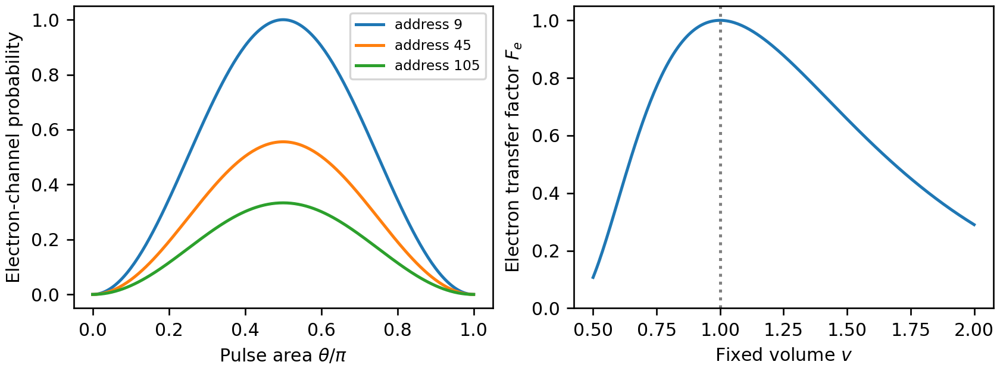
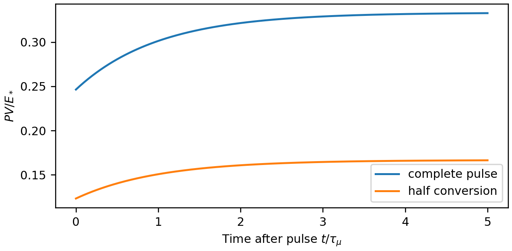

Corresponding author: Wonsik Choi, Independent Researcher, Seoul, Republic of Korea  
Email: janefather@gmail.com · ORCID: 0009-0001-4263-9772

## Abstract

Can an arithmetic particle-selection rule be implemented by one finite interaction rather than a separate fitted coupling at each address? We construct an effective carrier model within the Worldline–Residue–Resource–Action framework. Two conditionally independent registers encode the multiplicities of prime factors. A label-symmetric equality projector controls a common source coupled to two supplied particle-pair channels. One pulse generates the earlier collision-statistic probabilities without an address-dependent interaction strength. We prove a restricted single-register obstruction and classify the diagonal permutation-invariant effects that recover this statistic. The implementation reproduces species probabilities but does not reproduce the coherent output channel of the preceding interface. An explicit input Hamiltonian conserves bare energy at the calibrated reference volume. Away from that volume, detuning changes conversion probabilities and requires the interaction and switching work to be retained. A response identity relates the reference pressure-volume moment to the logarithmic-volume derivative of mean pulse work. We connect the generated populations to the implemented muon-decay kernel and recover its energy and pressure histories at full conversion. Conditional independence, resonance, and retained preparation records are thus distinct requirements, with separate controlled failures. The result is an executable effective interaction candidate and a compatibility analysis linking arithmetic preparation, carrier conversion, and subsequent kinetic evolution. It does not derive lepton identities, the weak interaction, or the full fifteen-channel carrier from arithmetic alone.

**Keywords:** finite carrier; effective Hamiltonian; arithmetic readout; quantum channel; energy conservation; kinetic pressure

# 1 Introduction

The distinction between assigning an output probability and implementing an interaction is central to a physical readout model. An assignment can be normalized and still leave unspecified its source energy, interaction time, inaccessible records, and stress. This paper examines that distinction for a finite arithmetic model whose earlier readout used the probability that two prime-factor occurrences have the same label.

Three preceding constructions define the problem. The r11 two-stage filter model [1] generated retained address distributions and an aggregate energy account. The particle interface [2] assigned electron-pair probability $\chi(n)$ and muon-pair probability $1-\chi(n)$ to an admitted address. Its Proposition 5 showed that equal reference energy does not imply equal pressure under volume change. The dynamical extension [3] propagated those populations into explicit decay daughters and retained momentum cohorts during expansion. It removed frozen occupation for the stated decay episode, while retaining the pressure obstruction. None of those three calculations supplied the explicit effective carrier interaction that realizes the arithmetic routing.

We now supply a finite effective interaction with a three-state carrier and two preparation registers. The interaction compares labels and uses a common coupling strength. The address dependence enters the preparation; the interaction does not contain a separate angle $\arcsin\sqrt{\chi(n)}$ for every address. This moves the construction from an output prescription to a specified controlled Hamiltonian. It leaves the preparation rule and the physical identification of output labels explicit.

The use of quantum channels and unitary dilation is standard [4,5]. Two-copy access to nonlinear state functionals is also established [6]. The contribution here is the particular connection to the WRRA input ledger, its restricted resource and symmetry results, the explicit difference from the earlier coherent channel, and the energy-and-pressure conditions on its composition with [3]. The construction can be used as a finite quantum simulation protocol. It is not evidence that prime registers have been observed in a lepton-production experiment.

The central compatibility question is whether recovering a channel probability also recovers the energy and stress conditions of its preparation. Our answer separates three requirements: matching readout probabilities, preserving a prescribed energy operator, and preserving its volume derivative. The comparator supplies a concrete setting in which the first holds while the other requirements have distinct boundaries. In particular, Corollary 4.1 identifies the reference pressure-volume moment with the negative logarithmic-volume derivative of mean pulse work, even though the population response is stationary there. This relation was absent from the earlier three constructions. It follows from the stated dispersion and standard two-state dynamics; its role is a specific compatibility result, not a new fundamental transition law.

This preparation problem warrants a separate treatment because neither a probability assignment [2] nor evolution from an already prepared population [3] determines the operation that creates that population or its control-work account. Here the retained arithmetic distribution, a common interaction, and the same energy-volume relation enter one executable calculation. Their connection yields both a stationary population response and a nonzero first-order work response at resonance, and identifies the latter with the previously unresolved stress. The advance is this explicit connection between preparation and subsequent physical readout, with its compatibility conditions. Known-value recovery establishes consistency with the inherited physical anchors; the structural contribution is assessed through the resulting operator and response relations.

The guiding WRRA ideas are minimal computation, a common carrier, and phenotype. In this paper those terms have specific roles: finite registers hold the preparation, a single source space feeds two output channels, and the particle labels define the readout. The historical intuition that gravity might express the weight of information motivates checking energy and stress together. The artistic origin reported in [2] remains research history, rather than a new physical input.

# 2 Inputs and operational assumptions

## 2.1 Assessment ledger

**Verified inputs.** We retain the r11 control file, the mass anchors, and the calibrated decay implementation of [3]. The cutoff is $N=10^6$, the exponent is $\alpha=1.8996876950554356$, and there are eight admission frames. Four archived thresholds are reused without refitting. The reference fractions $0.05,0.268,0.682$ are earlier aggregate inputs; only the phenotype distribution is reconstructed here.

**WRRA transformation.** A retained address is encoded as two independent prime-label registers. An equality-controlled source-to-pair interaction generates populations. A declared energy operator, pulse-work account, and the inherited decay kernel carry those populations into energy and pressure.

**Outputs.** We calculate pulse-dependent source and pair probabilities, conditions for recovering the earlier readout, detuned conversion and switching work, and post-pulse pressure histories.

**Falsification conditions.** Failure of positivity, unitarity, probability closure, the asserted reference-energy commutator, switching-work closure, or the handoff to the supplied decay map invalidates the specified realization. A physical test additionally requires measured preparation conditions to be mapped to the registers and a calibrated interaction. The mathematical results below do not assume that this latter step has been established.

**Assumption–derivation boundary.** The measured masses and lifetime are physical anchors; the archived filter parameters are inherited calibration inputs. Conditional independence, the comparison basis, equality-to-electron assignment, source dispersion, and pulse protocol are construction assumptions. Given these inputs, the pulse probabilities, restricted access obstruction, symmetric-effect classification, resonance condition, switching-work response, and decay handoff are derived results. None of the latter is used to relabel an assumed preparation or species identification as a discovery of a natural lepton-production law.

## 2.2 Arithmetic preparation

Let $\mathcal O$ be the odd composite addresses in $\{2,\ldots,N\}$. For $n=\prod_p p^{\nu_p(n)}$, define

$$
\Omega(n)=\sum_p\nu_p(n),\qquad r_p(n)=\frac{\nu_p(n)}{\Omega(n)},\qquad
\chi(n)=\sum_p r_p(n)^2. \tag{1}
$$

For a common finite prime alphabet $\mathcal P_N$, unused coordinates have zero weight. Two registers $A,B$ are initialized, conditional on $n$, as

$$
\tau_n=\sum_{p\in\mathcal P_N}r_p(n)|p\rangle\langle p|,
\qquad \sigma_n=\tau_n\otimes\tau_n. \tag{2}
$$

This is independent sampling with replacement from the factor occurrences. It is an explicit preparation assumption, not a consequence of factorization alone. Factorization and state preparation have a resource cost; neither is included in a claim of quantum computational advantage. Repeated preparation from the known classical address is not cloning an unknown quantum state. No physical infinity is used.

For drive $d$, define $w_n=n^{-\alpha}/\sum_{m=2}^N m^{-\alpha}$ and

$$
\pi_{n,d}=\frac{w_nT_{n,d}}{\sum_{m\in\mathcal O}w_mT_{m,d}},
\qquad X_d=\sum_{n\in\mathcal O}\pi_{n,d}\chi(n). \tag{3}
$$

Here $T_{n,d}=1-\prod_{k=0}^{7}[1-\operatorname{sigmoid}(g_{nkd}-h_d)]$, with $g_{nkd}=J^{-1/2}\sum_{j=1}^J\cos[f_{jd}(\log n+\xi_d k)]$ and $J=4$. The constant drive has $g=0$. The dynamic and static zeta controls use $(14.134725141734695,21.022039638771556,25.01085758014569,30.424876125859512)$; the equal-frequency control uses $(14,21,28,35)$. All values are archived inputs, not a new zeta-zero calculation.

| Drive | $\xi_d$ | $h_d$ | $X_d$ |
|:--|--:|--:|--:|
| zeta dynamic | 0.1 | 1.44767317035244 | 0.739066404 |
| zeta static | 0 | 1.3272231882678218 | 0.728712730 |
| equal frequency | 0.1 | 1.5258414200781683 | 0.743799725 |
| constant admission | not used | 1.25537782309341 | 0.739920138 |

Table 1. Frozen preparations and recomputed conditional electron-pair probabilities. The phenotype total is 0.05; these are not measured cosmic lepton fractions.

## 2.3 Supplied physical labels

The carrier basis is $\{|s\rangle,|e\rangle,|\mu\rangle\}$. The first is one source excitation, not a vacuum of zero energy. The others label an electron–positron pair and a muon–antimuon pair. At the reference volume, each pair has zero net momentum, zero charge, zero net lepton number, and the spin-singlet assignment of [2]. The source is assigned the same conserved total labels. The registers are neutral, degenerate computational degrees of freedom during the pulse. Their preparation or erasure costs are outside this pulse ledger and are not asserted to vanish in a physical device.

The finite three-state carrier is the actually implemented common source for this experiment. It is not identified with the earlier fifteen-channel chiral carrier merely by using the same name. No fifteen-channel matrix, gauge representation, spatial locality, or field-theoretic vertex is inserted here. The present interaction is an effective network operator; the labels and common energy do not establish a Standard Model interaction.

# 3 A common carrier interaction

Put

$$
Q=\sum_{p\in\mathcal P_N}|pp\rangle\langle pp|,\quad
X_e=|e\rangle\langle s|+|s\rangle\langle e|,\quad
X_\mu=|\mu\rangle\langle s|+|s\rangle\langle\mu|.
$$

For a real common coupling $g>0$, define the pulse Hamiltonian

$$
H_I=g\{Q\otimes X_e+(I-Q)\otimes X_\mu\},\qquad
\theta=gt_p/\hbar. \tag{4}
$$

The operator is block diagonal in the register labels. In an equal-label block it couples $s$ to $e$; in an unequal-label block it couples $s$ to $\mu$. Every block is a three-dimensional Hermitian matrix with one spectator. This is a controlled network interaction, not a proof of a spatially local two-body realization. Its explicit matrix dimension is $3|\mathcal P_N|^2$ before using sparsity and occupied-register support.

**Proposition 1 (common pulse realization).** Starting from $\sigma_n\otimes|s\rangle\langle s|$ and evolving with Eq. (4), the three readout probabilities are

$$
P_s=\cos^2\theta,\quad P_e=\chi(n)\sin^2\theta,\quad
P_\mu=[1-\chi(n)]\sin^2\theta. \tag{5}
$$

At $\theta=\pi/2$, this reproduces the probabilities of [2].

*Proof.* The equal and unequal register subspaces are orthogonal and invariant. In either active two-state block, $e^{-i\theta X}|s\rangle=\cos\theta|s\rangle-i\sin\theta|a\rangle$. The equal-label weight is $\operatorname{Tr}(Q\sigma_n)=\sum_pr_p^2$. Taking the register trace gives Eq. (5). The three probabilities are nonnegative and sum to one. □

The common pulse strength does not encode the address. At full transfer the pure-prime-power address 9 gives probability one, address 15 gives $1/2$, address 45 gives $5/9$, and address 105 gives $1/3$. An imperfect common pulse attenuates both pair branches equally; conditional on successful conversion, their ratio is unchanged whenever $\sin^2\theta>0$. This conditional invariance does not justify discarding unsuccessful source states from the unconditional energy or number account.

The construction removes one freedom: an independently fitted interaction angle for each address. Address dependence remains in the declared $r_p(n)$ preparation. Conditional independence, the comparison basis, the identification of equality with the electron label, and the source spectrum remain supplied choices. The verified output is that one common operator acts on all these preparations according to Eq. (5); it is not a derivation of those remaining choices. The diagonal readout also has a classical two-draw comparator implementation. The quantum description makes the effective Hamiltonian, coherence, and energy constraints explicit without claiming a nonclassical sampling advantage.

## 3.1 A restricted resource obstruction

**Proposition 2 (one diagonal register is insufficient).** A fixed measurement device with access only to one register $\tau_n$, and no address-dependent side information, cannot produce electron probability $\chi(n)$ for all admitted addresses when the set includes $9,25,15$.

*Proof.* Any fixed channel followed by a binary readout is represented on the input by an effect $0\le F\le I$. Its probability on a diagonal register is linear in $r$. Addresses 9 and 25 give pure labels 3 and 5 and require $F_{33}=F_{55}=1$. Address 15 has $r=(1/2,1/2)$ on those labels, so the same device returns one, whereas $\chi(15)=1/2$. □

The restriction to access through $\tau_n$ is essential. A device supplied with the classical address can compute $\chi(n)$ and perform a controlled rotation on one output register. Proposition 2 is not a lower bound on all implementations or a proof of a physically minimal universe. It establishes the need for more than one draw in the specified unknown-label sampling interface. Two registers suffice through Proposition 1. This is consistent with established multi-copy estimation of nonlinear functionals [6]; it is not a new general impossibility theorem.

## 3.2 What permutation symmetry does and does not fix

**Proposition 3 (diagonal symmetric effect classification).** Let $F$ be an effect diagonal in the ordered-label basis and invariant under all simultaneous permutations of a finite alphabet of size at least two. Then

$$
F=aQ+b(I-Q),\qquad 0\le a,b\le1,
\qquad \operatorname{Tr}(F\tau\otimes\tau)=b+(a-b)\sum_pr_p^2. \tag{6}
$$

If this probability is $\chi$ at both a pure label and an equal two-label mixture, then $a=1,b=0$.

*Proof.* Simultaneous permutations have exactly two orbits on ordered pairs: equal and unequal. A diagonal invariant coefficient must be constant on each orbit. The effect bounds give $a,b\in[0,1]$. Taking the expectation proves the formula. The two stipulated preparations require $a=1$ and $(a+b)/2=1/2$, hence $b=0$. □

This result singles out equality within the stated diagonal, label-symmetric effect class. It does not make all Hamiltonians unique, derive the species assignment, or forbid coherent alternatives. Exchanging the particle labels remains an allowed alternative. The diagonal effect restriction is substantive: dropping it enlarges the commutant and admits additional operators.

Independence is a separate condition. If the two registers instead have a diagonal joint distribution $\Gamma$ with the same marginals $r$, then $P_e(\pi/2)=\sum_p\Gamma_{pp}$. For the address-45 marginals $(2/3,1/3)$, independent preparation gives $5/9$, while perfectly correlated preparation $\Gamma=\operatorname{diag}(r)$ gives one. Equal marginals therefore do not determine the routing. This controlled failure identifies information lost by a marginal-only record.

# 4 Probability recovery is not channel identity

The earlier interface retained an address record and associated a pure state $|\psi_n\rangle=\sqrt{\chi(n)}|e\rangle+\sqrt{1-\chi(n)}|\mu\rangle$ with that record [2]. In the present implementation, at complete conversion, tracing out the preparation registers yields

$$
\rho_C(n)=\chi(n)|e\rangle\langle e|+[1-\chi(n)]|\mu\rangle\langle\mu|. \tag{7}
$$

Equal and unequal register records are orthogonal, so the species off-diagonal element vanishes. This also holds if coherent product-register amplitudes with the same diagonal probabilities are used: $Q$ and $I-Q$ still leave orthogonal records. The readout coincides with the species-dephased version of the earlier pure output for a diagonal address ensemble, not with the full earlier quantum channel. For one address the trace distance to its earlier pure output is $\sqrt{\chi(1-\chi)}$, equal to $\sqrt2/3$ for address 105. Equal species counts can therefore conceal a difference that a suitable coherent readout would detect.

A classical record of the address may be retained throughout. Alternatively, a controlled preparation can keep an orthogonal address register while preparing factor registers; this preserves input identity in a larger space. We do not erase it unitarily and assert that orthogonal inputs became nonorthogonal pure outputs. The numerical population and kinetic-stress results use only diagonal probabilities, so the distinction in Eq. (7) does not prevent the handoff to the additive decay observables of [3]. A claim about interference, pair angular correlations, or channel equivalence would require a different test.

# 5 Energy conservation and its reference-volume boundary

## 5.1 Explicit input and output energies

Use $c=1$ internally, with masses as rest energies in MeV. The inherited CODATA anchors are $m_e=0.51099895069$ MeV and $m_\mu=105.6583755$ MeV [7]. Their quoted standard uncertainties are $1.6\times10^{-10}$ MeV and $2.3\times10^{-6}$ MeV. Let $E_*=2m_\mu$, $r_m=(m_e/m_\mu)^2$, and $v=V/V_0$. Set

$$
E_s(v)=E_*,\quad E_\mu(v)=E_*,\quad
E_e(v)=E_*\sqrt{r_m+(1-r_m)v^{-2/3}},
\qquad H_0(v)=I_{AB}\otimes\operatorname{diag}(E_s,E_e,E_\mu). \tag{8}
$$

The source is assigned constant energy, the muon pair is at rest, and the electron pair has opposite momenta with $p_e(v)=\sqrt{m_\mu^2-m_e^2}\,v^{-1/3}$. These supplied dispersions implement the same reference-energy allocation as [2]. The source energy is an additional physical modeling input, not derived from its register dimension. The registers' degenerate reference energies can be included as a common constant.

**Proposition 4 (resonance and bare-energy conservation).** At $v=1$, $[H_0,H_I]=0$, so the pulse conserves the assigned bare energy for every state. For a nonzero $s$–$e$ coupling at any fixed $v$, commutation requires $E_s(v)=E_e(v)$. The supplied dispersions satisfy this equality only at $v=1$.

*Proof.* For a diagonal $H_0$, the $s,a$ matrix element of its commutator with $H_I$ is $(E_s-E_a)(H_I)_{sa}$. Each occupied coupling block must therefore connect equal energies for the commutator to vanish. At $v=1$, all three entries are $E_*$. Since $0<r_m<1$, Eq. (8) gives $E_e=E_*$ only when $v=1$. □

This is the distinction between a resonant effective realization and a universal energy-preserving conversion at arbitrary volume. The Hamiltonian is Hermitian away from resonance, but Hermiticity alone does not conserve the bare energy operator. It conserves its total, fixed-volume Hamiltonian $H_0+H_I$ while the pulse is on.

## 5.2 Detuning and pulse work

For $\Delta_a=E_a-E_s$, the exact transfer probability in one block under $H_0+H_I$ is

$$
F_a(v,t_p)=\frac{g^2}{g^2+\Delta_a^2/4}
\sin^2\!\left[\frac{t_p}{\hbar}\sqrt{g^2+\Delta_a^2/4}\right]. \tag{9}
$$

Thus $P_e=X_dF_e$, $P_\mu=(1-X_d)F_\mu$, and $P_s=1-P_e-P_\mu$. Here $F_\mu=\sin^2\theta$. In general the conditional pair ratio now changes. Equation (9) follows by subtracting the mean diagonal energy of each two-state block and squaring the residual matrix, giving $(g^2+\Delta_a^2/4)I$. It is the usual finite two-state solution applied to this carrier, not a new transition law.

Take an ideal rectangular pulse with instantaneous switching at fixed $v$. Initially $\langle H_I\rangle=0$. Switching on has zero mean work for the initial source state. The on-pulse total energy is conserved. Switching off contributes $W_{\mathrm{off}}=-\langle H_I\rangle_{t_p}$, so

$$
\langle H_0\rangle_{t_p}-E_*=W_{\mathrm{off}}
=P_e\Delta_e+P_\mu\Delta_\mu. \tag{10}
$$

Positive $W$ denotes work on the system. At resonance this work vanishes in expectation. Away from resonance the bare energy change must be recorded; it is not missing source energy or automatic reservoir compensation. This ideal switching protocol does not model a pulse controller, smooth turn-on, or all fluctuations of work. It supplies a complete mean-energy account for the stated control. The preparation and record-erasure costs remain separate.

For numerical stress testing we choose $g/E_*=0.1$ and $\theta=\pi/2$. These are simulation parameters, not measured interaction constants. No production time or decay lifetime is inferred from them. Figure 1 shows the pulse law and its detuning sensitivity.

**Corollary 4.1 (pressure as preparation-work response).** Keep $g,t_p$, the address distribution, and the register preparation fixed while comparing pulses prepared at neighboring fixed volumes. Put $\varepsilon=\log v$. At the reference volume,

$$
\left.\frac{dP_e}{d\varepsilon}\right|_0=0,\qquad
-\left.\frac{dW_{\mathrm{off}}}{d\varepsilon}\right|_0
=X_d\sin^2\theta\,\frac{E_*(1-r_m)}3
=\langle PV\rangle_{\mathrm{post},\,v=1}. \tag{10a}
$$

For a complete pulse, $F_e=1-\Delta_e^2/(4g^2)+O(\Delta_e^4/g^4)$ as $\Delta_e/g\to0$, whereas $W_{\mathrm{off}}/E_*=-X_d(1-r_m)\varepsilon/3+O(\varepsilon^2)$.

*Proof.* Equation (9) is even in $\Delta_e$, so its derivative with respect to detuning vanishes at zero. Equation (8) gives $\partial_\varepsilon\Delta_e|_0=-E_*(1-r_m)/3$. Differentiating $W_{\mathrm{off}}=P_e\Delta_e$ at $\Delta_e=0$ proves the result. Expansion of Eq. (9) at $\theta=\pi/2$ gives the stated leading conversion loss. □

Thus, near resonance, probability recovery can be insensitive to first order while the required mean control work already responds at first order. The old nonzero pressure-volume moment is precisely this work susceptibility for the stated family of preparations. This is a comparison of separately prepared pulses with fixed parameters, not an assertion that the preparation-dependent energy derivative itself defines instantaneous pressure.

{width=6.2in}

# 6 Pressure and the actual connection to decay dynamics

## 6.1 Instantaneous generalized force

For a state held fixed in the volume derivative, the pressure-volume observable is $\mathcal P=-v\partial_v H$. With volume-independent $g$ and register projectors, the interaction contributes no explicit derivative. Equation (8) gives

$$
\mathcal P_s=\mathcal P_\mu=0,\qquad
\frac{\mathcal P_e(v)}{E_*}=
\frac{(1-r_m)v^{-2/3}}{3\sqrt{r_m+(1-r_m)v^{-2/3}}}. \tag{11}
$$

At complete resonant conversion, the pressure-volume expectation is $X_d\mathcal P_e(1)>0$. Giving the routing a Hamiltonian has not removed the original dust-pressure obstruction. It has specified the conditions under which the source can generate that non-dust state. If $g$ or the physical register Hamiltonian depended on $v$, their derivatives would have to be added. Differentiating a family of separately prepared output states is not the fixed-state pressure derivative: it also differentiates the preparation and pulse response.

Operationally, the pressure calculation asks how the assigned energy changes under a virtual volume change while the current state is held fixed. A preparation scan instead resets the source, runs the same pulse at each volume, and compares the resulting states. For the post-pulse carrier state $\rho(v)$, the chain rule makes the distinction explicit:

$$
\frac{d\operatorname{Tr}[\rho(v)H_0(v)]}{d\log v}
=-\langle PV\rangle_{\rho(v)}
+\operatorname{Tr}\!\left[H_0(v)\frac{d\rho(v)}{d\log v}\right]. \tag{11a}
$$

The second term records changes in the prepared state and is not part of the instantaneous pressure. At reference resonance, $H_0(1)=E_*I$ and normalization gives $\operatorname{Tr}(d\rho/d\log v)=0$, so this term vanishes. The source energy is volume independent, hence Eq. (10) then recovers Corollary 4.1. The equality at this point is a consequence of the stated energy degeneracy and protocol; it does not identify the two derivatives at arbitrary volume.

## 6.2 Sequential conversion and decay

We implement a two-stage protocol. First perform the pulse at a fixed preparation volume. Then switch the interaction off and propagate the pair populations with the supplied kinetic map of [3]. During preparation, decay is omitted. This is an ideal preparation operation, or a short-pulse approximation requiring $t_p\ll\tau_\mu$ in a physical implementation; we do not simulate simultaneous production and decay. Residual source population remains in a stable source account and is not post-selected away.

For the illustrative $g/E_*=0.1$ and $\theta=\pi/2$, the assigned physical scale would give $t_p=\pi\hbar/(2g)\simeq4.9\times10^{-23}$ s, far below the supplied muon lifetime. This checks the separation of time scales for that ideal parameter choice; it does not establish that a controller with this coupling is physically available.

The inherited lifetime is $\tau_\mu=2.1969811\times10^{-6}$ s. The inherited positive $64\times64$ quadrature represents $\mu^-\to e^-+\overline{\nu}_e+\nu_\mu$ and the charge conjugate. It uses the tree-level unpolarized Fermi shape, massive electrons, massless neutrinos, and the inclusive measured lifetime as an effective scale [3,8]. These external physical inputs are evaluated by the included code. They are not deduced from $Q$. The original approximation excludes radiative photon packets, inverse reactions, annihilation, and medium effects.

Let $u=t/\tau_\mu$ measure time after the pulse. Let $D_\mu$ be the normalized daughter pressure-volume moment per resting parent, $D_\mu=\langle\sum_i p_i^2/(3E_i)\rangle/m_\mu$, evaluated with that quadrature. For initial carrier probabilities $P_s,P_e,P_\mu$ at fixed volume, the composition gives

$$
N_\mu=2P_\mu e^{-u},\quad
N_e=2P_e+2P_\mu(1-e^{-u}),\quad
N_\nu=4P_\mu(1-e^{-u}), \tag{12}
$$

$$
\frac{E_{\mathrm{all}}}{E_*}=P_s+P_e\frac{E_e(v)}{E_*}+P_\mu,
\qquad
\frac{PV}{E_*}=P_e\frac{\mathcal P_e(v)}{E_*}
+P_\mu(1-e^{-u})D_\mu. \tag{13}
$$

$N_e$ includes electrons and positrons, $N_\nu$ all daughter neutrinos and antineutrinos, and $N_\mu$ both muon charges. $P_s$ counts source excitations separately. Additive observables do not require a simulated joint spin-angular distribution of the two decays. The complete energy stays constant after the pulse at fixed volume, because each decaying parent is replaced by its complete daughter packet.

**Proposition 5 (composition at full conversion).** At $v=1$ and $\theta=\pi/2$, Eqs. (12)–(13) exactly equal the fixed-volume population and pressure formulas of [3] for every retained address distribution. Under its same prescribed expansion and cohort rules, the subsequent trajectories also coincide.

*Proof.* Proposition 1 gives $(P_s,P_e,P_\mu)=(0,X_d,1-X_d)$. Substitution gives the earlier formulas. The post-pulse expansion algorithm is deterministic in this initial allocation and the frozen daughter kernel, lifetime, and cohort update. Supplying the same initial allocation therefore gives the same trajectory. This is a compositional identity on the declared observables, not a new derivation of the decay law. □

For an incomplete resonant pulse, pressure and all particle counts are multiplied by $\sin^2\theta$; total energy remains $E_*$ after the residual source is counted. Conditional normalization alone would obscure this distinction. For the baseline $X=0.739066404$, full conversion recovers $PV/E_*=0.246350$ initially and $0.332735$ at five lifetimes. A pulse with $\theta=\pi/4$ gives half these pressures while leaving half the ensemble in the source state. Figure 2 reports these calculated consequences.

{width=5.3in}

## 6.3 Which information can be discarded

For the frozen protocol, source and two pair probabilities suffice at the interface to the additive fixed-volume decay observables. With a common pulse, $X_d$ suffices to predict those probabilities. This limited compression does not imply that arbitrary register states can be reduced to their separate marginals, as the correlated-register control demonstrates. Nor does it discard daughter birth momenta during expansion. The dynamic aggregation criterion of [3], consistent with established finite Markov aggregation [9], still applies to that subsequent step. Present energy and stress alone need not determine future massive-cohort stress. We preserve the inherited cohort representation in the expansion replay.

# 7 Numerical methods and controlled failures

The supplied script reruns the unchanged interface and decay calculations, then constructs full matrix exponentials on eight witness addresses. The witness matrices have dimension $3d_n^2$, where $d_n$ is the number of occupied prime labels. Removing zero-occupation blocks is exact because Eq. (4) never mixes register labels. The full $N=10^6$ ensemble is evaluated through the proved block law rather than allocating a dense matrix of dimension $3|\mathcal P_N|^2$.

The numerical pulse test uses five pulse areas per witness. It checks Hermiticity, unitarity, analytic-versus-matrix transition probabilities, and the vanishing species coherence at complete conversion. A separate analytic negative control uses the addresses $9,25,15$ for Proposition 2. Permutations of a three-label alphabet test equality invariance; a label-dependent effect fails that invariance. Correlated register preparation preserves both marginals but changes the equality readout.

Full matrix exponentiation of $H_0+H_I$ checks Eq. (9) at $v=0.5,0.8,1,1.2,2$. It separately checks total Hamiltonian conservation, bare-energy change against switching work, and the commutator norm $g|E_e-E_s|$. The pressure derivative uses centered differences with relative step $10^{-5}$ and normalized tolerance $10^{-9}$. Other floating-point closure tests use $10^{-12}$, with exact discrete assertions tested without tolerance. These are arithmetic implementation tolerances, not experimental uncertainties.

The comparator-produced $X_d$ is passed into the inherited decay and prescribed-expansion code for all four preparations. The latter retains its dimensionless expansion parameter $H\tau_\mu=0.1$ and step $\Delta t/\tau_\mu=0.01$ through five lifetimes. It is a transport stress test, not a fitted cosmology. The equality of two calls to the same expansion routine is a handoff regression check, not an independent transport validation. The unchanged decay suite supplies the independent birth-time quadrature, work closure, and step-refinement checks. The archived v0.2 computation passes 123 carrier-level assertions, including two checks that the inherited suites pass; those inherited scripts report 47 interface assertions and 56 decay assertions. These counts describe implementation checks, not independent physical confirmations. They neither test an experimentally realized prime-register preparation nor constitute external peer review; the two internal AI reviews are likewise separate from journal review. Corollary 4.1 is checked by centered differences in $\log v$ with step $10^{-5}$: the normalized negative work slope is 0.246349705523, compared with the post-pulse pressure 0.246349705591.

| $v$ | $F_e$ | $P_s$ | $W_{\mathrm{off}}/E_*$ | $PV/E_*$ after pulse |
|--:|--:|--:|--:|--:|
| 0.5 | 0.106888 | 0.660069 | 0.020533 | 0.033176 |
| 0.8 | 0.859213 | 0.104051 | 0.049033 | 0.228012 |
| 1.0 | 1.000000 | 0.000000 | 0.000000 | 0.246350 |
| 1.2 | 0.915931 | 0.062132 | −0.039914 | 0.212334 |
| 2.0 | 0.290161 | 0.524618 | −0.044239 | 0.056734 |

Table 2. Calculated detuning response for the zeta-dynamic preparation, $g/E_*=0.1$, and the fixed reference pulse $\theta=\pi/2$. The muon probability remains $1-X=0.260934$. These are normalized model outputs, not experimental data.

| Failure control | What fails | Consequence |
|:--|:--|:--|
| One diagonal register only | Cannot match 9, 25, and 15 | Extra access or two draws are required in the specified interface |
| Correlated register draws | Same marginals, different equality weight | Independence must be declared |
| Identify mixed and pure outputs | Nonzero trace distance at 105 | Probability agreement does not prove channel identity |
| Detuned pulse but omit switching work | Bare-energy change is unaccounted | Interaction and control must enter the ledger |
| Assign dust pressure to output | Hot electron branch has a positive pressure-volume moment | Hamiltonian realization does not solve the pressure obstruction |

Table 3. Distinct reasons for failure; none is repaired by refitting a hidden address-dependent coupling.

# 8 Discussion and scope

The positive result is a single explicit interaction that implements the chosen collision-statistic readout on a declared preparation family. The interaction strength is common, and the equal/unequal comparison is invariant under relabeling prime names. Proposition 3 shows precisely which assumptions make this comparison the relevant effect. It does not select the electron name, the source spectrum, or a unique physical theory. The factor multiplicities, independent preparation, comparison basis, chosen output labels, and controlled pulse remain model inputs.

This distinction also locates the result relative to existing quantum-information tools. Stinespring dilation [4] guarantees a broad representation of completely positive maps; it does not by itself choose a reference source energy, interaction graph, or stress law. Multi-copy functionals [6] explain why a nonlinear collision probability can be accessed by joint registers. Our equality projector reads a specified diagonal prime-label distribution, rather than estimating the purity of arbitrary unknown coherent states by a SWAP network. The relevant contribution is their explicit use and constraint analysis in this WRRA interface.

There are two different meanings of microscopic completion. The finite network operator and its matrix evolution are now supplied. A local relativistic interaction realizing the registers and physical lepton channels is not. The fifteen-channel carrier is not silently claimed as integrated; its representation and coupling operators would have to be inserted into this Hamiltonian and executed before such a claim could be made. Similarly, the supplied weak-decay map is executed after conversion, but it is not derived from the source-to-pair operator.

The resonance condition and the earlier pressure condition are complementary. The first constrains transitions between specified energies during preparation; the second constrains volume derivatives of occupied states after preparation. A common reference energy satisfies the first at one volume without satisfying dust pressure. Detuning exposes the additional work needed by a controlled realization away from that point. This is a structural explanation for why reference-energy matching is an incomplete microscopic integration test.

No independent new measured constant is required for these constructive results. Known masses and the calibrated lifetime legitimately anchor the model; their successful reproduction is counted as consistency. The new output is the explicitly computed relation among arithmetic preparation, carrier conversion, work, and subsequent stress. To test a physical realization, preparation-to-register mapping and pulse implementation would need to be fixed with an uncertainty model. A failed measured channel ratio or work account under those conditions would reject that realization. In contrast, the operator and code checks here test internal mathematical consistency. A future empirical comparison must first fix the preparation mapping and estimate register-independence errors and uncertainties in coupling and pulse duration; those measurements are not supplied by the present calculation.

# 9 Assessment and conclusion

**Verified inputs.** Frozen r11 preparations, known masses, and the previously evaluated lifetime and daughter kernel set the numerical and physical scales. Conditional independence, source energy, and pulse control are disclosed new modeling choices.

**WRRA transformation.** Two factor registers feed a label-equality interaction on one carrier; its output enters the same complete energy-and-stress ledger and the inherited decay dynamics.

**Outputs.** One address-independent coupling reproduces the earlier probabilities at full resonance. Restricted minimal-access and symmetry results identify assumptions behind the construction. Detuning computes a changed conversion and switching-work account. The generated baseline reproduces the preceding post-conversion pressure history. At reference resonance, the population response is stationary, while the negative logarithmic-volume derivative of mean pulse work equals the output pressure-volume moment.

**Falsification conditions.** A violation of the operator identities, the reference-energy commutator, the work account, or the compositional handoff fails the implemented model. Loss of conditional independence changes the readout and must not be hidden by retaining only marginals. A future physical realization is additionally testable by its fixed preparation and measurement protocol.

The present result closes an effective operator gap between arithmetic selection and the previously specified kinetic episode. It does so on a stated finite preparation family, with explicit control and energy conditions. It also identifies the next gap: a physical realization of the registers and interactions, including their preparation resources, full carrier representation, and joint production–decay dynamics where the sequential approximation is insufficient.

# Statements and Declarations

**Data and code availability.** Online Resource 1 includes the new calculation, unchanged inherited interface and decay scripts, archived controls, results, figure sources, and editable manuscript source. The three preceding public records are [1–3]. No new experimental dataset is reported. This new manuscript has not been assigned a public DOI or submitted by this preparation workflow.

**AI assistance.** ChatGPT assisted with mathematical construction, code, numerical checks, drafting, and document preparation. A separate Astra model at medium reasoning reviewed the package and the revision; its reports and the revision response accompany the preparation materials. This is internal AI review, not external journal peer review. The named human authors retain responsibility for final review and submission.

**Author and submission declarations.** The author names follow the three companion manuscripts. Final author contributions, approval of this new work, funding, and competing-interest statements must be confirmed by the authors before journal submission; approval of a preceding manuscript is not treated as approval of this one.

# References

[1] Choi, W., Choi, J.: Conditional Reproduction of Ordinary Matter Fractions: Admissible Targets and Energy Readout in a WRRA Two Stage Filter Model. Preprint r11 (2026). https://doi.org/10.5281/zenodo.23237629

[2] Choi, W., Choi, J.: From Number Structure to Particle Selection: A Possible Readout and Its Energy–Pressure Constraints in a Finite WRRA Toy Model. Version 0.2 (2026). https://doi.org/10.5281/zenodo.23241511

[3] Choi, W., Choi, J.: Dynamic Decays and Nonequilibrium State Transitions in a Finite WRRA Model. Version 0.2 (2026). https://doi.org/10.5281/zenodo.23246308

[4] Stinespring, W.F.: Positive functions on C*-algebras. Proceedings of the American Mathematical Society 6, 211–216 (1955). https://doi.org/10.1090/S0002-9939-1955-0069403-4

[5] Watrous, J.: The Theory of Quantum Information. Cambridge University Press (2018). Author manuscript and chapter index: https://cs.uwaterloo.ca/~watrous/TQI/

[6] Ekert, A.K., Alves, C.M., Oi, D.K.L., Horodecki, M., Horodecki, P., Kwek, L.C.: Direct estimations of linear and non-linear functionals of a quantum state. Physical Review Letters 88, 217901 (2002). https://doi.org/10.1103/PhysRevLett.88.217901

[7] National Institute of Standards and Technology: CODATA recommended values of the fundamental physical constants, 2022 adjustment. https://physics.nist.gov/cuu/Constants/Table/allascii.txt. Accessed 8 October 2026.

[8] Navas, S., et al. (Particle Data Group): Review of Particle Physics. Physical Review D 110, 030001 (2024), and 2025 update, muon listing. https://doi.org/10.1103/PhysRevD.110.030001. https://pdg.lbl.gov/2025/listings/rpp2025-list-muon.pdf

[9] Ganguly, A., Petrov, T., Koeppl, H.: Markov chain aggregation and its applications to combinatorial reaction networks. Journal of Mathematical Biology 69, 767–797 (2014). https://doi.org/10.1007/s00285-013-0738-7
