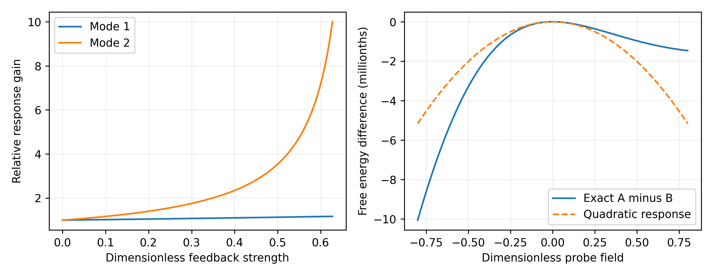

Wonsik Choi — Independent Researcher, Seoul, Republic of Korea. Corresponding author: janefather@gmail.com. ORCID: 0009-0001-4263-9772.

Jeongin Choi — Independent Researcher. Email: cjeongin024@gmail.com.

# Abstract

Can an information load determine gravitational response when the microscopic states realizing that load are unresolved? We study this question in a finite Worldline–Residue–Resource–Action model with a specified equilibrium preparation and a calibrated weak-field response functional. We construct two address–carrier states that preserve the same address marginal, carrier marginal, and all three inherited weighted carrier operators, yet have different load susceptibilities. The distinction persists when the address marginal is held fixed during equilibration. Thus the earlier snapshot interface does not determine the new response contract. A finite Gibbs construction supplies an explicit completion: load covariance reduces the field stiffness, with a sharp spectral condition for local stability. The resulting inverse kernel admits a scalar effective gravitational coupling only under a stated proportionality condition; otherwise its enhancement depends on the probe mode. We distinguish moment sufficiency at one preparation from exact partition-function sufficiency on an open field domain, and retain source terms when eliminating unobserved field coordinates. Equal entropy and mean load do not fix the response. Reproducible finite examples quantify each obstruction and repair. The contribution is a conditional information-to-response construction and its information requirements, not a derivation of Newton's constant, a spacetime topology, or the Einstein equation from address counting alone.

Keywords: information load; gravitational response; finite state reduction; susceptibility; coarse graining; WRRA

# 1 Introduction

The question whether gravity reflects the weight of information requires a physical definition of both weight and information. A finite address count, a Shannon entropy, an energy expectation and a response coefficient are different quantities. They can be related by a model, but none determines the others without a specified preparation, coupling and dimensional calibration. Here we turn the motivating question into a finite test: which state information must be retained to determine a weak-field susceptibility, and when can the resulting response be represented by one effective gravitational coupling?

The preceding WRRA model [1] maps conditional carrier states to three sector-weighted operators and then to information loads, energy, pressure and stipulated gravitational readouts. It already distinguishes snapshot sufficiency from closure under address-controlled updates. Its class-resolved rank-six construction repairs a particular controlled-update failure; it does not claim a universally closed reduced state. Our question is different: even without that update, does the same snapshot representation determine how the state changes under a field that couples to its information load? We give a counterexample using the actual even-composite response function of [1], and identify the additional response data needed.

The particle-interface study [2], the decay extension [3], and the effective carrier construction [4] distinguish reference-energy matching, subsequent evolution and volume derivatives. The companion energy-pressure study [5] develops finite compensating sectors and their stability limits. Those results motivate retaining a single thermodynamic potential and its declared derivative conditions here. We do not identify the present thermal degrees of freedom with that compensator, the lepton source, or the complete fifteen-channel carrier. The present construction is a new response layer on a commuting finite subfamily, with its own explicit equilibrium assumption.

The covariance Hessian of a finite exponential family is established statistical mechanics and information geometry [6]. Schur elimination of internal field coordinates is standard, including its graph interpretation [7]. Neither identity is claimed as a new law. Our independent contribution is their use to expose a specific ambiguity in the WRRA information-to-gravity interface, its persistence under two inequivalent preparation constraints, and the resulting hierarchy of sufficient descriptions. The general mathematics serves an explicit failure-and-repair calculation rather than supplying novelty by itself. The information hierarchy is the organizing result. In [1], the variable operation is an address-controlled channel, the preserved data are the three weighted operators, the distinguishing output is a post-update query, and the repair is a control-class lift. Here the variable operation is an equilibrium field tilt, the same operators and both marginals remain equal at preparation, the distinguishing output is the susceptibility, and the repair is response-specific fluctuation information. We further show that a complete global load distribution, sufficient for every joint field tilt, can still fail under clamped-address equilibration. Consequently a proposed gravitational renderer cannot infer its own backreaction from the old snapshot cache or from a global entropy/load histogram alone; it must declare the allowed relaxation and retain its corresponding state distinctions.

Thermodynamic approaches to gravitational field equations employ further physical structure. Jacobson's horizon argument assumes an entropy-area relation and local heat balance [8]; entanglement equilibrium uses a distinct small-region variational setting [9]. We assume neither horizon thermodynamics nor a continuum entanglement construction. Our static potential is a finite weak-field ansatz, with an inherited dimensional gravitational scale. This keeps the intended comparison precise: the model computes relative response after a bridge is specified; it does not obtain that bridge from entropy alone.

# 2 Inputs and the finite response contract

Let a finite classical address register have strictly positive normalized weights $w_n$. In a chosen commuting carrier basis, address $n$ has probabilities $r_{nk}>0$, with $\sum_k r_{nk}=1$. The reference joint probabilities are $p_{nk}=w_n r_{nk}$. The diagonal carrier states form a legitimate restricted subfamily of the classical–quantum states in [1]; no theorem below is asserted for arbitrary noncommuting couplings.

In WRRA, the common carrier is the shared state substrate on which address-dependent admission rules act before sector readouts are assigned. Here a carrier state records the conditional occupation of a finite commuting set of carrier modes; an information load is a specified observable of that state, weighted by the address response, whose numerical value enters the declared energy coupling. It is neither an address count nor a synonym for Shannon entropy. The finite subfamily below makes that state-to-load transformation explicit without requiring the reader to reconstruct the full parent model.

For fixed nonnegative admission-response functions $f_s(n)$, the inherited snapshot interface is

$$\Sigma_s=\sum_n w_n f_s(n)\rho_n,\qquad L_s=\operatorname{Tr}(\Sigma_s A_s),\qquad s\in\{P,D,R\}.\qquad(1)$$

Choose $m$ dimensionless field coordinates $x_i$ and a specified dimensionless load vector $b_a\in\mathbb R^m$ for each joint label $a=(n,k)$. Coordinates may be grounded graph potentials or fixed spatial basis amplitudes. A nonnegative single load can source a negative attractive potential with the sign convention below; signed load coordinates may alternatively describe contrasts about a reference. Positivity of every component is not required by the mathematical response theory. The map from addresses to spatial coordinates is supplied, not inferred from the numerical order of prime factors.

The present energy scale $\epsilon$ is distinct from the inherited carrier diagnostic $\varepsilon$. The energy scale $\epsilon>0$ and inverse energy $\beta>0$ are fixed. A positive definite matrix $K_0$ has energy units, and a source vector $j$ also has energy units. Define

$$Z_p(x)=\sum_a p_a e^{-\beta\epsilon b_a^T x},\quad F_p(x)=-\beta^{-1}\log Z_p(x),\quad \mathcal F_p(x;j)=\tfrac12 x^T K_0x+j^Tx+F_p(x).\qquad(2)$$

The normalized tilted state is $p_a(x)=p_a e^{-\beta\epsilon b_a^Tx}/Z_p(x)$. Equation (2) is an equilibrium ansatz. For one fixed temperature the baseline energies $h_a=-\beta^{-1}\log p_a$ realize it as a finite canonical partition function, with a chosen additive constant. Across different reference preparations $p$, these baseline energies or preparation resources change. We do not infer an autonomous thermalization process, or equate $h_a$ with a measured particle rest energy. A heat bath and any control bias are external to this static effective description. In particular, the prescribed field charge $\epsilon b_a$ is not identified with the complete thermodynamic baseline energy $h_a$. A physical theory with universal energy–gravity coupling would have to include the energy and stress of the preparation and bath, or supply a constitutive relation between these quantities. The counterexample is a failure of inference from the inherited snapshot under a specified new preparation family, not two different equilibria of one unchanged Hamiltonian.

Two preparation contracts must be distinguished. In the joint contract (2), the field can reweight addresses as well as carrier labels. It preserves the reference $w$ at $x=0$, not at general $x$. If addresses must remain clamped, the alternative is

$$F_{\mathrm{cl}}(x)=-\beta^{-1}\sum_n w_n\log\left(\sum_k r_{nk}e^{-\beta\epsilon b_{nk}^Tx}\right).\qquad(3)$$

Here each address equilibrates only its carrier probabilities. These alternatives are not interchangeable interpretations of one calculation. They define two physically different constraints and generally different susceptibilities.

Table 1. Two equilibration contracts for the same reference preparation. A field is applied, the allowed probabilities relax, and the corresponding covariance determines the stiffness correction. The covariance entries below are evaluated at $x=0$; $\mu_n=\sum_k r_{nk}b_{nk}$ and $C_n=\operatorname{Cov}_{r_n}(b_n)$.

| Feature | Joint relaxation | Clamped-address relaxation |
|:--|:--|:--|
| What may change | Address weights and conditional carrier probabilities | Conditional carrier probabilities only |
| What stays fixed | Total probability and prescribed load alphabet | Each address weight $w_n$ and prescribed load alphabet |
| Equilibration rule | One normalized tilt of $p_{nk}$, Eq. (2) | Separate normalized tilt within each address, Eq. (3) |
| Response covariance | Global covariance $C_p$ | Weighted conditional covariance $\sum_n w_n C_n$ |
| Additional contribution at reference | Covariance of the address means $\mu_n$ | No redistribution of address means through changing weights |
| Sufficient local data | Global first and second load moments | Conditional first and second moments, with $w_n$ |
| Sufficient data for all fields | Global load-class masses | Conditional load-class masses at each address, with $w_n$ |

For an operating point $x_*$, choose $j$ so that $K_0x_*+j+\nabla F_p(x_*)=0$. All local response claims concern perturbations about such a stationary point. In the examples $x_*=0$ and $j=-\epsilon\langle b\rangle_p$. This bias is part of the preparation, not a fitted cosmological source. Stability refers to a local minimum of this specified static functional, not to causal or relativistic stability.

Table 2 separates inherited and new inputs. We keep $c$ and any baseline gravitational calibration fixed. No new measured constant is required to test the finite identities.

Table 2. Input provenance and role in the response calculation.

| Quantity | Status | Use |
|:--|:--|:--|
| $f_D(n)$ and $\alpha$ from [1] | Inherited | Concrete snapshot-preserving witness |
| Finite carrier subspace | Explicit restriction | Two commuting eigenmodes |
| $b_a$, spatial basis and $K_0$ | Constitutive choices | Field coupling and baseline response |
| $\beta$, $\epsilon$ and preparation $p$ | Declared scales and state | Equilibrium susceptibility |
| Joint or clamped addresses | New preparation contract | Which covariance enters |
| Baseline $G_0$ and length scale | Dimensional calibration | Optional weak-field interpretation |

# 3 A snapshot-preserving WRRA counterexample

**Proposition 1.** The three operators in Eq. (1), even together with both marginals, do not in general determine either the joint or the clamped susceptibility of the load $b=f_D(n)a_k$.

**Construction and proof.** Use the even-composite addresses $n=(4,6,8)$ and the inherited function

$$f_i=1+\frac{\log n_i}{4\log N},\quad N=1{,}015{,}000,\quad w_i=\frac{n_i^{-\alpha}}{\sum_{j=1}^3 n_j^{-\alpha}},\quad\alpha=1.8996877935161325.\qquad(4)$$

The normalization in Eq. (4) conditions the source on these three witnesses; it is not a new calibration of the full address shares. On even composites, $f_P=f_R=0$. At $\varepsilon=0$ in the carrier of [1], two Fourier modes of the 128-site cycle have $A_D$ eigenvalues $a_0=0$ and $a_1=2$. Restrict to this two-dimensional invariant subspace. All displayed probabilities are strictly positive on it; unused carrier modes are absent from this preparation, not additional zero-temperature populations.

Set $t=(f_2-f_3,f_3-f_1,f_1-f_2)$ and $\delta_i=c_0t_i/w_i$, with $c_0$ chosen so that $\max_i|\delta_i|=0.2$. Thus $\sum_i w_i\delta_i=\sum_i w_if_i\delta_i=0$. Take $z_0=0.1$ and

$$\rho_i^\pm=\operatorname{diag}\left(\tfrac12+z_0\pm\delta_i,\ \tfrac12-z_0\mp\delta_i\right).\qquad(5)$$

Both states are normalized and positive. Their carrier marginals agree by the first null identity. Their $\Sigma_D$ agree by the second, while $\Sigma_P$ and $\Sigma_R$ vanish identically in the conditioned example. Consequently every inherited sector query $\operatorname{Tr}(\Sigma_sB)$, for arbitrary carrier operator $B$, agrees. In particular the mean of $b=f_i a_k$ agrees. However,

$$\operatorname{Var}_{+}(b)-\operatorname{Var}_{-}(b)=-8\sum_iw_if_i^2\delta_i\ne0.\qquad(6)$$

Indeed the mean terms cancel, and the second moment is $4\sum_iw_if_i^2(1/2-z_0\mp\delta_i)$. The sum in Eq. (6) is nonzero: the three distinct $f_i$ make $(1,f,f^2)$ a nonsingular Vandermonde system, so its last row cannot annihilate the nonzero null vector of its first two rows. For the clamped contract, the relevant variance is $\sum_iw_if_i^2[1-4(z_0\pm\delta_i)^2]$. Its difference is $-16z_0\sum_iw_if_i^2\delta_i$, also nonzero. This proves the claim. $\square$

The same construction embeds into the full source by altering only these three carrier blocks and leaving all other addresses identical. The conditional weights in Eq. (4) are multiplied by the common probability of the three-address subset, so the null identities survive. The variance gap is correspondingly multiplied by that probability because the global means remain equal. We report the transparent conditional calculation rather than presenting it as a rerun of the million-address benchmark.

This result adds a response obstruction to the previously established update obstruction. The mod-3 class lift in [1] retains the information needed for its specified controlled channels. Here, powers of the actual response coefficient enter a thermodynamic derivative even when all original weighted operators agree. The appropriate repair depends on the newly declared query family: for a joint linear response, add global second moments; for a clamped response, retain the required conditional mean terms as well; for a whole field-dependent partition family, retain the load-class measure in Section 5. A class lift built for a different purpose cannot be assumed sufficient.

# 4 Effective response and its stability boundary

Differentiating the finite sum in Eq. (2) gives the standard identities

$$\nabla F_p=\epsilon\langle b\rangle_x,\qquad \nabla^2F_p=-\beta\epsilon^2 C_x,\qquad C_x=\operatorname{Cov}_{p(x)}(b).\qquad(7)$$

For example $\partial_i p_a(x)=-\beta\epsilon p_a(x)(b_{ai}-\langle b_i\rangle_x)$; substituting into the derivative of the mean proves Eq. (7). The covariance is positive semidefinite. This is the familiar exponential-family Hessian [6], applied to the declared WRRA load rather than an independent postulate relating entropy directly to gravity.

**Proposition 2.** At a stationary point, define $K=K_0-\beta\epsilon^2 C_{x_*}$ and $M=\beta\epsilon^2 K_0^{-1/2}C_{x_*}K_0^{-1/2}$. A strictly stable linear response exists precisely when $\lambda_{\max}(M)<1$. In that case

$$\delta x=-R\,\delta j,\quad R=K^{-1}=K_0^{-1/2}(I-M)^{-1}K_0^{-1/2},\quad R\succeq K_0^{-1}.\qquad(8)$$

**Proof.** The Hessian of Eq. (2) is $K=K_0^{1/2}(I-M)K_0^{1/2}$. Congruence gives the stated positive-definiteness condition. Linearizing stationarity gives $K\delta x+\delta j=0$. Every eigenvalue of $(I-M)^{-1}$ is at least one on the stable domain, proving the final inequality. $\square$

The roles of the matrices are distinct: $C_{x_*}$ measures load fluctuations in the selected preparation, $K$ is the remaining restoring stiffness after relaxation, and $M$ measures the fractional stiffness reduction in coordinates normalized by $K_0$. In a normalized eigenmode with eigenvalue $\lambda_i$, the remaining stiffness is proportional to $1-\lambda_i$ and the response gain is $(1-\lambda_i)^{-1}$. One may picture the prepared population redistributing in a way that assists the imposed field, so less restoring force remains. At $\lambda_i=1$ the quadratic restoring term in that mode vanishes and the linear inverse ceases to exist; higher-order terms may still matter, so this statement alone does not diagnose a global phase transition.

Thus fluctuations soften the chosen field stiffness and enhance its static inverse response. This sign follows from allowing the prepared state to relax. Frozen probabilities instead give a linear load energy and no covariance contribution. At the spectral boundary the linear inverse becomes singular. Beyond it the reference stationary point is not a strict local minimum; one must solve the nonlinear problem rather than interpret a negative or divergent linear coefficient as a measured gravitational constant. A finite state sum can coexist with this loss of local stability: finite counting does not remove feedback instabilities.

For a closed graph, an ungrounded Laplacian has a constant zero mode. We either fix a Dirichlet boundary, as in the examples, or restrict to an explicitly specified zero-mean subspace with compatible sources. Applying Eq. (8) to an unreduced singular Laplacian would be invalid. In an arbitrary field domain, a sufficient uniform stability bound is obtained from the directional load ranges:

$$u^TC_xu\le\tfrac14\big[\max_a(u^Tb_a)-\min_a(u^Tb_a)\big]^2.\qquad(9)$$

To see this, any scalar random variable confined to an interval of width $d$ has variance at most $d^2/4$, since its variance minimizes the mean squared distance to a constant and the interval midpoint has squared distance at most $d^2/4$. If $u^TK_0u$ exceeds $\beta\epsilon^2$ times this bound for every nonzero $u$, the full functional is strictly convex everywhere. The sharper local criterion in Proposition 2 does not require this stronger global bound.

The clamped construction replaces $C_x$ with the weighted sum of within-address covariances. At $x=0$, the law of total covariance yields

$$C_{\mathrm{joint}}=\sum_nw_n\operatorname{Cov}_{r_n}(b_n)+\operatorname{Cov}_{w}(\langle b_n\rangle_{r_n}).\qquad(10)$$

Hence joint relaxation softens the reference stiffness at least as much as clamped relaxation. This is a conditional comparison at the same reference state, scales and bias. At nonzero fields the two contracts have different address weights and different equilibria, so Eq. (10) is not a license to compare unmatched operating points. Proposition 1 demonstrates that snapshot insufficiency survives either choice.

# 5 What information determines the response

The word information admits several candidates in this setting. The Shannon entropy is $S(p)=-\sum_a p_a\log p_a$, in nats. The load mean is $\langle b\rangle_p$; the response matrix involves $C_p$. For a fixed alphabet $b=(-2,-1,1,2)$, distributions $(0.1,0.4,0.4,0.1)$ and $(0.4,0.1,0.1,0.4)$ have the same entropy and zero mean, but variances $1.6$ and $3.4$. At fixed $K_0,\beta,\epsilon$, they therefore have different response. This is a comparison of two prepared reference states, not two distinct canonical equilibria of one unchanged nondegenerate Hamiltonian at the same temperature.

The Gibbs family nevertheless has a precise information-geometric interpretation. Its classical Fisher information in the coordinates $x$ is $\beta^2\epsilon^2 C_x$. Thus the curvature of distinguishability is proportional to the load-induced stiffness correction. The scalar entropy itself is insufficient. This identity uses a specified family of probability changes; changing the load alphabet or the preparation rule changes the family and its metric.

At one operating point under the joint contract, normalization, the first load moments and the symmetric second load moments determine Eq. (8). For arbitrary distributions on the finite alphabet, form the row matrix with entries $1$, $b_i$ and $b_i b_j$ for $i\le j$. Its rank, minus the known normalization direction, counts the variable linear coordinates needed to preserve this full moment family on the interior of the simplex. Some rows may be dependent, so the count need not equal the number of listed moments. The usual null-space argument proves necessity: an omitted independent row admits opposite sufficiently small interior perturbations with unchanged retained coordinates and a changed target moment. This statement concerns the full joint moment family, not a claim that every individual response scalar needs every moment.

For clamped addresses, the required covariance is $C_{\mathrm{cl}}=\sum_n w_n[\langle b_nb_n^T\rangle-\mu_n\mu_n^T]$, where $\mu_n=\langle b_n\rangle$. Global second moments alone do not determine the subtraction $\sum_nw_n\mu_n\mu_n^T$. A sufficient linear microscopic representation retains the conditional first and second moments at each address, together with $w_n$; a task-specific nonlinear cache may instead retain the final covariance itself. We assert no minimum dimension for this clamped representation.

**A stronger separation of the two contracts.** Take two addresses of equal weight, each with load alphabet $(0,2)$. Preparation A has conditional probabilities $(1/2,1/2)$ at both addresses. Preparation B has $(0.8,0.2)$ at the first and $(0.2,0.8)$ at the second. Their entire global load distribution is identical, so their joint partition functions agree for every field. Their clamped variances are nevertheless $1$ and $0.64$. Thus even exact global load-class compression can lose the clamped susceptibility. This elementary example proves that a preparation constraint is part of the sufficient-description contract, not a detail that can be restored from a globally compressed state.

Exact finite-field prediction demands more information. Partition the labels into $r$ nonempty classes with distinct common load vectors $c_\ell$, and let $q_\ell=\sum_{a:b_a=c_\ell}p_a$. Then

$$Z_p(x)=\sum_{\ell=1}^r q_\ell e^{-\beta\epsilon c_\ell^Tx}.\qquad(11)$$

**Proposition 3.** With fixed distinct load vectors and positive normalized class masses, the $r$ class masses determine the partition function and all its derivatives on every finite field domain. Conversely, agreement of the partition functions on a nonempty open subset of $\mathbb R^m$ implies agreement of all class masses. Any exact linear encoding for this full family needs at least $r-1$ variable real coordinates; this number suffices together with known normalization.

**Proof.** Sufficiency follows by grouping the finite sum. For necessity choose a direction $u$ avoiding the finite union of hyperplanes $(c_\ell-c_k)^Tu=0$. Restrict equality to a line segment inside the open set. Differentiating orders $0$ through $r-1$ at an interior point gives a Vandermonde system in the distinct numbers $c_\ell^Tu$, multiplied by nonzero exponential factors. Every coefficient difference therefore vanishes. The interior of the normalized class simplex has dimension $r-1$; a lower-rank linear encoding has a nonzero tangent kernel, yielding two nearby positive mass vectors with the same code but different partition functions. Storing the first $r-1$ masses and reconstructing the last from normalization attains the bound. $\square$

This minimality is for exact linear encoding of the entire partition family on an open domain, with the load alphabet already known. It is not a bound on all possible nonlinear algorithms, approximate representations, or one-point response storage. A finite set of measurements can have a smaller sufficient encoding. Moreover, Eq. (11) applies to joint relaxation; for the clamped sum of logarithms one may safely retain each address's conditional load-class masses and its fixed weight. We make no minimality claim for that alternative, whose factorization can have additional degeneracies.

# 6 When the response can be called a gravitational coupling

For a physical interpretation, let $x_i=\Phi_i/c^2$ be dimensionless weak gravitational potentials in fixed basis functions. A discretization of the positive Newtonian field functional has $K_0$ proportional to $c^4/G_0$ times a geometric stiffness with length units. The source term approximates the mass-energy coupling $\int\rho_m\Phi\,d^3r$, with $j_i$ in energy units. Variation of the continuum expression $\int |\nabla\Phi|^2/(8\pi G_0)\,d^3r+\int\rho_m\Phi\,d^3r$ gives $\nabla^2\Phi=4\pi G_0\rho_m$ for fixed boundary data. We adopt this weak-field bridge as a constitutive ansatz; no continuum limit or spacetime geometry follows from our finite addresses alone.

The new microscopic assumption is that the chosen information load shifts energy by $\epsilon b_a^Tx$. Interpreting $\epsilon b_a$ as a gravitational source is a stipulated effective bridge, not a consequence of its thermodynamic baseline energy. We have not established equivalence of inertial mass, total energy and this charge. Accordingly the calculation is a conditional weak-field response model that can be tested as such, not a derivation of universal gravitational coupling. For a fixed probe vector $u$, define the dimensionless enhancement

$$\gamma(u)=\frac{u^TRu}{u^TK_0^{-1}u},\qquad G_{\mathrm{eff}}(u)=G_0\gamma(u).\qquad(12)$$

This definition measures a conjugate source-and-readout response with the same vector on both sides. It does not assert that arbitrary off-diagonal transfer elements increase, that a force obeys an inverse-square law on an arbitrary graph, or that the probe-dependent quantity is a new universal constant.

**Proposition 4.** The full response can be replaced by one scalar $G_{\mathrm{eff}}=\gamma G_0$ at the operating point if and only if

$$R=\gamma K_0^{-1}\quad\Longleftrightarrow\quad \beta\epsilon^2 C=(1-\gamma^{-1})K_0.\qquad(13)$$

**Proof.** Invert the positive definite matrices and subtract $K$ from $K_0$. Conversely the proportionality yields the displayed inverse. Equivalently, constant quadratic ratios for all $u$ imply matrix equality by polarization. In the stable domain $\gamma\ge1$. $\square$

Outside this special proportional case, the eigenvalues of $M$ determine different gains $(1-\lambda_i)^{-1}$. Matching one mode cannot justify a universal scalar replacement. Even where Eq. (13) holds locally, higher derivatives of the finite Gibbs free energy can break it away from the reference field. Thus the model supplies an effective response kernel first, with a scalar coupling only as a restricted consequence.

The dimensional limitation can be made exact. Rescale $K_0,\epsilon,j$ by a common positive factor $s$ and $\beta$ by $1/s$. The probability family and $M$ are unchanged, whereas $R$ is divided by $s$. Dimensionless address data therefore cannot select an absolute energy stiffness. With the geometry and $c$ fixed, the corresponding baseline $G_0$ also changes. Fixing a legitimate empirical calibration removes this ambiguity and leaves calculable relative responses, but it is not an independent derivation of $G_0$. The same limitation prevents finiteness alone from determining a dimensional cosmological constant.

# 7 Eliminating unobserved field coordinates

Coarse graining must preserve the source as well as the stiffness. At a stable operating point, write the quadratic perturbation functional in observed coordinates $y$ and hidden coordinates $z$:

$$Q(y,z)=\tfrac12\begin{pmatrix}y\\z\end{pmatrix}^{T}\begin{pmatrix}A&B\\B^T&D\end{pmatrix}\begin{pmatrix}y\\z\end{pmatrix}+j_y^Ty+j_z^Tz.\qquad(14)$$

Here the full matrix is the effective Hessian, $j_y,j_z$ are perturbation sources distinct from the background operating-point bias, and $D$ is positive definite. Minimization in $z$ gives

$$Q_{\mathrm{red}}(y)=\tfrac12y^T(A-BD^{-1}B^T)y+(j_y-BD^{-1}j_z)^Ty-\tfrac12j_z^TD^{-1}j_z.\qquad(15)$$

Substituting $z=-D^{-1}(B^Ty+j_z)$ proves Eq. (15). Its stiffness is the Schur complement; its source is transformed, and its constant is required for the minimized energy. The constant does not affect fixed-parameter stationarity, but it can contribute when differentiating energy with respect to volume or other parameters. For graph Laplacians the related elimination is commonly called Kron reduction [7]. An effective Hessian after covariance softening need not itself retain all graph-Laplacian sign properties, so we use the more general positive-definite matrix statement.

This distinguishes two reductions. Load-class aggregation acts on the microscopic probability family before the field is solved. Schur elimination acts on field coordinates after the local Hessian and operating point are fixed. Replacing one with the other would discard different information. Equation (15) is exact for the quadratic perturbation problem; it is not a global elimination formula for an arbitrary nonlinear log-partition functional.

# 8 A shared energy and pressure account

To connect with the previous energy-pressure papers, specify a physical volume $V$ and let $h_a(V)$, $b_a(V)$, $K_0(V)$ and $j(V)$ be differentiable, keeping $\beta$ fixed. The relevant canonical free energy uses $E_a(V,x)=h_a(V)+\epsilon b_a(V)^Tx$ inside the partition function, rather than silently reusing a normalized reference prior whose volume dependence has been omitted. Its pressure at fixed $x$ is

$$P_T=-\tfrac12 x^T\partial_VK_0\,x-(\partial_Vj)^Tx-\left\langle\partial_VE_a\right\rangle.\qquad(16)$$

Equation (16) follows directly by differentiating the finite partition sum. At a stationary $x_*(V)$, the envelope identity cancels the term $(\partial_x\mathcal F)^Tdx_*/dV$. This requires a differentiable stationary branch and its stated stability domain; it cannot be continued through a singular response without further analysis. At frozen probabilities, pressure is instead the expectation of the same microscopic energy derivative plus the field terms. One must not identify a total derivative of a changing internal energy with that frozen pressure. The isothermal bath supplies the corresponding heat; no isolated-universe conservation claim is attached to the canonical ansatz.

Our numerical pressure check takes $v=V/V_0$, volume-independent baseline energies $h_a$ realizing the fixed reference probabilities, a volume-dependent addition $E_a-h_a=\epsilon v^{-1/3}b_ax$, and $K_0=kv^{1/3}$. Differentiation is at fixed temperature and field, and reports $PV_0$ in energy units. This is a small closure check of one explicitly specified potential. It is not the fifth paper's correlated compensator, an equation of state for dark energy, or a tensor conservation law. A covariant stress tensor, causal dynamics and a bath-inclusive gravitational stress account require a further physical model. The present matrix response is a susceptibility in a finite probe basis, not a spacetime stress-energy tensor.

# 9 Reproducible results and negative controls

The offline script `reproduce.py` uses NumPy and SciPy for finite sums and matrices and Matplotlib for the figure. It writes `results.json` with named residuals and tolerances. No random seed, online dataset, fit or new astronomical observation enters these calculations. Table 3 gives the direct witness results; the common load agrees to floating precision while the two response coefficients differ. The numerical difference is deliberately small because the inherited logarithmic response varies weakly across 4, 6 and 8. Its nonzero value is established analytically by the Vandermonde proof, not inferred merely from floating-point rank.

Table 3. Conditioned WRRA witness at $\beta=\epsilon=1$ and $K_0=2$ in declared dimensionless numerical units.

| Quantity | Preparation A | Preparation B |
|:--|--:|--:|
| Mean load | 0.823167093659 | 0.823167093659 |
| Joint variance | 1.016451706290 | 1.016435565120 |
| Clamped variance | 0.941571835290 | 0.941568607056 |
| Joint inverse response | 1.016726892208 | 1.016710206812 |

The joint variance gap is $1.614116958\times10^{-5}$; the clamped gap is one fifth of it. The carrier marginal residual is zero in this run and the weighted-operator residual is $5.56\times10^{-17}$. Both preparations use the same stationary bias because their mean loads agree. These values quantify a failure of response sufficiency within the model, not a measured departure from Newtonian gravity.

For a separate two-node grounded field example take

$$K_0=\begin{pmatrix}2&-1\\-1&2\end{pmatrix},\qquad b\in\{(1,0),(-1,0),(0,2),(0,-2)\},\qquad p_a=\tfrac14.\qquad(17)$$

Its covariance is $\operatorname{diag}(1/2,2)$. In numerical units let $\eta=\beta\epsilon^2$. The generalized covariance eigenvalues are $0.232408120756$ and $1.434258545911$, giving the critical value $\eta_c=0.697224362268$. At $\eta=0.3$, the two modal gains are $1.074947992881$ and $1.755240686365$. The response therefore cannot be represented by a single scalar coupling. Figure 1 shows their growth toward the local stability boundary. Its second panel resolves the otherwise nearly coincident free-energy responses of the WRRA witness.

{width=6.3in}

Figure 1. Left, relative modal gains for the grounded two-node example, below its local instability. Right, the difference between the centered free-energy curves of preparations A and B in Table 3. The dashed curve is the quadratic approximation $-\Delta C x^2/2$ in the witness units. The curves are finite constructed-state calculations and are not astronomical data.

For the source-elimination check, use the symmetric stiffness with rows $(3,-1,-0.5)$, $(-1,3,-1)$, $(-0.5,-1,2.5)$ and source $(0.3,-0.2,0.7)$. Eliminating the third coordinate with Eq. (15) reproduces the first two full-solution coordinates $(-0.203278688525,-0.124590163934)$ and the minimized energy. If the source correction is omitted, the result becomes $(-0.088524590164,0.036065573770)$, including a wrong sign in the second coordinate. This negative control shows why stiffness matching alone is incomplete.

The suite records 31 named residual checks, including central differences of both the joint and clamped analytic Hessians with step $10^{-5}$, exact load-class aggregation at nine finite fields, the same-global-distribution clamped counterexample, the Schur response and energy, and the pressure derivative. Algebraic residual tolerances are $10^{-10}$; finite-difference tolerances are $10^{-8}$ for the Hessians and $10^{-9}$ for pressure. Conditional positivity and normalization, positive reference stiffness and a negative mode beyond the critical feedback are explicitly tested. Counts describe internal implementation checks, not independent experiments. The publication-style AI review is also distinct from external journal peer review.

# 10 Assessment and conclusion

Verified inputs comprise the inherited even-composite response and address exponent, normalized finite preparations, a declared load alphabet, equilibrium rule, baseline stiffness and dimensional anchors. The WRRA transformation maps retained address–carrier probabilities to a load-dependent partition function and then to the Hessian of the same field potential. Its outputs are an explicit snapshot-preserving susceptibility counterexample, a stable inverse response with generally mode-dependent enhancement, and exact reductions for their stated query families.

The mathematical construction fails if preserved operators disagree, if the covariance identity or Schur source account fails, or if a claimed stable response is used beyond the positive-Hessian domain. A physical realization faces separate tests: the preparation and equilibration constraint, load-to-energy coupling, spatial map and dimensional scales must be fixed before comparing measured perturbation responses. Our finite calculations do not supply those observations. A discrepancy under that fixed protocol would reject the proposed realization; refitting a new coupling for each output would change the tested model.

The result advances the information-weight question by identifying a concrete missing ingredient. The same inherited snapshot can correspond to different weak-field susceptibilities. Retaining global load fluctuations repairs the joint local response, while clamped response additionally requires conditional mean information. Retaining the distinct global load-class masses repairs the full joint partition family but can still fail for clamped response. A universal scalar gravitational renormalization is possible only under the proportionality condition of Proposition 4. Thus information has no unique gravitational weight independent of its physical coupling and preparation, while a specified finite model yields an explicit and testable response. Absolute Newtonian normalization, universal coupling of all energy, relativistic field dynamics, quantum noncommutativity, spacetime topology and the observed vacuum-energy scale remain outside this construction.

A concrete next application is a single particle on a small finite lattice with internal states. The joint labels $(n,k)$ can denote its site and internal mode, and a controlled field can shift the assigned mode energies through the fixed load $b_{nk}$. If hopping and internal transitions equilibrate, Eq. (2) is the relevant preparation contract; if hopping is suppressed while internal transitions relax within each prepared site subensemble, Eq. (3) describes the fixed site weights. This gives an operational comparison of mobile and clamped preparations using the same finite alphabet. It is a proposed realization, not an experimental result or a completed many-particle lattice-gas calculation. Interactions between several particles would require a new configuration-state energy and the appropriate occupancy constraints.

For such a realization, independently characterized baseline stiffness, temperature and energy shifts could be fixed as inputs. The WRRA address-to-carrier load map would then generate the covariance correction and modal response, to be compared with perturbation measurements under each declared constraint. Failure of the covariance response after fixing those inputs, or an observed instability inconsistent with the predicted positive-Hessian boundary, would reject that realization within its stated equilibrium and small-perturbation regime. Matching known response values would be a valid calibration or reproduction result; subsequent unmeasured responses computed with the fixed map would be model predictions. No such laboratory comparison is claimed here. This application separates the already calculated finite response mechanism from the additional physical work needed to realize and test it.

# Statements and Declarations

Data and code availability. All newly generated numerical data, the offline reproduction script and editable manuscript source accompany this paper as Online Resource 1. The parent v1.8 construction is archived at https://doi.org/10.5281/zenodo.23233991. No new experimental dataset is reported.

Funding. No funding was received for this study.

Competing interests. The authors declare no competing financial or non-financial interests relevant to this work.

AI assistance. ChatGPT assisted with mathematical development, code, numerical checks, English drafting and document preparation. An independently invoked Astra model at medium reasoning effort reviews the preparation package; its actual reports and revision responses are retained separately. AI review is not external journal peer review. Human authors are responsible for evaluating the work and approving its submission.

Author contributions. Wonsik Choi directed the research question and development of the WRRA framework and preparation of the manuscript with the AI assistance disclosed above. The proposed contribution of Jeongin Choi is discussion of the research ideas and manuscript review. Contributions and approval for this new manuscript are to be finalized by the authors before submission.

Ethics. This theoretical and computational study involves no human participants or animals.

# References

[1] Choi, W., Choi, J. Developing a finite WRRA toy model to explore quantum gravity vacuum energy and dark sector connections. Version 1.8, preprint (2026). https://doi.org/10.5281/zenodo.23233991

[2] Choi, W., Choi, J. From Number Structure to Particle Selection: A Possible Readout and Its Energy–Pressure Constraints in a Finite WRRA Toy Model. Version 0.2-r1, preprint (2026). https://doi.org/10.5281/zenodo.23253033

[3] Choi, W., Choi, J. Dynamic Decays and Nonequilibrium State Transitions in a Finite WRRA Model. Version 0.2, preprint (2026). https://doi.org/10.5281/zenodo.23246308

[4] Choi, W., Choi, J. Effective Carrier Routing, Control Work, and Stress in a Finite WRRA Model. Version 0.2, preprint (2026). https://doi.org/10.5281/zenodo.23250062

[5] Choi, W., Choi, J. Energy and Pressure Compatibility in Finite WRRA Models: Cold Allocations and Compensating Sectors. Version 0.2, preprint (9 October 2026). Companion manuscript `WRRA_Energy_Pressure_v0_2_EN.pdf`; research repository: https://github.com/Wonsik-Choi-janefather/wrra-m-0.1

[6] Wainwright, M. J., Jordan, M. I. Graphical Models, Exponential Families, and Variational Inference. Foundations and Trends in Machine Learning 1, 1–305 (2008). https://doi.org/10.1561/2200000001

[7] Dörfler, F., Bullo, F. Kron Reduction of Graphs With Applications to Electrical Networks. IEEE Transactions on Circuits and Systems I 60, 150–163 (2013). https://doi.org/10.1109/TCSI.2012.2215780

[8] Jacobson, T. Thermodynamics of Spacetime: The Einstein Equation of State. Physical Review Letters 75, 1260–1263 (1995). https://doi.org/10.1103/PhysRevLett.75.1260

[9] Jacobson, T. Entanglement Equilibrium and the Einstein Equation. Physical Review Letters 116, 201101 (2016). https://doi.org/10.1103/PhysRevLett.116.201101
