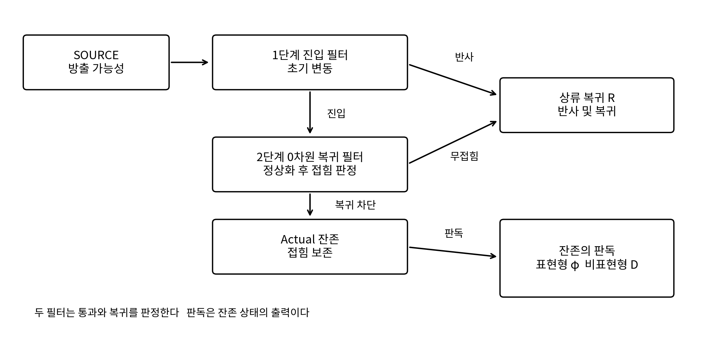

# WRRA M 상위 구조의 두 단계 차원필터 가설

초기 필터 변동과 접힘 상태의 잔존 및 현재의 프레임 갱신

최원식 Wonsik Choi  
ORCID [0009-0001-4263-9772](https://orcid.org/0009-0001-4263-9772)  
janefather@gmail.com  
상류 구조 가설 1.0 · 2026-10-01

## 초록

본 논문은 WRRA-M의 상류를 두 단계 차원필터로 구성하는 물질 생성 가설을 제안한다. 초기의 통과 필터가 변동하는 동안 소수처럼 읽힌 합성 관계 상태가 하류에 진입하고, 필터가 정상화된 뒤에는 보존된 접힘 때문에 0차원 복귀 필터를 통과하지 못한다. 이 잔존을 보통 물질의 표현형과 비표현형 Actual의 공통 기원으로 해석한다. 표현형이 있는 잔존과 표현형이 없는 잔존은 같은 Actual 안의 두 판독 부문이다. 현재의 상태를 순서대로 갱신하는 필터 작동은 시간의 프레임으로 읽힌다는 확장 가설을 함께 제시한다.

유한 산술 주소에 제타 분모 가중치를 적용한 계산에서, 지수 2와 소수 2 필터는 홀수 합성수 잔존율 4.876893353%를 산출한다. 이 선택의 산술적 극한은 약 4.876952810%다. 이어 하나의 공통 가중치와 초기 통과율을 보정한 두 단계 구성은 표현형 5%, 비표현형 Actual 26.8%, 상류 복귀 68.2%를 같은 분모에서 재현한다. 전체 Actual은 31.8%이며, 표현형 5%를 포함한다. 이 결과는 선언한 필터 규칙에서 세 부문의 양수성과 완전성을 만족하는 구성 가능성을 확립한다.

연구의 목적은 우리 우주가 채택했을 수 있는 하나의 실행 구조를 고정하고 입자 상수 보정의 기준점을 만드는 데 있다. 검증된 수론적 항등식, WRRA의 관계 상태 해석, 계산 출력과 물리 응답의 연결을 구분해 제시한다. 입자 질량과 전하의 공통 응답, 접힘 보존 동역학, 프레임 간격 및 복귀 부문의 에너지와 압력이 다음 연결 과제다.

핵심어  WRRA  차원필터  잔존  소수 관계  Actual  제타 가중치  프레임 갱신

### 평가 순서

검증 입력  산술 주소 2부터 N까지, 소수 판정과 인수분해, 제타 급수의 가중 후보, 공개된 구성비 목표를 사용한다. 전자·양성자·중성자의 질량과 전하는 다음 보정에 사용할 검증 입력으로 분리한다.

WRRA 고유 변환  SOURCE 주소와 합성 관계를 구분하고, 초기 진입 필터와 정상 복귀 필터를 순서대로 적용한다. 복귀하지 못한 Actual을 표현형과 비표현형 판독으로 나누어 하나의 장부에 기록한다.

산출값  고정 지수 2 시험의 4.8769% 잔존과 두 매개변수 보정의 5%·26.8%·68.2% 분할을 재현한다. 소수 인수 가중치의 곱, 주소별 분할의 완전성, 유한 범위 변화와 산술적 극한을 확인한다.

반증조건  같은 입력에서 장부가 재현되지 않거나, 정상 복귀 연산자가 접힘 상태를 허용하거나, 공통 물리 응답에서 구성비와 입자 상수가 함께 성립하지 않는 경우 해당 구성 또는 연결 규칙을 수정한다. 이 순서에 따라 본 논문은 상류 구조의 조건부 실현을 주장한다.

## 1장 영사기 모델과 상류 하류 정보 흐름

### 소수 SOURCE와 합성 관계의 구분

WRRA는 Wonsik Reality Renderer Architecture의 약자다. 현상계에서 읽히는 물리량을 공통전달자와 차원필터의 출력으로 구성한다. 영사기라는 표현은 상류 정보가 필터 작동을 거쳐 현재의 표현형과 기록으로 나타나는 관계를 뜻한다. 우리는 이 해석을 WRRA Core 1.0과 최소계산우주론 MCC 2.3.2 위에 놓는 상류 가설로 제안한다. 기존 하류 모형의 보정 장부와 구현은 기준으로 유지한다.

MCC 2.3.2 제55장은 각 소수를 독립 SOURCE 주소로, 합성수를 소수 계보와 지수를 보존하는 관계 주소로 구분한다[1]. 소수의 독립성은 주소의 독립성이다. 각 소수가 같은 에너지를 갖는다는 뜻은 아니다. 가능한 관계 주소와 실제로 활성화된 관계도 구별한다. 이번 계산은 유한 주소를 방출 후보의 장부로 펼친 다음 통과와 복귀를 계산한다. 모든 가능성이 방출된다는 서술을 이 유한 장부의 완전한 열거로 구현한다.

$$
n=\prod_p p^{\nu_p(n)},\qquad \Omega(n)=\sum_p\nu_p(n),\qquad d_{\mathrm{fold}}(n)=\Omega(n)-1\tag{1}
$$

식 1의 마지막 항은 이번 시험의 접힘 대용 지표다. 소수는 0, 합성수는 1 이상이다. 이는 물리 공간의 차원 수를 측정한 값이 아니라 SOURCE 하나로 되돌릴 수 있는지를 분류하는 산술적 후보다. 같은 소수의 거듭제곱도 이 후보에서 접힘을 갖는다. 서로 다른 소수의 결합만 잔존한다는 대안과는 계산 출력이 달라지므로, 거듭제곱의 기여를 별도로 기록한다.

표 1 상류 가설의 용어와 판정 기준

| 용어 | 이 논문의 의미 |
| --- | --- |
| SOURCE | 독립 소수 주소와 방출의 상류 기준 |
| 합성 관계 | 소수 인수와 지수를 보존한 관계 상태 |
| WRRA 유사소수 | 초기 판독에서 소수처럼 통과한 합성 관계 상태 |
| Actual | 진입 후 정상 복귀가 차단된 잔존 상태 전체 |
| 표현형 | Actual 중 물질 판독이 활성화된 부문 |
| 0차원 복귀 | 보존된 접힘이 없는 상태를 허용하는 복귀 판정 |

WRRA 유사소수는 특정 밑에 대한 페르마 유사소수의 정의를 사용하지 않는다. 불완전한 초기 판독에서 통과하지만 정상 복귀에서는 합성 관계의 접힘이 드러나는 상태를 뜻한다. 또한 0차원은 전하 0이나 숫자 0을 뜻하지 않는다. 전기적으로 중성인 입자도 표현형이 있을 수 있다.

### 두 단계 필터의 인과 순서

첫 단계는 진입 필터다. 초기 변동은 하류로 통과할 상태를 선택하고 일부 합성 관계의 진입을 허용한다. 두 번째 단계는 정상화된 0차원 복귀 필터다. 이미 진입한 상태가 SOURCE로 돌아갈 수 있는지 판정한다. 초기의 통과 조건과 이후의 복귀 조건이 같을 필요는 없다. 두 조건의 시간적 차이가 잔존의 원인이다.

그림 1 초기 진입과 정상 복귀의 두 단계 구조  잔존 이후의 표현형 판독은 세 번째 차원필터로 세지 않는다

이 구조에서 필터가 정상화되었다는 말은 진입한 상태를 모두 자동으로 회수한다는 뜻이 아니다. 정상 복귀가 요구하는 무접힘 조건을 잔존 상태가 만족해야 한다. 초기 조건을 통과한 이력과 현재 복귀 자격이 다르므로, 같은 정상 필터 아래에서도 진입 이력이 다른 두 상태가 다른 결과를 낼 수 있다. 이것이 본 가설의 이력 의존성이다.

### 연산자로 표현한 진입과 복귀

정규화된 방출 상태를 ρ, 첫 진입 연산자를 A, 정상 복귀 연산자를 B로 둔다. 두 연산자는 확률을 늘리지 않는 수축 연산자다. 순서를 보존한 식 2와 3은 비가환인 경우에도 적용된다. 단순히 독립 통과 확률 둘을 곱하는 대신 실제로 진입한 상태에 복귀 연산자를 작용시킨다.

$$
\rho\succeq0,\quad\operatorname{Tr}\rho=1,\quad A^\dagger A\preceq I,\quad B^\dagger B\preceq I,\quad\rho_{\mathrm{in}}=A\rho A^\dagger\tag{2}
$$

$$
\begin{aligned}q_{\mathrm{ret}}&=1-\operatorname{Tr}\rho_{\mathrm{in}}+\operatorname{Tr}(B\rho_{\mathrm{in}}B^\dagger),\\q_{\mathrm{res}}&=\operatorname{Tr}\!\left[\rho A^\dagger(I-B^\dagger B)A\right],\qquad q_{\mathrm{ret}}+q_{\mathrm{res}}=1.\end{aligned}\tag{3}
$$

복귀 장부는 첫 단계에서 반사된 부분과 진입한 뒤 정상 복귀한 부분을 함께 센다. 잔존 장부는 진입 후 복귀에 실패한 부분이다. 양의 효과를 갖는 표현형과 비표현형 판독을 잔존 분기에 두면 세 출력의 합도 1이 된다. 이 분할은 정보 가중치의 장부이며, 에너지 보존은 상태별 물리 부하를 연결한 뒤 함께 검사한다.

장기 잔존은 정상 복귀의 핵 K 안에 상태가 놓이고, 이후의 내부 갱신이 K를 보존한다는 가설로 정의한다. 초기의 한 번 통과만으로 장기 잔존을 결론 내리는 대신 접힘 보존을 구조의 핵심 조건으로 둔다. 식 4는 이 조건의 명세다.

$$
K=\ker B,\qquad \operatorname{supp}\rho_{\mathrm{res}}\subseteq K,\qquad U_kK\subseteq K\tag{4}
$$

잔존한 관계의 내부 재배열이나 입자 붕괴와 SOURCE 복귀는 구별된다. 관계 상태가 다른 관계 상태로 바뀌어도 접힘 부문을 유지하면 Actual 안에 남는다. 반대로 접힘을 풀어 복귀 허용 부문에 연결하는 동역학이 발견되면 그 상태의 잔존 기간을 다시 계산해야 한다.

### 현재의 갱신 순서로 읽히는 시간

영사기의 찰칵거림을 본 논문에서는 현재의 정보 갱신으로 정식화한다. 기본 변수는 흐르는 배경 시간이 아니라 갱신 순서 k와 현재 상태 Xₖ다. 물리적 시계는 갱신 사이의 비교 가능한 사건을 기록하고, 그 기록에 시간 단위를 부여한다. 과거 프레임은 별도의 현재 우주로 존재하기보다 현재 기록에 보존된 이전 상태의 흔적이다.

$$
X_{k+1}=\mathcal T_k(X_k),\qquad t_k=\sum_{j=0}^{k-1}\Delta\tau_j,\qquad t_k=k\Delta\tau_*\ \text{if }\Delta\tau_j=\Delta\tau_*\tag{5}
$$

두 단계 필터는 한 갱신에서 진입 자격과 복귀 자격을 정하고, 갱신된 Actual은 다음 현재의 입력이 된다. 정상화 이후에도 접힘이 보존되는 한 물질은 매 프레임 새로 생성될 필요가 없다. 초기 진입으로 형성된 잔존을 현재의 갱신이 이어받는다. 따라서 물질 생성의 역사와 시간의 작동을 같은 상태 전이 언어로 연결할 수 있다.

Δτ*는 물리 단위로 보정할 최소 갱신 간격의 후보다. 프레임의 순서를 먼저 정의하고 시계 단위를 나중에 정하므로, 프레임 가설은 광속이나 플랑크 시간을 미리 출력에 넣는 방식으로 성립하지 않는다. 프레임 간격의 결정과 로런츠 대칭을 보존하는 시계 판독은 4장의 연결 과제로 제시한다.

## 2장 0차원 필터와 보통 물질의 잔존율

### 제타 분모와 소수별 기여

주소 범위는 2부터 N까지다. 1은 이 시험에서 항등 또는 진공의 자리로 보고 정규화에서 제외한다. 이 선택을 유지한 채 각 주소에 n의 음의 α승을 부여한다. 산술 주소의 점유 가중치를 나타내며, 에너지 단위는 아직 갖지 않는다. α=0은 균등 장부이고, α=2는 첫 제타 가중 시험이다.

$$
Z_N(\alpha)=\sum_{n=2}^{N}n^{-\alpha},\qquad w_n=\frac{n^{-\alpha}}{Z_N(\alpha)},\qquad n^{-\alpha}=\prod_p p^{-\alpha\nu_p(n)}\tag{6}
$$

식 6은 각 소수의 기여를 그 소수와 지수의 곱으로 계산하게 한다. 예를 들어 77의 가중치는 7과 11의 인수 가중치가 결합한 값이다. 제타함수의 오일러 곱은 이러한 연결의 수학적 기준이다[3]. 무한 급수와 곱은 실수 지수 α가 1보다 클 때 절대수렴한다. 유한 합 자체는 이번에 시험한 모든 지수에서 계산할 수 있다.

$$
\zeta(s)=\sum_{n=1}^{\infty}n^{-s}=\prod_p(1-p^{-s})^{-1},\quad\operatorname{Re}s>1;\qquad |n^{-s}|^2=n^{-2\operatorname{Re}s}\tag{7}
$$

제타 분모의 점유 가중치와 복소 방출 진폭은 구별한다. 진폭을 n의 음의 s승으로 정하고 절댓값 제곱을 점유로 채택한다면 α=2Re(s)다. 따라서 α=2의 이번 시험을 비자명 영점의 실수부 1/2와 바로 동일시할 수 없다. 현재 계산은 제타 영점의 간섭을 넣기 전의 실수 가중 장부다.

### 작은 소수부터 추가하는 모듈러 필터

선행 WRRA 모듈러 필터[2]는 소수 p의 배수 여부를 유한 위상합으로 판정한다. 정수 주소에서 식 8은 배수이면 0, 배수가 아니면 1이다. 작은 소수부터 필터를 추가하면서 통과하는 합성 관계의 장부를 갱신한다.

$$
H_p(n)=1-\frac1p\sum_{r=0}^{p-1}e^{2\pi i rn/p}=1-\mathbf1_{p\mid n}\tag{8}
$$

$$
C(P,N)=\{n\leq N:n\text{ composite},\ p\nmid n\ \forall\text{ primes }p\leq P\},\qquad f_\alpha=\sum_{n\in C(P,N)}w_n\tag{9}
$$

이 체 계산은 초기 판독에서 놓칠 수 있는 합성 관계의 집합을 만드는 대용 구현이다. 이후의 0차원 복귀는 이미 진입한 관계에 접힘 조건을 적용한다. 정적 체를 끝까지 확장하는 연산과 이력에 따라 형성된 Actual을 회수하는 연산은 다른 단계에 놓인다.

표 2 균등 가중치에서 N 161인 체의 진행

| 마지막 소수 | 합성수 후보 수 | 전체 160개에 대한 비율 |
| --- | --- | --- |
| 2 | 44 | 27.50% |
| 3 | 18 | 11.25% |
| 5 | 8 | 5.00% |
| 7 | 2 | 1.25% |
| 11 | 0 | 0.00% |

소수 2·3·5를 적용한 뒤 남는 관계는 49, 77, 91, 119, 121, 133, 143, 161이다. 전체 160개 중 8개이므로 정확히 5%다. 이 중 49와 121은 소수 거듭제곱이며, 이를 제외하면 3.75%다. 목표를 탐색한 유한 창에서 얻은 정확한 구성으로 기록한다. N을 321로 바꾸면 같은 필터에서 6.875%가 된다.

### 지수 2에서 얻은 4점8769퍼센트

N=1,000,000, α=2, 소수 2 필터를 고정하면 통과 후보는 홀수 합성수다. 이 고정 시험에서 5%를 결과식에 직접 넣지 않고 계산한 잔존율은 4.8768933533645545%다. 거듭제곱과 서로 다른 소수의 결합이 각각 다음의 기여를 갖는다.

표 3 지수 2의 홀수 합성수 잔존 분해

| 잔존 계열 | 전체 가중치에 대한 기여 |
| --- | --- |
| 소수 거듭제곱 | 2.498328130% |
| 서로 다른 소수 인수를 가진 합성수 | 2.378565223% |
| 합계 | 4.876893353% |

작은 소수부터 출력이 달라지는 과정을 탐색하는 목적에서는 이 값이 첫 잔존 기준점이다. α=2와 필터 종료점 p=2를 고정했을 때의 결과를 보존하고, 다음 장의 공동 보정에서는 다른 α를 쓰는 경우를 별도의 장부로 표시한다.

### 산술적 잔존 극한의 유도

α가 1보다 큰 경우, 소수만 더한 급수를 P(α)라 둔다. 전체 홀수 가중치에서 항등 주소 1과 홀수 소수 가중치를 빼면 홀수 합성수 가중치가 된다. 전체 분모는 제타함수에서 1을 뺀 값이다. 따라서 식 10은 이 후보의 잔존 극한을 직접 준다.

$$
P(\alpha)=\sum_{p\ \mathrm{prime}}p^{-\alpha},\qquad f_{\mathrm{odd},\infty}(\alpha)=\frac{(1-2^{-\alpha})(\zeta(\alpha)-1)-P(\alpha)}{\zeta(\alpha)-1}\tag{10}
$$

유도는 주소 집합의 분할만 사용한다. 1을 포함한 홀수의 합은 (1−2의 음의 α승)ζ(α)이고, 홀수 소수의 합은 P(α)−2의 음의 α승이다. 두 항의 차에서 1을 제외한 뒤 공통 분모로 나누면 식 10을 얻는다. α=2에서 P(2)를 수치평가하면 잔존 극한은 4.876952810%다. 무한합은 유한 장부의 수렴성을 평가하는 수학적 기준으로 사용한다.

표 4 고정 지수 2와 소수 2 필터의 범위 비교

| 주소 범위 N | 홀수 합성수 잔존율 |
| --- | --- |
| 161 | 4.600993937% |
| 10,000 | 4.871477356% |
| 1,000,000 | 4.876893353% |
| 수학적 극한 | 4.876952810% |

이로써 지정한 주소 집합과 가중치의 산술적 잔존 한계를 얻는다. 위상적 접힘이 이 한계를 실제 우주의 비복귀량으로 유지한다는 연결은 식 4의 접힘 보존 가설이 담당한다. 산술 계산의 결과와 접힘 보존의 물리 조건이 같은 구조 안에서 어느 역할을 하는지 명시한다.

필터를 모든 소수 p≤√N까지 확장하면 정적 체의 합성수 후보는 0이 된다. 이는 체의 정상적인 검사 결과다. 본 논문의 생성 가설은 그 전에 진입한 상태가 다른 정상 복귀 조건 아래에 남는 구조다. 그러므로 필터 정상화 이후의 잔존을 평가할 때는 정적 체를 더하는 계산과 Actual의 접힘을 풀어 회수하는 계산을 구분한다.

## 3장 두 단계 필터와 우주 구성비의 공통 장부

### 표현형과 비표현형 Actual 및 복귀 부문

구성비의 전체 분모는 방출 장부 하나다. 그 안에서 물질 표현형을 φ, 비표현형 Actual을 D, 상류 복귀를 R로 둔다. 표현형도 Actual의 일부이므로 Actual의 총량은 φ와 D의 합이다. D는 물질 표현형을 출력하지 않으면서 중력 부하를 줄 수 있는 부문으로 해석하고, R은 상류 복귀와 배경 응답의 연결 후보로 둔다.

$$
f_\varphi+f_D+f_R=1,\qquad f_{\mathrm{Actual}}=f_\varphi+f_D=0.318\tag{11}
$$

표 5 같은 전체를 분모로 한 이번 논문의 목표

| 부문 | 목표 | 구조상 위치 |
| --- | --- | --- |
| 물질 표현형 φ | 5.0% | Actual의 표현형 판독 |
| 비표현형 Actual D | 26.8% | Actual의 비표현형 판독 |
| 전체 Actual | 31.8% | 앞의 두 부문 합계 |
| 상류 복귀 R | 68.2% | 초기 반사와 정상 복귀의 합 |

이 숫자는 상류 가설을 구성할 이번 보정 목표다. 기존 WRRA-M 0.6의 하류 에너지 장부는 표현형 4.93%, 모이는 숨은 부문 26.5%, 잔여 배경 68.57%를 사용한다[4]. 두 장부는 목적과 보정값이 다르므로 상류 결과를 하류 파일에 자동 대입하지 않는다. 관측 우주론의 구성비 역시 채택한 자료와 모형에 따른 추정량이다[6].

### 소수 2 계열의 정확한 인수 항등식

합성수를 가장 작은 소수 인수의 계열로 나누면 중복 없이 작은 소수부터 기여를 쌓을 수 있다. 소수 2 계열은 n=2m, m≥2인 짝수 합성수 전체다. 각 주소의 인수 가중치에서 2의 기여를 분리하면 식 12가 정확히 성립한다.

$$
f_2(N,\alpha)=\frac{\sum_{m=2}^{\lfloor N/2\rfloor}(2m)^{-\alpha}}{Z_N(\alpha)}=2^{-\alpha}\frac{Z_{\lfloor N/2\rfloor}(\alpha)}{Z_N(\alpha)}\ \longrightarrow\ 2^{-\alpha}\quad(\alpha>1)\tag{12}
$$

0.5부터 3.0까지 0.1 간격의 공개 탐색에서, N=1,000,000의 α=1.9는 소수 2 계열에 26.794199652%를 준다. 같은 장부의 홀수 합성수는 5.774214802%이고, 나머지 소수 부문은 67.431585546%다. 26.7942%가 26.8% 목표에 가까운 후보를 제공하지만, 이 한 번의 탐색만으로 나머지 두 목표가 자동으로 맞지는 않는다.

표 6 같은 분모에서 비교한 초기 두 후보

| 지수 α | 짝수 합성수 | 홀수 합성수 | 소수 |
| --- | --- | --- | --- |
| 2.0 | 24.999961% | 4.876893% | 70.123145% |
| 1.9 | 26.794200% | 5.774215% | 67.431586% |

표 6의 각 행은 하나의 완전한 장부다. α=2의 4.8769%와 α=1.9의 26.7942%를 가져와 더하면 서로 다른 정규화 상태를 섞게 된다. 공동 출력은 하나의 α로 다시 계산한다. 특히 α=2에서 합성수 전체는 약 29.8769%이므로, 합성수만 Actual로 쓰는 이 후보에서는 통과율을 줄이는 방법으로 31.8%를 만들 수 없다.

### 두 단계 구성의 대각 연산자 실현

가장 낮은 소수에서 출발하는 시험 배정으로, 소수 2 계열을 비표현형 Actual 후보에 놓고 다른 합성수 계열을 물질 표현형 후보에 놓는다. 첫 진입 필터는 짝수 합성수의 진입을 허용하며, 홀수 합성수에는 초기 통과율 β를 적용한다. 정상 복귀 필터는 소수 주소만 허용한다. 홀짝성에 대한 이 배정은 다음 입자 응답 계산에서 평가할 상류 후보 규칙이다.

$$
\begin{aligned}A_{nn}&=\mathbf1_{\mathrm{prime}}(n)+\mathbf1_{\mathrm{even\ composite}}(n)+\sqrt\beta\,\mathbf1_{\mathrm{odd\ composite}}(n),\\B_{nn}&=\mathbf1_{\mathrm{prime}}(n),\qquad0\leq\beta\leq1.\end{aligned}\tag{13}
$$

식 13의 두 연산자는 식 2와 3을 실제로 실현한다. β는 첫 단계의 초기 통과율이다. 정상 복귀 후의 잔존은 합성수 부문에만 놓이고, B를 다시 적용해도 복귀 출력은 0이다. 이 결과는 선언한 접힘 규칙 안에서 성립한다. 표현형과 비표현형을 읽는 분할은 이 잔존의 판독이며 새로운 진입 또는 복귀 필터가 아니다.

$$
\begin{aligned}E_D(n)&=\mathbf1_{\mathrm{even\ composite}}(n),\\E_\varphi(n)&=\beta\,\mathbf1_{\mathrm{odd\ composite}}(n),\\E_R(n)&=\mathbf1_{\mathrm{prime}}(n)+(1-\beta)\mathbf1_{\mathrm{odd\ composite}}(n),\\E_D(n)+E_\varphi(n)+E_R(n)&=1,\qquad f_s=\sum_{n=2}^Nw_nE_s(n).\end{aligned}\tag{14}
$$

이 효과들은 방출 입력으로 되돌려 표현한 전체 두 단계의 효과다. 첫 단계에 진입하지 못한 홀수 관계는 R에 포함되고, 진입한 홀수 관계만 표현형 잔존에 포함된다. 모든 주소에서 세 효과가 양수이고 합이 1이므로, 가중 장부에도 중복이나 누락이 없다.

### 공동 보정과 산출값

N=1,000,000을 고정하고 소수 2 계열의 가중치를 26.8%로 맞추는 공통 지수 α를 구한다. 그 α에서 얻는 홀수 합성수의 가용 가중치는 5.777294456%다. 이 가용량 중 5%가 초기에 진입하도록 β를 정한다. 두 값의 보정 근거와 결과는 식 15와 표 7에 공개한다.

$$
\alpha=1.8996876950554356,\qquad \beta=\frac{0.05}{0.057772944563189425}=0.8654570124136961\tag{15}
$$

표 7 두 단계 후보의 공동 보정 출력

| 출력 | 계산값 |
| --- | --- |
| 물질 표현형 φ | 5.0000000000% |
| 비표현형 Actual D | 26.8000000000% |
| 전체 Actual | 31.8000000000% |
| 상류 복귀 R | 68.2000000000% |
| 주소별 효과 합의 최대 오차 | 0 |
| 전체 장부 합 | 0.9999999999999993 |

따라서 주어진 두 목표를 만족하는 양의 두 단계 구성이 존재한다. 68.2%는 같은 장부의 나머지로 따라 나오며 세 번째 독립 보정값을 요구하지 않는다. α는 비표현형 목표, β는 표현형 목표에 의해 결정했다. 두 수를 입자 상수나 초기 변동 스펙트럼에서 결정한 결과와는 보정 출처가 다르다. 보정은 우리 우주 모형의 정당한 구성 단계이며, 공개된 규칙의 실제 계산 출력으로 평가한다.

표 8 작은 소수부터 집계한 합성 관계 계열

| 가장 작은 소수 인수 | 주소 수 | 전체 가중치에 대한 기여 |
| --- | --- | --- |
| 2 | 499,999 | 26.800000% |
| 3 | 166,666 | 4.648527% |
| 5 | 66,666 | 0.765484% |
| 7 | 38,094 | 0.229504% |
| 11 | 20,778 | 0.060071% |
| 13 | 15,983 | 0.032550% |
| 17 | 11,283 | 0.014712% |
| 19 | 9,502 | 0.009574% |

표 8은 최소 인수별 서로 겹치지 않는 기여다. 주소 수의 비율과 가중치의 비율은 같지 않다. p≥3 계열의 가중 합에 β를 적용하면 표현형 5%가 된다. 더 높은 소수의 전체 장부는 재현 자료의 results_26_8.json에 기록한다.

### 보정값을 고정한 유한 범위 검사

같은 α와 β를 다시 보정하지 않고 주소 범위만 바꾸어 계산한다. 표 9는 유한 절단이 출력에 주는 영향을 보여준다. 이 범위에서 세 출력이 보정값에 가까워지는 것을 확인한다. 또한 α를 고정한 작은 변동의 결과를 재현 장부에 함께 저장해 선택한 가중치에 대한 민감도를 보존한다.

표 9 보정값을 고정한 범위 변화

| N | 표현형 | 비표현형 Actual | 상류 복귀 |
| --- | --- | --- | --- |
| 10,000 | 4.989044% | 26.791475% | 68.219480% |
| 100,000 | 4.998716% | 26.799046% | 68.202237% |
| 1,000,000 | 5.000000% | 26.800000% | 68.200000% |

검사 항목은 소수 분류, 유한 위상합과 산술 선택기의 일치, 인수 가중치의 곱, 소수 2 계열의 항등식, 최소 인수 계열의 중복 없는 분할, 주소별 완전성 및 전체 장부 보존이다. 선행 체 계산의 위상합 오차는 약 8.624×10⁻¹⁴이고, 공동 분할의 여덟 검사는 모두 통과했다. 정상 복귀가 Actual을 막는다는 검사에서는 그 접힘 규칙을 입력 조건으로 표시한다.

### 중력 부하와 암흑 에너지 압력으로 연결

표현형 φ와 D의 차이는 물질 판독이 있는가에 있으며, 중력 부하의 유무와 자동으로 같지 않다. WRRA의 중력은 표현형 이전의 정보 부하를 읽는다는 기준을 유지한다. D의 암흑물질 해석에는 표현형 출력 0과 중력 부하 양수가 함께 필요하다. R의 암흑에너지 해석에는 복귀 부문이 만드는 배경 에너지와 부피 응답이 필요하다.

$$
F_s^{E}=\frac{\sum_n w_n e_nE_s(n)}{\sum_n w_ne_n},\qquad p_s=-\left(\frac{\partial\mathcal E_s}{\partial V}\right)_{\mathrm{state}},\qquad w_s^{\mathrm{EOS}}=\frac{p_s}{u_s}\tag{16}
$$

식 16에서 eₙ은 주소별 물리 에너지 부하다. 동일한 부하를 부여하면 주소 가중 비율과 에너지 비율이 일치하지만, 소수 주소의 독립성 자체는 동일 부하를 요구하지 않는다. 소수 계보에서 에너지 연산자로 가는 사상을 정의해야 상류 구성비를 우주의 에너지 구성비와 직접 비교할 수 있다.

WRRA-M 0.6은 한 에너지 함수에서 부하와 부피 미분 압력을 계산하는 하류 구조를 갖는다[4]. 그 인터페이스를 활용해 상류의 잔존과 복귀를 같은 에너지 장부에 전달할 수 있다. R이 배경 에너지 밀도를 유지하는 부피 의존성을 갖는다면 음의 압력이 나오는 경로를 계산할 수 있다. 이번 논문의 68.2% 분할과 그 압력의 산출은 별개의 연결 단계로 기록한다. 복귀량의 숫자만으로 압력이 결정되지는 않는다.

## 4장 프레임과 입자 상수를 연결하는 확장

### 셔터 갱신과 양자화의 구조

프레임 가설은 상류의 가능성이 연속적으로 표현형에 직접 흘러드는 대신, 필터가 허용한 상태가 현재의 갱신 단위로 읽힌다고 제안한다. 양자화의 기원 후보는 이 갱신과 허용 모드의 결합이다. 영사기의 셔터는 갱신 시점을 정하고, 차원필터와 관계 상태의 경계조건은 어떤 모드가 읽힐 수 있는지 정한다. 두 역할을 함께 계산하면 입자의 표현형과 전이 단위를 같은 구조에서 다룰 수 있다.

$$
X_{k+1}=\mathcal T(X_k),\qquad U_*v_j=e^{-i\theta_j}v_j,\qquad E_j=\frac{\hbar}{\Delta\tau_*}(\theta_j+2\pi\ell),\quad\ell\in\mathbb Z\tag{17}
$$

식 17은 손실 없는 정상 갱신의 후보를 유니터리 연산자 U*로 표현했을 때의 에너지 판독이다. 유한 허용 모드에는 이산 고유위상이 있고, 시간 단위와 작용 단위를 정하면 에너지 후보가 정해진다. 위상의 부호와 가지는 U*=exp(−iHΔτ*/ℏ)의 관례를 따른다. 허용 모드와 에너지 가지의 선택을 명시해야 관측 스펙트럼을 계산할 수 있다.

셔터의 이산 갱신만으로 모든 에너지의 이산성이 따르지는 않는다. 연속 스펙트럼을 갖는 H에도 같은 이산 갱신 연산자를 정의할 수 있다. 따라서 본 구조는 갱신 간격에 더해 유한 활성 지지, 접힘 조건과 경계조건이 허용 모드를 어떻게 제한하는지 계산한다. 자유 상태의 연속 스펙트럼과 묶인 상태의 이산 스펙트럼을 함께 처리하는 것이 이 연결의 평가 기준이다.

이 정식화는 양자화를 영사기의 단순 비유에 머물게 하지 않고, 갱신 연산자의 고유모드 문제로 옮긴다. 진입·복귀 장부에 쓰인 β를 초기 갱신의 변동에서 계산하고, 정상 모드에 남은 관계의 전하와 에너지를 읽으면 생성량과 개별 입자 성질을 같은 상류 규칙에서 연결할 수 있다.

### 최소 갱신 간격과 플랑크 시간

프레임에 물리적 최소 간격이 있다면 Δτ*가 그 값의 후보다. 비교할 차원 척도로 플랑크 시간 tP를 사용할 수 있다. 정의는 ℏ, G, c의 조합이다. tP를 먼저 가정해 갱신에 넣는 구성과, 갱신 부하 및 허용 전이에서 Δτ*를 구해 tP와 비교하는 구성은 보정 근거가 다르다.

$$
t_P=\sqrt{\frac{\hbar G}{c^5}},\qquad \Delta\tau_*\stackrel{?}{=}t_P,\qquad \Delta x_*=c\Delta\tau_*\tag{18}
$$

플랑크 시간은 확정된 최소 시간 간격의 측정값으로 사용하지 않는다. 이 논문의 프레임 간격은 제안하는 구조의 변수다. 또한 Δx*=cΔτ*는 광속을 한 프레임의 최대 전달량에 적용한 길이 척도 후보이며, 독립적인 최소 공간 길이의 증명이 아니다. c는 이미 정해진 물리 단위의 기준으로 고정한다.

전 우주에 하나의 관측 가능한 셔터 시계를 놓으면 선호 기준계가 생길 수 있다. 이를 해결하는 후보는 갱신의 순서를 인과적 부분 순서로 정의하고, 각 시계가 자신의 경로에 따른 고유 갱신을 읽도록 구성하는 것이다. 로런츠 대칭, 서로 다른 관측자의 시계 비교와 저에너지 연속 극한을 같은 전이 규칙에서 확인해야 한다. 여기서 프레임은 반드시 외부의 전역 벽시계와 같은 의미일 필요가 없다.

### 전자 양성자 중성자의 공통 상수 장부

다음 계산은 알려진 입자 상수로 필요한 소수 조합을 좁힌다. 전자, 양성자, 중성자는 질량과 전하 및 내부 관계 구조가 다른 기준점이다. 중성자의 전하가 0이라는 사실은 표현형이 0이라는 뜻이 아니다. 특히 양성자와 중성자의 작은 질량 차이는 가까운 두 관계 상태를 공통 응답이 구별할 수 있는지 평가하는 입력이다.

표 10 입자 응답 보정에 사용할 기준값

| 입력 | 중심값 | 용도 |
| --- | --- | --- |
| 전자 정지에너지 | 0.51099895069 MeV | 에너지 척도 |
| 양성자 정지에너지 | 938.27208943 MeV | 양성자 모드 |
| 중성자 정지에너지 | 939.5654219 MeV | 중성자 모드 |
| 중성자와 양성자 질량 차의 에너지 | 약 1.2933325 MeV | 가까운 모드의 분리 |
| 전하 비 qe qp qn | −1  +1  0 | 선택 판독의 구분 |

질량 중심값은 PDG 2026의 전자 및 핵자 요약표를 사용한다[5]. 단위가 MeV인 항은 mc²다. 실제 보정 장부에는 중심값뿐 아니라 원자료의 불확도와 공분산을 보존한다. 표준모형에서 양성자는 uud, 중성자는 udd라는 서로 다른 쿼크 조합이다. 그 차이는 소수 주소의 홀짝성에 직접 대응시키지 않고 공통 관계 응답을 평가하는 자료로 사용한다.

$$
\begin{aligned}\mathcal E(n;\vartheta)&=\varepsilon_*\Phi_E(\{\nu_p(n)\},d_{\mathrm{fold}},\text{mode};\vartheta),\\Q(n;\vartheta)&=e\,\Phi_Q(\{\nu_p(n)\},\text{mode};\vartheta),\\(n_e,n_p,n_n,\vartheta)&\mapsto(\mathcal E_e,\mathcal E_p,\mathcal E_n,Q_e,Q_p,Q_n).\end{aligned}\tag{19}
$$

식 19는 소수 계보와 접힘 및 내부 모드에서 공통 에너지·전하 응답으로 가는 인터페이스다. 함수 ΦE와 ΦQ는 후속 구현에서 구체적으로 정한다. 입자마다 독립 함수를 추가하기 전에 하나의 매개변수 집합 ϑ로 기준 상태를 동시에 맞춘다. 소수 주소만 맞추는 수치 검색보다 같은 응답이 장부 전반에서 작동하는지를 우선 평가한다.

계산 순서는 작은 소수부터 유한 인수 지지와 지수 범위를 열거하고, 공통 응답을 적용하며, 입자 상수의 허용 범위에 들어오는 조합을 남기는 것이다. 같은 후보의 에너지 부하를 구성비 장부에 적용하고, 표현형 및 중력 판독까지 함께 계산한다. 여러 조합이 남으면 허용 후보를 보존한다. 우리 우주에 맞는 하나의 실행 구성을 찾는 목적은 유일해를 요구하지 않는다.

### 제타 영점과 초기 변동의 후보

초기 차원필터의 변동을 위상으로 만들기 위한 후보는 제타 영점의 허수부를 로그 주소의 진동에 넣는 것이다. 비자명 영점 중 선택한 유한 집합에 대해 식 20의 위상합을 사용할 수 있다. 감마는 선택한 영점의 허수부이며, 실제 영점 자료와 선택 기준을 장부에 기록한다[3].

$$
\delta_n(k)=\sum_{j=1}^{J}c_j(k)\cos\!\left(\gamma_j\log n+\phi_j(k)\right),\qquad a_n(k)=g(\delta_n(k)),\quad0\leq g\leq1\tag{20}
$$

aₙ(k)는 첫 진입 필터의 확률 후보다. 정규화와 접힘 규칙을 유지하면서 초기 변동의 진입률을 계산하면, 현재 목표에서 보정한 β를 위상 변동 장부로 전달할 수 있다. 이때 제타 실수 가중치를 점유에 사용하고 영점 허수부를 위상에 사용하는 두 역할을 구별한다. 모든 비자명 영점이 특정 직선 위에 있다는 전제를 필요조건으로 삼지 않는다.

현재 재현 자료는 식 20을 실행하지 않는다. 다음 구현에서는 영점 집합 J, 계수와 위상, 확률화 함수 g, 정상화의 종료 조건을 한 번에 공개한다. 단계별 진입 상태에 접힘 보존 갱신을 적용하고, 같은 출력 효과에서 구성비와 입자 응답을 계산한다. 이는 고정한 상류 구조 안에서 초기 변동을 구체화하는 과제다.

### 반증조건과 다음 구현의 완료 기준

산술 단계는 같은 주소와 가중치에서 잔존 집합·인수 항등식·출력 합을 재현해야 한다. 두 단계 실현은 초기 반사와 정상 복귀를 중복 없이 합산해야 한다. 물리 연결은 한 부하 사상으로 표현형, 비표현형 중력 및 배경 압력을 계산해야 한다. 프레임 연결은 같은 갱신에서 시간 단위와 허용 모드 및 관측자의 시계 관계를 설명해야 한다.

보정 규칙 아래에서 알려진 상수나 목표 구성비를 재현하지 못하면 그 후보를 기각하거나 수정한다. 정상 복귀의 핵을 내부 갱신이 보존하지 못하면 장기 잔존 주장을 수정한다. 에너지 부하를 붙인 뒤 구성비가 달라지면 물리 에너지 장부에서 다시 보정한다. 이것이 상류 가설을 계산 모형으로 발전시키는 기준이다. 관측에 없던 별도 예측을 추가해야만 완료된다는 조건을 두지 않는다.

### 결론

본 논문은 초기 진입과 정상 복귀라는 두 단계 차원필터를 WRRA-M의 상위 구조로 고정한다. 초기 변동 중 통과한 합성 관계가 보존된 접힘 때문에 정상 복귀하지 못해 Actual로 남고, 그 잔존의 판독이 표현형과 비표현형 부문을 만든다는 가설이다. 지정한 제타 가중 장부에서 4.8769% 잔존을 계산했고, 공통 지수와 초기 통과율을 보정한 두 단계 실현에서 5%·26.8%·68.2% 분할의 양수성과 완전성을 확인했다.

현재의 프레임 갱신은 이 잔존을 다음 현재로 이어받는 상태 전이이며, 그 순서가 물리적 시간으로 읽힌다는 확장을 제안한다. 허용 모드의 스펙트럼과 공통 물리 부하를 연결하면 물질 생성량, 입자 상수 및 시간 단위를 같은 구조에서 평가할 수 있다. 우주의 비특수성을 유지하면서 우리 우주에 보정할 수 있는 실행 후보를 제공하는 것이 이 상류 가설의 역할이다.

## 재현 자료와 계산 명세

부속 패키지는 선행 탐색 계산 v0.1과 공통 분할 계산 v0.2 및 본 논문의 산술 극한 계산을 포함한다. Python 3, NumPy와 SciPy를 사용한다. 첫 계산은 주소 분류와 체의 진행, 거듭제곱 분해 및 범위 민감도를 기록한다. 두 번째 계산은 같은 분모의 세 효과와 α·β 보정 및 최소 소수 인수 계열을 기록한다. 극한 계산은 오일러 곱의 로그와 뫼비우스 반전으로 소수 급수를 수치평가한다.

$$
\log\zeta(\alpha)=\sum_{r\geq1}\frac{P(r\alpha)}r,\qquad P(\alpha)=\sum_{r\geq1}\frac{\mu(r)}r\log\zeta(r\alpha),\qquad\alpha>1\tag{21}
$$

식 21은 오일러 곱에 로그를 적용하고 로그의 거듭제곱 급수를 전개한 뒤 반전한 항등식이다. analytic_limit.py는 80항을 사용하고 40항과의 차를 확인한다. 출력 수치는 부동소수점 정밀도로 기록한다. 극한의 정확한 정의는 식 10이고, 유한 범위의 실제 계산값은 results.json과 results_26_8.json을 기준으로 한다.

표 11 재현 파일과 역할

| 파일 | 역할 |
| --- | --- |
| compute.py | 유한 소수 필터 탐색과 산술 검사 |
| results.json | 지수 2 및 유한 체의 출력 장부 |
| partition_26_8.py | 공통 α와 β의 두 단계 분할 |
| results_26_8.json | 보정값과 범위 및 계열별 장부 |
| analytic_limit.py | 소수 급수와 산술적 극한 평가 |
| analytic_limit.json | 극한값과 수치 검사 |
| manuscript.json | 본문과 수식의 원문 블록 |

실행은 코드 폴더에서 python compute.py --max-N 1000000 --out results.json, python partition_26_8.py, python analytic_limit.py 순서로 한다. 서술에 사용한 계산의 보정 목표와 선택 규칙은 각 결과 파일에 포함되어 있다. Word의 수식은 수정 가능한 기본 수식으로 조판했고, 수식 원문은 manuscript.json에도 보존했다.

## 참고문헌

[1] Choi, W. 최소계산우주론 2.3.2. 제55장 Prime SOURCEs and Composite Relation Ports. 2026. https://github.com/Wonsik-Choi-janefather/minimal-computing-cosmology-2.3.2

[2] Choi, W. WRRA Modular Optical Comb Prime Sieve. 선행 모듈러 필터 구현. https://github.com/Wonsik-Choi-janefather/wrra-modular-optical-comb-prime-sieve

[3] NIST Digital Library of Mathematical Functions. §27.4 Euler Products and Dirichlet Series 및 §25.10 Zeros. https://dlmf.nist.gov/27.4 ; https://dlmf.nist.gov/25.10. 확인일 2026-10-01.

[4] Choi, W. WRRA-M 0.6-r2 정보부하와 뒤틀림 중력 및 팽창의 유한 연결. 2026-10-01. WRRA-M 하류 원고. https://github.com/Wonsik-Choi-janefather/wrra-m-0.1

[5] Takahashi, F. et al. Particle Data Group. Review of Particle Physics. International Journal of Modern Physics A 41, 2630011, 2026. 핵자 및 렙톤 요약표. https://pdg.lbl.gov/2026/tables/rpp2026-sum-baryons.pdf ; https://pdg.lbl.gov/2026/tables/rpp2026-sum-leptons.pdf

[6] Planck Collaboration. Planck 2018 results VI Cosmological parameters. Astronomy and Astrophysics 641, A6, 2020. arXiv:1807.06209. https://arxiv.org/abs/1807.06209

[7] Choi, W. WRRA 상류 잔존율 탐색 계산 v0.1 및 26.8% Actual 공통 분할 v0.2. 2026-10-01. 본 논문의 부속 재현 자료.
